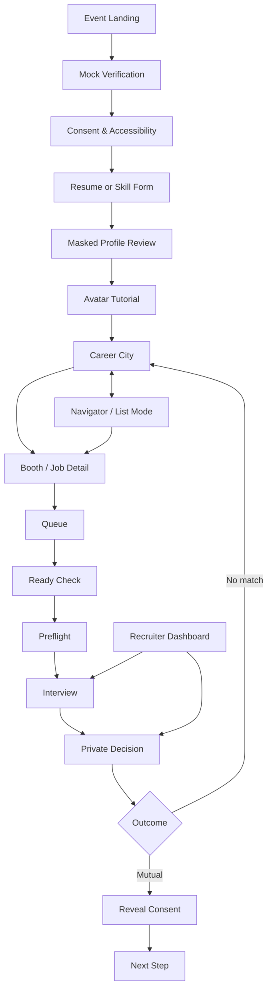

# MaskedMatch — Wireframe & Functional Prototype Design Handoff

> Version 1.1 · Interactive Career Hall visual revision · 21 August 2026  
> ใช้คู่กับ [MaskedMatch Complete Specification](./MaskedMatch_Complete_Specification.md) และ [AGENT.md](./AGENT.md)

---

## 1. Purpose

เอกสารนี้แปลง product specification ให้เป็นข้อมูลที่ทีมสามารถนำไป:

- วาด Low-fidelity Wireframe
- สร้าง High-fidelity UI และ component library
- เชื่อมหน้าจอเป็น clickable prototype
- พัฒนา functional browser prototype
- วาง demo story สำหรับ Coding Final Product AI Hackathon

เอกสารนี้ไม่แทนที่สเปกหลัก เมื่อ logic, privacy, state หรือ acceptance criteria ขัดกัน ให้ใช้ลำดับความสำคัญใน `AGENT.md` Section 2

### Design outcome

ผู้ชมต้องเข้าใจภายใน 30 วินาทีว่า MaskedMatch คือ **Job Fair ที่เริ่มจากทักษะ ไม่ใช่ตัวตน** และภายใน 5 นาทีต้องเห็น core loop ตั้งแต่ Masked Profile จนถึง Mutual Reveal ทำงานจริง

---

## 2. Experience North Star

### 2.1 One-line experience

> “เดินเข้า Career Hall ที่มีชีวิต ค้นพบงานจากทักษะ คุยกันโดยยังไม่เห็นตัวตน แล้วเปิดเผยข้อมูลเมื่อทั้งสองฝ่ายอยากไปต่อ”

### 2.2 Emotional arc

| Moment | User feeling | Design response |
|---|---|---|
| Event entry | สนใจแต่ยังระวัง | อธิบาย Blind Mode และ demo limitation อย่างตรงไปตรงมา |
| Masked Profile | ควบคุมข้อมูลของตนเอง | แสดง before/after และให้ approve เอง |
| Career Hall | ตื่นเต้นและรู้สึกว่ามีผู้คนอยู่จริง | ฮอลล์มี NPC, บูธและวัตถุที่ตอบสนอง แต่มี Navigator ที่เร็วกว่าเสมอ |
| Queue | มั่นใจว่าไม่หลุดคิว | position, ETA, notification และ recovery ชัด |
| Interview | ปลอดภัยและเป็นมืออาชีพ | privacy status, timer, media fallback และ help อยู่ในสายตา |
| Private choice | กล้าตัดสินใจจริง | ย้ำว่าอีกฝ่ายยังไม่เห็นคำตอบ |
| Mutual Match | ดีใจแต่ยังคุมข้อมูลได้ | celebration สั้น แล้วเลือก field ที่แชร์เอง |

### 2.3 Design principles

1. **Skills before identity** — เริ่มจาก evidence และเหตุผลของ match
2. **Playful, not childish** — โลก pixel สนุก แต่ task UI เป็น professional SaaS
3. **Purposeful spatial design** — การเดินช่วยค้นพบ ไม่เป็น toll gate
4. **Mobile first-class** — mobile มี flow ครบ ไม่ใช่ desktop ย่อส่วน
5. **Privacy is visible** — แสดงสิ่งที่ซ่อน, สิ่งที่กำลังแชร์ และ consent state
6. **One primary action per state** — ลดความสับสนในคิวและ interview
7. **Equivalent access** — canvas และ Navigator ใช้ข้อมูล/คำสั่งชุดเดียวกัน
8. **Explain, do not mystify** — AI score มี evidence และความไม่แน่นอน
9. **Recover gracefully** — refresh, timeout, denied permission และ offline ต้องมีทางต่อ
10. **Original visual language** — อ้างหลัก spatial event แต่ไม่คัดลอกหน้าตาหรือ asset ของแพลตฟอร์มอื่น

---

## 3. Target Users and Design Jobs

### 3.1 Candidate

**Primary job:** “ช่วยฉันหางานที่ตรงทักษะและคุยกับบริษัท โดยยังควบคุมข้อมูลส่วนตัวได้”

Needs:

- เข้าใจว่าข้อมูลใดซ่อนจาก recruiter
- ตรวจสิ่งที่ระบบสกัดจาก resume
- ไปถึงงานที่น่าสนใจเร็ว แม้ไม่เล่นเกมเก่ง
- รู้ตำแหน่งคิวและทำอย่างอื่นระหว่างรอ
- ใช้มือถือ เน็ตช้า หรือไม่เปิดกล้องได้
- ตัดสินใจโดยไม่ถูกกดดันจากคำตอบของอีกฝ่าย

### 3.2 Recruiter

**Primary job:** “ช่วยฉันพบ candidate ที่มี evidence ตรงงานและทำ speed interview อย่างเป็นระบบ”

Needs:

- รู้ว่าตนรับคิวอยู่หรือไม่
- เห็น job rubric และ masked evidence ในเวลาสั้น
- เข้า interview ตรงเวลา
- ส่ง decision โดยไม่เห็น choice ของ candidate
- เห็น contact เฉพาะ field ที่ได้รับ consent

### 3.3 Organizer

**Primary job:** “ช่วยฉันเห็นว่างานแฟร์กำลังติดขัดตรงไหนและหยุดระบบได้อย่างปลอดภัย”

R0 ออกแบบเพียง overview/optional frame; Candidate/Recruiter core loop มาก่อน

---

## 4. R0 Design Scope

### 4.1 Priority legend

- **P0-Demo:** ต้องมีทั้ง Wireframe และ Functional Prototype
- **P1-Frame:** ต้องมี Wireframe/visual frame แต่อาจใช้ scripted state
- **P2-Concept:** เก็บเป็น concept เท่านั้น ห้ามแย่งเวลาจาก core loop

### 4.2 Screen inventory

| ID | Screen | Role | Priority | Desktop | Mobile | Prototype depth |
|---|---|---|---|---|---|---|
| SC-01 | Event Landing | Public | P0-Demo | Yes | Yes | Functional |
| SC-02 | Mock Verification & Consent | Candidate | P0-Demo | Yes | Yes | Functional |
| SC-03 | Resume/Skill Import | Candidate | P0-Demo | Yes | Yes | Functional/sample upload |
| SC-04 | Masked Profile Review | Candidate | P0-Demo | Yes | Yes | Functional approval |
| SC-05 | Avatar & Tutorial | Candidate | P1-Frame | Yes | Yes | Short functional preset |
| SC-06 | Neon Career Hall World | Candidate | P0-Demo | Yes | Yes | Functional movement, NPC, booth proximity |
| SC-07 | Navigator/List Mode | Candidate | P0-Demo | Yes | Yes | Functional parity |
| SC-08 | Booth & Job Detail | Candidate | P0-Demo | Yes | Yes | Functional |
| SC-09 | Queue HUD & Ready Check | Candidate | P0-Demo | Yes | Yes | Functional state machine |
| SC-10 | Interview Preflight | Both | P0-Demo | Yes | Yes | Functional permissions/fallback |
| SC-11 | Private Interview | Both | P0-Demo | Yes | Yes | Functional sandbox/scripted peer |
| SC-12 | Private Decision | Both | P0-Demo | Yes | Yes | Functional two-role state |
| SC-13 | Match / No-match Result | Both | P0-Demo | Yes | Yes | Functional branches |
| SC-14 | Reveal Consent | Candidate | P0-Demo | Yes | Yes | Functional field selection |
| SC-15 | Recruiter Dashboard | Recruiter | P0-Demo | Yes | Compact | Functional |
| SC-16 | Organizer Live Ops | Organizer | P2-Concept | Yes | No | Static concept |
| SC-17 | Demo Controller | Team only | P1-Frame | Desktop | No | Functional hidden route |

### 4.3 Explicitly deferred

- Main Stage/workshop
- proximity voice/chat
- map builder
- multi-queue conflict handling
- ATS/calendar integration
- production ThaID
- production voice transform or biometric mask claim
- public leaderboard, candidate browsing or social scoring

---

## 5. Information Architecture

### 5.1 Sitemap



### 5.2 Route model

| Route | Screen | Share/refresh expectation |
|---|---|---|
| `/event/demo` | SC-01 | Public/shareable |
| `/demo/verify` | SC-02 | Resume onboarding state |
| `/candidate/profile/import` | SC-03 | Guarded |
| `/candidate/profile/review` | SC-04 | Guarded; resume draft |
| `/candidate/avatar` | SC-05 | Guarded; skippable |
| `/event/demo/world` | SC-06 | Restores location/queue |
| `/event/demo/navigator` | SC-07 | Same domain data as world |
| `/event/demo/booths/:boothId/jobs/:jobId` | SC-08 | Deep-linkable after sign-in |
| `/interviews/:sessionId/preflight` | SC-10 | Guarded by dispatch |
| `/interviews/:sessionId` | SC-11 | Reconnects same session |
| `/decisions/:sessionId` | SC-12 | Restores private submitted state |
| `/matches/:matchId/reveal` | SC-14 | Guarded by mutual match |
| `/recruiter/demo/dashboard` | SC-15 | Recruiter role only |
| `/demo/control` | SC-17 | Hidden, demo build only |

### 5.3 Navigation model

Desktop candidate:

- Event HUD ด้านบน
- Minimap/Navigator rail ด้านซ้าย
- World ตรงกลาง
- Context panel ด้านขวา
- Utility controls ด้านล่าง

Mobile candidate:

- Compact event/queue status ด้านบน
- World หรือ task content ตรงกลาง
- Context เป็น bottom sheet/full-screen secondary view
- Bottom navigation: `แผนที่ · งาน · คิว · ช่วยเหลือ · ฉัน`

Pilot prototype ห้ามใส่ Chat ใน bottom navigation; Support สำคัญกว่า

---

## 6. Frame and Grid Specification

### 6.1 Reference frames

| Frame token | Size | Use |
|---|---:|---|
| `D/Wide` | 1440×900 | Primary desktop presentation |
| `D/Compact` | 1024×768 | Laptop/desktop constraint |
| `T/Portrait` | 768×1024 | Tablet layout check |
| `M/Primary` | 390×844 | Primary mobile design |
| `M/Narrow` | 320×568 | Reflow/accessibility constraint |
| `M/Landscape` | 844×390 | Interview/code-task check |

### 6.2 Layout dimensions

Desktop world:

```text
Top HUD:          56–64 px
Left rail:        248–280 px
Center world:     min 440 px, fluid
Right context:    320–360 px
Bottom utility:   56–64 px
Outer safe gap:   16 px
Panel gap:        8–12 px
```

Mobile:

```text
Top app bar:      52–56 px + safe-area
Bottom nav:       60–68 px + safe-area
Horizontal pad:   16 px; 12 px at 320
Card gap:         12 px
Bottom sheet:     50/90 dvh snap, with explicit controls
Primary CTA:      full width or ≥48 px high
```

### 6.3 Responsive behavior

| Component | ≥1024 | 768–1023 | 360–767 | 320–359 |
|---|---|---|---|---|
| World shell | left + canvas + right | canvas + one panel | canvas + sheet | canvas optional; List Mode promoted |
| Booth detail | right context panel | side/bottom panel | bottom sheet/full page | full page one column |
| Queue status | top HUD chip | top HUD chip | compact sticky chip | compact chip + accessible detail |
| Ready Check | centered dialog | centered dialog | alert bottom/full dialog | full-height alertdialog |
| Interview | dual panes | primary + PiP | primary + PiP | avatar/audio-first controls |
| Recruiter dashboard | table + session rail | cards | stacked cards | read-only compact flow |

---

## 7. Visual Direction — Neon Career Hall

### 7.1 Art direction

โลกคือ **ฮอลล์จัดงาน Job Fair ขนาดใหญ่ที่มีชีวิต** มองแบบ top-down/three-quarter top-down ผสม convention hall, coworking space, exhibitor booth, interview table, quiet lounge และ futuristic neon device แบบ original pixel art งานภาพต้องหนาแน่นและอบอุ่นเหมือนเกมผจญภัย 16-bit คุณภาพสูง แต่เส้นทางหลักและจุด interactive ต้องอ่านออกทันที

Visual layers:

1. **Environment layer:** indoor pixel hall, floor pattern, walls, booth furniture, plants, props และ blank logo panels
2. **Living layer:** player, candidate/recruiter/support NPC, idle/walk loop, hover response, speech bubble, booth glow และ environmental light
3. **Product layer:** crisp HTML, glass/solid HUD, readable Thai, clear states
4. **Privacy layer:** mask badge, shield motif, field visibility indicator

ความเป็น pixel ไม่ควรทำให้ข้อความแตก อ่านยาก หรือ interaction คลุมเครือ

### 7.2 Color tokens

| Token | Value | Primary use |
|---|---|---|
| `--bg-canvas` | `#070816` | page/background |
| `--bg-world-night` | `#0D1025` | world base |
| `--surface-1` | `#17162E` | cards/HUD |
| `--surface-2` | `#262047` | raised panels |
| `--brand-purple` | `#8B5CF6` | primary accent |
| `--brand-pink` | `#FF4FD8` | match/celebration |
| `--brand-cyan` | `#37E7FF` | info/navigation |
| `--brand-mango` | `#FFD84D` | attention/Ready Check |
| `--success` | `#4ADE80` | success |
| `--warning` | `#FBBF24` | warning |
| `--danger` | `#FF5A6F` | destructive/error |
| `--text-primary` | `#F8F7FF` | text on dark |
| `--text-muted` | `#BBB6D5` | secondary text |
| `--text-on-accent` | `#070816` | text on neon/status |
| `--focus-ring` | `#FFFFFF` | outer focus ring |

Rules:

- ใช้ dark text บน neon button ไม่ใช้ white โดยอัตโนมัติ
- Match ใช้ pink + heart/handshake icon + label ไม่ใช้สีอย่างเดียว
- Ready Check ใช้ mango + clock icon + countdown text
- Scanline/glitch เป็น decorative layer ที่ปิดได้และห้ามทับข้อความ
- Company theme เปลี่ยน accent ของ booth ได้ แต่ไม่เปลี่ยน status/focus token

### 7.3 Typography

| Role | Font direction | Size guidance |
|---|---|---|
| Brand/display Latin | Licensed pixel display | 24–48 px |
| Thai headings | Chakra Petch or tested Thai display face | 20–32 px |
| UI/body | Noto Sans Thai + system sans | 16–18 px |
| Label/meta | Noto Sans Thai | 14–16 px; avoid below 14 |
| Timer/code/score | Readable monospace, tabular numbers | 16–32 px |

Body/legal/error/caption ต้องไม่ใช้ pixel font

### 7.4 Geometry

- UI grid 4 px; common spacing 8/12/16/24/32
- Border 2 px solid; optional hard pixel shadow 2–4 px
- Radius 0–4 px, large modal ไม่เกิน 8 px
- Touch target ≥44×44; critical CTA ≥48 px high
- World tile 16×16 logical px ที่ integer scale 2x/3x
- Avatar 24×32 logical px, 4 directions, idle 2 frames, walk 4–6 frames
- DOM icon ใช้ original SVG หรือ licensed set; ห้าม rasterize text

### 7.5 Motion and sound

| Event | Default | Reduced motion |
|---|---|---|
| Avatar walk | 8–10 fps sprite | static step/position update |
| Panel open | 180 ms slide/fade | instant or 80 ms fade |
| Queue ready | 2 pulse cycles + optional sound | no pulse; persistent highlight |
| Mutual match | ≤2 sec confetti/pixel burst | static match illustration |
| Reconnect | subtle spinner + text | text/progress only |

Sound/haptic เป็น opt-in และมี visual equivalent ทุกครั้ง

### 7.6 Interactive density and animation contract (Revision 1.1)

- กล้องติดตาม avatar ด้วย easing; click/tap target และ WASD ต้องเคลื่อนที่ต่อเนื่องไม่กระตุก
- ฮอลล์ R0 มี NPC อย่างน้อย 12 ตัวจากอย่างน้อย 5 role silhouette: Candidate, Recruiter, Hall Guide, Event Staff และ Accessibility Support
- NPC ต้องมี idle/walk variation, depth sorting ตามแกน Y, hover/tap highlight และ synthetic one-line conversation; ห้ามสร้างบทสนทนาที่เปิด PII หรือทำให้เข้าใจว่าเป็นคนจริง
- ทุก booth มี blank logo plate/monogram layer แยกจาก environment art เพื่อให้เปลี่ยน company fixture ได้
- Scene props ขั้นต่ำ: โต๊ะ, เก้าอี้, plant, lamp, kiosk, coffee cart, sign, partition, lounge object และ device pod
- Ambient animation ใช้ booth glow, light pulse, marker bob, NPC drift และ central hub pulse; ห้ามใช้ flashing, camera shake หรือ autoplay sound
- Reduced Motion เปลี่ยน NPC เป็น stationary pose, ปิด bob/pulse/drift และคง focus/interaction marker แบบนิ่ง
- HUD desktop ลอยเหนือ world แบบ translucent panel เพื่อให้ world เป็นพื้นที่หลัก ไม่จัด canvas เป็นเพียง card ระหว่าง sidebar สองข้าง
- Mobile ใช้ world เต็มพื้นที่และ bottom context sheet; controls ต้องไม่บัง avatar/interaction target

---

## 8. Neon Career Hall World Design

### 8.1 Map concept

R0 ใช้ฮอลล์ indoor เดียวขนาดใหญ่ กล้องตามตัวละครบน desktop/mobile และมี minimap/Navigator ช่วยให้เห็นโครงสร้างทั้งหมด

```text
┌────────────────────────────────────────────────────────────┐
│ DEVICE TEST PODS      GRAND LOBBY          SOCIAL LOUNGE    │
│                                                            │
│ CYBER ORCHARD ─────── CENTRAL AISLE ───── CLOUD LANTERN    │
│ cyan booth            info kiosks           pink booth      │
│                                                            │
│ RIVERBYTE ─────────── CENTRAL HUB ───────── PIXEL LOOM     │
│ green booth           help counter           mango booth     │
│                                                            │
│ QUIET LOUNGE        MAIN ENTRANCE       SUPPORT / ACCESS    │
└────────────────────────────────────────────────────────────┘
```

Map rules:

- Entry → recommended booth ต้องเห็นหรือไปถึงภายใน 10–15 วินาที
- ทางหลักกว้างไม่น้อยกว่า 3 tiles ที่ render scale ปกติ
- ไม่มี decorative object บัง entrance/interaction marker
- ทุก district มี shape/sign/icon ต่างกัน ไม่พึ่งสี
- Quiet Lane และ Support Station มองเห็นได้โดยไม่ต้องค้นเมนู
- Booth interaction radius แสดง outline และ prompt ชัด
- ไม่มี proximity media autoplay
- Background environment มี resolution อ้างอิง 1536×1024 และกล้องแสดงเพียงส่วนที่เกี่ยวข้องเพื่อให้รู้สึกว่าเป็นฮอลล์จริง ไม่ย่อทั้งฮอลล์เป็น thumbnail
- Player/NPC/prop เป็น layer แยกจาก background เพื่อทำ animation, depth sort, tint, hover และเปลี่ยน fixture ได้
- NPC density ต้องไม่ปิดทางหลักหรือบัง booth entrance; crowd movement เป็น ambient เท่านั้นและไม่ชน/ผลัก player ใน R0

### 8.2 Original booth set

| Company | District | Color cue | Role in demo |
|---|---|---|---|
| Cyber Orchard Co. | Tech | Cyan + mango fruit circuit | Recommended job + queue |
| Cloud Lantern Labs | Tech | Purple + cloud lantern | Alternative job |
| Riverbyte Studio | Creative-Tech | Blue + river pixels | Portfolio-heavy role |
| Pixel Loom Works | Creative-Tech | Pink + woven grid | Explore-only booth |

ชื่อ โลโก้ และภาพทั้งหมดเป็น fictional/original ห้ามนำโลโก้จริงมาแทน

### 8.3 Controls

Desktop:

- WASD/Arrow หรือ click-to-move
- `E`/Enter เมื่อ interaction prompt focus อยู่
- Search/Navigator เปิดด้วยปุ่มที่มองเห็น; shortcut เป็น optional
- `Esc` ปิด context layer ล่าสุดและคืน focus

Mobile:

- Tap destination/POI เป็น default
- Recenter, zoom +/− และ `ดูบูธ` เป็นปุ่ม
- Joystick เป็น optional setting
- Bottom sheet ไม่บัง avatar/target; context action ย้ายตำแหน่งเมื่อ sheet เปิด

Accessible equivalent:

- Skip link ไป Navigator เป็น focus แรก
- Canvas เป็น decorative/visual complement เมื่อใช้ screen reader
- Navigator เปิด booth, job และ queue ได้โดยไม่ต้องเคลื่อน avatar

---

## 9. Detailed Screen Blueprints

แต่ละ blueprint ระบุสิ่งที่ต้องวาดและสิ่งที่ต้องทำงานใน prototype

### SC-01 — Event Landing

**Goal:** เข้าใจ value และเริ่มงานภายใน 30 วินาที

Hierarchy:

1. `MaskedMatch — Skills First. Bias Last.`
2. คำอธิบายหนึ่งประโยค
3. Event status/date/timezone
4. Primary CTA `เข้าสู่งาน Demo`
5. Secondary CTA `ดูตำแหน่งงาน`
6. Blind Mode explainer: recruiter เห็น/ไม่เห็นอะไร
7. Device test, accessibility และ privacy summary
8. Persistent banner `DEMO DATA · NOT A REAL THAID INTEGRATION`

Desktop: hero ซ้าย + animated/pixel city preview ขวา 55/45  
Mobile: copy → CTA → compact city preview → trust cards

States: upcoming, live, paused, capacity wait, ended, unavailable

Prototype actions:

- `เข้าสู่งาน Demo` ไป SC-02
- `ดูตำแหน่งงาน` เปิด public job cards โดยไม่ขอ sign-in
- `ลดการเคลื่อนไหว` มีผลกับ city preview ทันที

### SC-02 — Mock Verification & Consent

**Goal:** สร้างความเชื่อใจและแยก required/optional consent

Layout:

- Progress `1 ยืนยัน → 2 โปรไฟล์ → 3 อวตาร`
- Demo verification card พร้อม icon และคำเตือนว่าไม่ใช่ ThaID จริง
- Alternative demo login
- Consent cards แยก:
  - required: event participation/demo terms
  - optional: camera, notification, analytics demo
- Accessibility preferences: List Mode first, reduced motion, text-assisted interview

Primary CTA เปลี่ยนจาก `ดำเนินการต่อ` เป็น loading แล้ว success; failure ไม่ใช้คำว่า identity ปลอม

### SC-03 — Resume / Skill Import

**Goal:** ให้ข้อมูลทักษะโดยไม่บังคับอัปโหลดไฟล์จริง

Options:

- `ใช้ Resume ตัวอย่าง` — recommended demo path
- `กรอกทักษะเอง`
- `อัปโหลดไฟล์` — ถ้ามี ให้จำกัด demo และเตือนว่าไม่ควรใช้ข้อมูลจริง

Content:

- accepted file type/size
- progress and scanning/parsing states
- manual skill chips/evidence fields
- privacy note ว่ายังไม่เผยให้ recruiter ก่อน review

States: idle, uploading, scanning, parsing, needs review, failed, manual fallback

### SC-04 — Masked Profile Review

**Goal:** ทำ “AI + human control” ให้เห็นเป็นภาพ

Desktop wireframe:

```text
┌──────────────────── ORIGINAL ────────────────────┐
│ Candidate Demo · candidate@example.test          │
│ University X · IoT telemetry 2M events/day       │
└───────────────────────────────────────────────────┘
                         ↓
┌────────────────── MASKED PREVIEW ────────────────┐
│ Candidate #8F3A · Contact hidden                 │
│ Institution hidden · IoT telemetry 2M events/day │
│ Node.js · MQTT · Redis · Evidence 1              │
└───────────────────────────────────────────────────┘
[แก้ไข] [รายงานข้อมูลที่ยังระบุตัวตน] [ยืนยันโปรไฟล์]
```

Mobile: segmented control `ต้นฉบับ | โปรไฟล์ที่ซ่อนแล้ว` แทนสอง column และมี visibility summary sticky

Interaction:

- Highlight redacted field พร้อม label `ซ่อนเพราะเป็นข้อมูลติดต่อ`
- Confidence ต่ำมี warning + edit
- Primary CTA ใช้ได้เมื่อ review required field ครบ
- Success แสดง alias และ route ต่อไป

### SC-05 — Avatar & Tutorial

**Goal:** เรียน controls ในไม่เกิน 60 วินาที

- Avatar pack เริ่มต้น: fox, rabbit, bear, dog ที่วาดใหม่
- Fantasy palette ไม่ map กับ skin tone หรือ personality
- Preview idle/walk 4 directions
- Step `เดิน`, `เปิดบูธ`, `เปิด Navigator`, `ขอความช่วยเหลือ`
- CTA `พร้อมเข้า Career City`; secondary `ข้ามทัวร์`; link `ใช้โหมดรายการ`

Avatar เป็น cosmetic เท่านั้น ห้ามอธิบายสัตว์ว่าแทนบุคลิกหรือคุณสมบัติการทำงาน

### SC-06 — Neon Career Hall World

**Goal:** สร้าง wow moment ที่รู้สึกว่าอยู่ในฮอลล์ Job Fair ที่มีผู้คนจริง พร้อม path สู่ recommended job

Desktop low-fi:

```text
┌────────────────────────────────────────────────────────────────────┐
│ NEON CAREER CITY · LIVE  [Network: Good]  [Queue: none] [Profile] │
├──────────────┬───────────────────────────────────┬─────────────────┤
│ NAV/MINIMAP  │                                   │ RECOMMENDED     │
│ Search       │          PIXEL WORLD              │ Backend Dev     │
│ Recommended  │       Candidate #8F3A             │ 92/100          │
│ Districts    │     → Cyber Orchard Booth         │ 3 match reasons │
│ Support      │                                   │ [เปิดงาน]       │
├──────────────┴───────────────────────────────────┴─────────────────┤
│ [Navigator] [Help] [Reduced motion]          [E เปิดบูธ]          │
└────────────────────────────────────────────────────────────────────┘
```

Mobile low-fi:

```text
┌──────────────────────────────┐
│ Tech District   [Queue none] │
│ Network: Good       [Map]    │
├──────────────────────────────┤
│                              │
│        PIXEL WORLD           │
│       Candidate #8F3A        │
│                              │
│ [Recenter]        [ดูบูธ]    │
├──────────────────────────────┤
│ แผนที่  งาน  คิว  ช่วย  ฉัน │
└──────────────────────────────┘
```

Prototype behavior:

- smooth camera-follow movement + world bounds
- NPC crowd อย่างน้อย 12 ตัว พร้อม idle/walk variation, hover/tap highlight และ synthetic speech bubble
- booth proximity prompt + `E` interaction และ tap/click booth zone
- logo plate/monogram ของแต่ละ booth เป็น dynamic layer
- ambient light/booth glow/central hub pulse และ stationary Reduced Motion variant
- POI hover/focus/tap label
- recommended route marker
- World/Navigator selection sync
- booth context opens panel/sheet
- current queue persists while moving

### SC-07 — Navigator / List Mode

**Goal:** ให้เส้นทางเร็วและ accessible เทียบเท่า world

Sections:

- Search
- Recommended Jobs
- All Companies
- Districts
- Current Queue
- Schedule
- Support/Accessibility

Job list item:

```text
Backend Developer · Cyber Orchard Co.
92/100 · Node.js, Queue Systems, IoT evidence
Blind Mode · 12-min interview · Wait 8–12 min
[ดูรายละเอียด] [นำทางบนแผนที่]
```

Mobile Navigator เป็น full page tab `งาน`; Desktop อยู่ left rail/drawer

### SC-08 — Booth & Job Detail

**Goal:** ตัดสินใจก่อนเข้าคิวด้วยข้อมูลครบ

Tabs: `ภาพรวม · ตำแหน่งงาน · คิว · ทีมที่บูธ`

Required blocks:

- Fictional company + verified demo badge
- Job title, work mode, salary range/status
- Must-have vs nice-to-have
- Match score + confidence + three evidence reasons
- Missing/uncertain evidence
- Blind Mode visibility table
- Interview format/duration/accessibility
- Queue depth/ETA
- One state-aware primary CTA

CTA states: `เข้าคิว`, `กำลังเข้าคิว`, `อยู่ในคิว`, `คิวปิด`, `สัมภาษณ์แล้ว`, `ลองใหม่`

Mobile CTA sticky ด้านล่างแต่ต้องไม่บัง content/focus

### SC-09 — Queue HUD & Ready Check

**Goal:** ผู้สมัครเชื่อมั่นว่าคิวยังอยู่และไม่พลาดเมื่อถึงเวลา

Queue chip:

```text
คิว Cyber Orchard #3 · ประมาณ 8–12 นาที
[ดูคิว] [ออกจากคิว]
```

Expanded content:

- position and ETA timestamp
- job/interview duration
- notification limitations
- `ทดสอบอุปกรณ์ระหว่างรอ`
- leave confirmation

Ready Check alertdialog:

```text
ถึงคิวสัมภาษณ์แล้ว
Backend Developer · พร้อมภายใน 00:42
[พร้อมสัมภาษณ์] [ขอเลื่อน 1 ครั้ง]
ต้องการความช่วยเหลือ? [ติดต่อ Support]
```

Rules:

- Focus heading ก่อน ไม่ focus primary CTA อัตโนมัติ
- `Esc` ย่อเป็น critical QueueChip โดยไม่ตอบแทนผู้ใช้
- Countdown มาจาก deadline
- Timeout แสดง `หมดเวลาตอบรับ` + no-blame requeue action
- Refresh/reconnect คืน state เดิม

### SC-10 — Interview Preflight

**Goal:** เลือก capability ที่ปลอดภัยก่อนเข้าห้อง

Checks:

- camera permission/state
- microphone permission/level
- speaker test
- mask mode: `Animal mask`, `Avatar only`, `Camera off`
- bandwidth mode: video/audio/text-assisted
- privacy summary: recording/transcription off
- support/accommodation

Primary CTA `เข้าห้องสัมภาษณ์`; disabled พร้อมเหตุผลเฉพาะเมื่อไม่มี safe mode เลย

Fail-closed message:

> ระบบปิดบังใบหน้าหยุดชั่วคราว เราหยุดส่งวิดีโอแล้ว เลือกลองใหม่หรือใช้ Avatar-only

### SC-11 — Private Interview

**Goal:** speed interview ที่เป็นส่วนตัว ชัด และไม่ทำให้ media failure จบโอกาส

Desktop:

```text
┌────────────────────────────────────────────────────────────────┐
│ PRIVATE INTERVIEW · Backend Developer · 08:42 · Mask Active   │
├─────────────────────────────┬──────────────────────────────────┤
│ Candidate #8F3A            │ Recruiter · Hiring Team          │
│ animal mask/avatar          │ video/avatar                     │
│ Mic on                      │ Mic on                           │
├─────────────────────────────┴──────────────────────────────────┤
│ Shared prompt: Explain one queue reliability decision          │
├────────────────────────────────────────────────────────────────┤
│ [Mic] [Camera] [Mask] [Low bandwidth] [Report] [Leave]        │
└────────────────────────────────────────────────────────────────┘
```

Mobile:

- Remote participant full width
- Self-preview PiP ที่เลือกย้ายมุมด้วยปุ่ม
- sticky timer/status ด้านบน
- thumb-reachable control dock
- prompt เปิด full-screen secondary view
- world renderer unmounted

Never show: eye contact score, humanity score, browser locked, candidate PII

Prototype states: lobby, connecting, active, reconnecting, wrap-up, completed, left early

### SC-12 — Private Decision

**Goal:** ตัดสินใจโดยไม่ถูกอิทธิพลจากคำตอบอีกฝ่าย

Copy:

> การตัดสินใจนี้เป็นส่วนตัว อีกฝ่ายจะไม่เห็นคำตอบของคุณก่อนปิดผล

Actions:

- `ยังไม่ไปต่อ`
- `สนใจไปต่อ`

After submit:

> บันทึกคำตอบแล้ว · กำลังรออีกฝ่าย คุณกลับไปสำรวจบูธอื่นได้

ห้ามแสดง spinner ที่บอกเป็นนัยว่าอีกฝ่ายกำลังกดอะไร และห้ามให้แก้คำตอบหลัง lock หาก demo policy ไม่รองรับ

### SC-13 — Result

Mutual match:

- `MATCH!` + ≤2 sec pixel celebration
- สรุปว่า “ทั้งสองฝ่ายสนใจไปต่อ”
- CTA `เลือกข้อมูลที่ต้องการแชร์`

No match:

- ไม่ใช้ success/failure ที่ให้ความรู้สึกสอบตก
- ไม่บอกว่าใคร pass
- CTA `กลับ Career City`, `ดูงานแนะนำ`

### SC-14 — Reveal Consent

**Goal:** ให้ user คุม field ที่แชร์หลัง match

```text
เลือกข้อมูลที่ต้องการแชร์กับ Cyber Orchard Co.
[x] Email: candidate@example.test
[ ] Phone
[x] Portfolio link
[ ] Full resume

บริษัทจะแชร์กลับ: Recruiter role, work email, next step
[ยืนยันการแชร์]
```

- Unchecked by default ยกเว้น event consent ที่อนุมัติชัด
- บอก consequence ก่อน confirm
- Success แสดง field ที่แชร์ + next step
- Prototype activity summary ใช้ language แบบ audit แต่ไม่เผย internal IDs เกินจำเป็น

### SC-15 — Recruiter Dashboard

**Goal:** ตั้ง availability และทำ interview flow โดยเห็นเฉพาะข้อมูล masked

Desktop layout:

```text
┌────────────────────────────────────────────────────────────┐
│ Cyber Orchard Hiring Desk   Availability: [รับคิว ▼]     │
├───────────────────┬────────────────────────────────────────┤
│ QUEUE             │ CURRENT / NEXT                        │
│ 4 waiting         │ Candidate #8F3A · Backend Developer   │
│ ETA 8–12 min      │ Node.js · Queue · IoT evidence        │
│ coverage warning  │ [เปิด rubric] [เริ่ม session]         │
├───────────────────┴────────────────────────────────────────┤
│ Today: 6 interviews · 2 mutual matches · no PII leaderboard│
└────────────────────────────────────────────────────────────┘
```

Required:

- availability `รับคิว`, `พัก`, `ออฟไลน์`
- current/next session
- masked profile evidence
- assigned job/rubric
- reconnect/incident support
- private decision
- revealed fields only after consent

### SC-16 — Organizer Live Ops

P2 concept frame only:

- event state/health
- queue wait alerts
- recruiter coverage gap
- media join failure
- moderation reports
- pause/resume action with confirmation

ห้ามใช้เวลาพัฒนา dashboard นี้ก่อน Candidate/Recruiter loop ทำงานครบ

### SC-17 — Demo Controller

Hidden route สำหรับทีมบนเวที:

- Reset all demo data
- Select scenario: `Happy match`, `No match`, `Media denied`, `Queue timeout`, `Offline recovery`
- Speed queue: `Dispatch now`
- Open Candidate/Recruiter windows
- Show current state/debug IDs

ต้องมี banner `DEMO CONTROLLER — NOT A PRODUCT SCREEN` และไม่รวมใน production navigation/build

---

## 10. Component Library

### 10.1 Foundations

- Color, typography, spacing, elevation, focus, motion, sound
- Icon grid 16/20/24 px
- Pixel asset grid and nearest-neighbor rule
- Responsive container and safe-area helpers

### 10.2 Primitives

| Component | Variants | Required states |
|---|---|---|
| PixelButton | primary, secondary, danger, quiet | default, hover, focus, pressed, disabled, loading |
| IconButton | standard, compact | tooltip/touch label, toggled state |
| TextField | text, search, OTP | focus, valid, invalid, disabled |
| Checkbox/Radio | standard, consent | checked, mixed, error |
| Select/Menu | role/status | keyboard open/select/close |
| Card | flat, raised, interactive | focus, selected, disabled |
| DialogWindow | modal, alertdialog | open, closing, error |
| BottomSheet | 50/90 dvh | open, expanded, closing |
| Tabs | line/pixel tabs | selected, focus, overflow |
| Toast | info, success, warning | timed/persistent/action |
| Skeleton | card/list/media | reduced-motion static |

### 10.3 Product components

| Component | Essential content |
|---|---|
| DemoBanner | demo type, limitation, details link |
| BlindModeBadge | masked state + explainer |
| CandidateAlias | alias, never legal name pre-reveal |
| VisibilityTable | field, visible/hidden, reason |
| MatchScoreCard | score, confidence, evidence, uncertainty |
| BoothCard | company, job count, queue, recommended reason |
| JobCard | role, requirements, salary/work mode, score |
| QueueChip | job, position, ETA, state, expand |
| ReadyCheckDialog | deadline, accept, snooze, support |
| NetworkBadge | good, unstable, reconnecting, offline |
| MediaControlDock | mic, camera, mask, fallback, leave |
| PrivacyStatusBar | mask/recording/transcription state |
| DecisionCard | private notice + two choices |
| RevealFieldPicker | field, value preview, consent state |
| SupportEntry | urgent/non-urgent help path |

### 10.4 Component naming in design tool

Use slash hierarchy:

```text
Button/Primary/Default
Button/Primary/Loading
Status/Network/Reconnecting
Queue/Chip/Ready
Dialog/ReadyCheck/Mobile
Card/Job/Recommended
Media/Control/Mic/Muted
```

Props/variant name ต้องตรงกับ code vocabulary เท่าที่ทำได้ เช่น `state=ready_check` ไม่ใช้ชื่อภาพอย่าง `yellow-modal`

---

## 11. Content and Microcopy

### 11.1 Voice

- เป็นมิตร ชัด เคารพ และไม่ตัดสิน
- บอกผลของ action ที่ย้อนกลับยากก่อนกด
- เรียก AI ว่า “แนะนำ”, “สกัด”, “ประเมินความตรง”
- ไม่ใช้ “จับโกง”, “ผิดปกติ”, “ไม่ใช่มนุษย์”, “แพ้”, “ไม่ผ่าน” กับ low-confidence/failure
- แยก product copy ออกจาก pitch claim

### 11.2 Key copy set

| Situation | Copy |
|---|---|
| Demo identity | `โหมดสาธิต — ไม่ได้เชื่อมต่อ ThaID จริง` |
| Profile uncertainty | `เรายังไม่มั่นใจว่าข้อมูลนี้ถูกต้อง กรุณาตรวจและแก้ไข` |
| Queue delayed | `คิวล่าช้ากว่าประมาณการ ตำแหน่งของคุณยังอยู่` |
| Mask failure | `ระบบหยุดส่งวิดีโอแล้ว เลือกลองใหม่หรือใช้ Avatar-only` |
| Reconnect | `การเชื่อมต่อขาดชั่วคราว กำลังนำสถานะล่าสุดกลับมา` |
| Ready timeout | `หมดเวลาตอบรับครั้งนี้ คุณเข้าคิวใหม่ได้โดยไม่ถูกลงโทษ` |
| No match | `ครั้งนี้ยังไม่มีขั้นตอนต่อ ข้อมูลติดต่อของคุณยังไม่ถูกเปิดเผย` |
| Reveal | `แชร์เฉพาะช่องที่คุณเลือก บริษัทจะไม่เห็นช่องอื่น` |

### 11.3 Localization

- Thai default, English secondary
- Frame ต้องทดสอบ copy ยาวขึ้น 30–40%
- Timer/score ใช้ tabular numerals
- Event time แสดง timezone
- Company/person name ไม่บังคับ uppercase
- หลีกเลี่ยงข้อความฝังใน pixel image

---

## 12. Functional Prototype Data

### 12.1 Event

```yaml
id: event-neon-career-city
name_th: Neon Career City Demo Job Fair
state: LIVE
timezone: Asia/Bangkok
demo: true
blind_mode: candidate_anonymous
active_queue_limit: 1
ready_check_seconds: 60
interview_duration_seconds: 720
recording_enabled: false
transcription_enabled: false
```

### 12.2 Candidate

```yaml
alias: "Candidate #8F3A"
email: candidate@example.test
skills:
  - Node.js
  - MQTT
  - Redis
  - Queue Systems
evidence:
  - "Built an IoT telemetry pipeline handling 2M synthetic events/day"
hidden_fields:
  - legal_name
  - email
  - institution
  - exact_employer
```

### 12.3 Primary job

```yaml
id: job-backend-01
company: Cyber Orchard Co.
title: Backend Developer
work_mode: Hybrid
salary: "Demo range 45,000–70,000 THB"
interview_minutes: 12
match_score: 92
match_confidence: Demo rule
reasons:
  - Node.js ตรงกับ must-have
  - มีหลักฐาน Queue Systems และ Redis
  - IoT/MQTT ตรงกับบริบทผลิตภัณฑ์
uncertain:
  - ยังไม่มีหลักฐาน observability ใน profile
```

### 12.4 Scenario presets

| Scenario | Candidate decision | Recruiter decision | Media | Queue behavior | Result |
|---|---|---|---|---|---|
| Happy match | interested | interested | avatar/video mock | dispatch now | reveal enabled |
| No match | interested | pass | avatar | normal | private no-match |
| Media denied | interested | interested | permission denied → avatar | normal | flow continues |
| Queue timeout | none | none | not started | ready expires | requeue offered |
| Offline recovery | interested | interested | reconnect once | ticket restored | match |

---

## 13. Interaction and State Annotation Standard

ทุก wireframe/high-fi frame ต้องมี annotation block:

```text
Frame ID:
Role:
Route:
Entry state:
Primary task:
Primary CTA:
Secondary actions:
Data required:
Loading state:
Empty state:
Error/recovery:
Keyboard/focus:
Mobile adaptation:
Analytics event:
Spec/AC reference:
```

### Interaction naming

ใช้รูปแบบ:

```text
ACT/JOIN_QUEUE
ACT/ACCEPT_READY_CHECK
ACT/ENABLE_AVATAR_ONLY
ACT/SUBMIT_DECISION
ACT/CONFIRM_REVEAL
SYS/QUEUE_POSITION_UPDATED
SYS/NETWORK_RECONNECTING
SYS/MUTUAL_MATCHED
```

ชื่อ interaction ต้องบอก intent ไม่บอกตำแหน่ง visual เช่นใช้ `OPEN_JOB_DETAIL` แทน `CLICK_RIGHT_CARD`

---

## 14. Prototype Transition Map

### 14.1 Primary demo

```text
SC-01 CTA
→ SC-02 verify success
→ SC-03 use sample resume
→ SC-04 approve masked profile
→ SC-05 choose avatar/skip
→ SC-06 follow recommended marker
→ SC-08 inspect job
→ SC-09 join and dispatch
→ SC-10 choose safe media mode
→ SC-11 complete interview
→ SC-12 submit candidate decision
→ SC-15 recruiter submits decision
→ SC-13 mutual match
→ SC-14 select email + portfolio
→ Next-step success
```

### 14.2 Clickable prototype minimum

- ทุก primary CTA ใน flow เชื่อมจริง
- Back action รักษา state ที่สมเหตุสมผล
- Overlay เปิด/ปิด/restore focus concept มี annotation
- มี happy, no-match และ media-denied branch
- ใช้ smart animate เฉพาะที่ reduced-motion alternative อธิบายไว้
- ห้ามใช้ hotspot โปร่งใสขนาดใหญ่ซึ่งไม่ตรงกับ control ที่เห็น

### 14.3 Functional prototype minimum

- route refresh ได้
- form/consent/profile approval มี state จริง
- World movement และ Navigator เปิดข้อมูลเดียวกัน
- Queue transition/timer/refresh recovery ทำงาน
- Candidate/Recruiter decision แยกกัน
- Match result คำนวณจาก state ไม่ hard-code จากปุ่มเดียว
- Reveal filter แสดงเฉพาะ selected field
- reset preset ได้

---

## 15. Accessibility Design Specification

Target: WCAG 2.2 AA สำหรับ flow ที่นำขึ้น demo

### 15.1 Structure

- มีหนึ่ง `h1` ต่อ page/primary task
- Landmarks: header, nav, main, complementary เมื่อเหมาะสม
- Skip link แรก: `ข้ามโลกและเปิดโหมดรายการ`
- Canvas ไม่เป็นแหล่งข้อมูลเดียว
- Heading/order ไม่เปลี่ยนมั่วเมื่อ responsive

### 15.2 Focus and keyboard

- Focus ring ขาว/cyan แบบ inner + outer contrast
- Dialog/sheet trap focus และคืน trigger
- Ready Check focus heading/description ก่อน
- Escape behavior ระบุใน annotation
- World keyboard มีทางออกและ shortcut remap/disable ได้
- No hover-only content/action

### 15.3 Reflow and touch

- Semantic flow ไม่มี horizontal page scroll ที่ 320 CSS px
- ทดสอบ 200% text zoom และ 400% browser zoom desktop equivalent
- Touch target ≥44×44 px; critical ≥48 px
- Swipe, drag, pinch มี button alternative
- Safe-area ไม่บัง nav/CTA/timer

### 15.4 Color, motion and media

- Text contrast AA ทุก token recipe ที่ใช้จริง
- State มี icon + label + shape/pattern
- Reduced motion variant ทุก major motion
- Captions/control label หากเปิด media
- Camera off/avatar/text path ต้องไม่ถูกออกแบบเหมือนตัวเลือกด้อยกว่า
- ไม่บังคับ eye contact

### 15.5 Design review checklist

- [ ] Keyboard path วาดครบ
- [ ] Focus state ของทุก component
- [ ] Error ไม่หายเมื่อใช้ screen reader
- [ ] Live region ไม่ประกาศ countdown ทุกวินาที
- [ ] Mobile sheet มีปุ่ม close/expand
- [ ] No critical content in tooltip only
- [ ] Status ไม่ใช้สีอย่างเดียว
- [ ] Thai text ไม่ถูกตัดหรือ rasterized
- [ ] List Mode ทำ core task ได้เท่ากับ world

---

## 16. Privacy and Trust Design

### 16.1 Persistent trust signals

- `Blind Mode active`
- field visibility summary
- recording/transcription off
- camera/mic/mask state
- demo/non-production banner
- private decision notice

### 16.2 High-risk confirmations

ต้อง confirmation พร้อม consequence สำหรับ:

- ออกจากคิว
- ออกจาก interview
- แชร์ contact/resume
- เปิด camera หลังอยู่ avatar-only
- reset demo data ใน Demo Controller

### 16.3 Prohibited patterns

- pre-checked optional contact reveal
- dark pattern ที่ทำให้ `สนใจไปต่อ` เด่นจนเหมือนบังคับ
- recruiter view ที่เผลอมี PII ใน toast, URL, alt text หรือ debug panel
- score/animation ที่บอกว่า candidate “ผ่าน” ก่อนมนุษย์ตัดสินใจ
- raw signal timeline หรือ tab-switch count ให้ interviewer
- warning ที่กล่าวหาผู้ใช้จาก connection/media failure

---

## 17. Asset Production Plan

### 17.1 R0 asset list

| Asset group | Minimum | Notes |
|---|---:|---|
| Core tiles | 24–40 | floor, wall, path, water/light accents |
| Booth sets | 4 | original silhouette/sign/color cue |
| Candidate avatars | 4 animals × 4 directions | 2 idle + 4 walk frames |
| Recruiter/NPC | 2–4 | visually distinct from candidates |
| POI objects | 8–12 | kiosk, support, interview pod, wayfinding |
| UI icons | 20–30 | semantic SVG/pixel-consistent |
| Match celebration | 1 static + 1 animated | reduced-motion static required |
| Empty/error illustrations | 3–5 | reusable and subtle |

### 17.2 Asset registry fields

```text
asset_id
filename
category
creator/owner
license
source URL if licensed
allowed use
logical dimensions
compressed size
alt/semantic role
attribution requirement
```

### 17.3 Constraints

- Original or clearly licensed assets only
- No logos/screenshots from PDF or competitor products
- Pixel art uses integer scale and nearest-neighbor
- Keep UI copy out of bitmap
- Atlas grouped by core/district/booth to control loading
- Decorative art marked decorative; interactive POI has DOM/list equivalent

### 17.4 R0 generated asset registry (Revision 1.1)

| Asset ID | File | Role | Provenance / allowed use |
|---|---|---|---|
| `world.hall.v3` | `public/assets/world/neon-career-hall-v3.png` | Indoor hall environment, 1536×1024 | Generated original for MaskedMatch; references used for mood/density only; project use |
| `world.atlas.source.v1` | `public/assets/world/career-hall-atlas-v1.png` | Raw generated 4×4 character/prop atlas | Generated original; source retained; not loaded at runtime |
| `world.atlas.runtime.v3` | `public/assets/world/career-hall-atlas-v3.png` | Transparent normalized 1280×1280 Phaser atlas | Derived mechanically from source atlas; project use |

ไฟล์ `neon-career-city-v2.png` เป็น exploration draft กลางแจ้ง ไม่ใช่ runtime direction ของ Revision 1.1 และห้ามนำกลับมาใช้โดยไม่สร้าง decision ใหม่

---

## 18. Design Tool File Structure

Recommended pages:

```text
00 — Cover & Decisions
01 — User Flows
02 — Foundations
03 — Components
04 — Candidate Wireframes
05 — Candidate High-fi
06 — Recruiter
07 — Responsive & Accessibility
08 — Prototype Connections
09 — Edge States
10 — Demo Storyboard
99 — Archive
```

Frame naming:

```text
SC-06/D/Wide/World/NoQueue
SC-06/M/Primary/World/QueueActive
SC-09/M/Narrow/ReadyCheck/42s
SC-11/D/Wide/Interview/Reconnecting
SC-13/M/Primary/Result/MutualMatch
```

Every frame description should link to screen ID, state, viewport and design decision. ห้ามใช้ชื่อ `Frame 123` ใน handoff

---

## 19. Wireframe Production Order

### Round 1 — Flow skeleton

1. SC-01 → SC-04 onboarding
2. SC-06/07 → SC-09 discovery and queue
3. SC-10 → SC-14 interview, decision and reveal
4. SC-15 recruiter counterpart

Use grayscale + one accent; validate hierarchy and task completion before pixel polish

### Round 2 — Responsive and edge states

- 390 mobile for every P0 screen
- 320 reflow for onboarding, Navigator, booth, queue, interview controls and decision
- loading, error, permission denied, offline, timeout, no-match
- keyboard/focus annotation

### Round 3 — Visual system

- tokens and component variants
- original pixel map/avatars/booths
- high contrast and reduced motion
- Thai/English copy stress

### Round 4 — Prototype and rehearsal

- connect primary/branch flows
- test with 3 first-time users
- time the 5-minute demo
- remove any interaction that needs verbal explanation to discover

---

## 20. Hackathon Demo Storyboard

Target 4–5 minutes, plus technical explanation/Q&A

| Time | Action | What judges should understand |
|---:|---|---|
| 0:00–0:25 | Event Landing + one-line problem | Hiring starts with skill evidence, not identity |
| 0:25–0:55 | Use sample resume and show redaction | AI assists; candidate reviews and controls data |
| 0:55–1:35 | Enter Career City, show mobile/List parity | Spatial discovery is fun but not an accessibility gate |
| 1:35–2:05 | Open Cyber Orchard job and match reasons | Recommendation is explainable and evidence-based |
| 2:05–2:35 | Join queue, refresh, receive Ready Check | Queue is stateful and recoverable |
| 2:35–3:15 | Preflight + interview privacy controls | Safe fallback exists; no surprise camera/recording |
| 3:15–3:45 | Candidate and recruiter decide privately | Neither side pressures the other |
| 3:45–4:20 | Mutual Match + field-level reveal | Identity/contact opens only after mutual interest + consent |
| 4:20–5:00 | Architecture/impact summary | Prototype has a credible path to pilot without overclaiming AI |

### Backup story

เตรียม:

- local/offline build
- pre-recorded 60–90 second core demo
- static screenshots ของแต่ละ major state
- scenario reset
- avatar-only interview path หาก camera/network venue ล้ม

---

## 21. User Testing Script

ทดสอบอย่างน้อย 3 คนที่ไม่เคยเห็นโปรเจกต์ ถ้าเป็นไปได้ให้มี mobile-first user

### Tasks

1. “เข้า Event และบอกว่าบริษัทจะเห็นข้อมูลอะไรจากคุณ”
2. “ตรวจโปรไฟล์ที่ระบบซ่อนข้อมูลแล้วแก้จุดที่ไม่มั่นใจ”
3. “หางาน Backend Developer โดยไม่เดินในแผนที่”
4. “เข้าคิวและบอกว่าตอนนี้ต้องรอนานแค่ไหน”
5. “ถ้าไม่อยากเปิดกล้อง คุณจะเข้า interview ต่ออย่างไร”
6. “เลือกสนใจไปต่อ แล้วบอกว่า recruiter เห็นคำตอบคุณตอนไหน”
7. “หลัง match แชร์เฉพาะอีเมลและ portfolio”

### Observe

- เข้าใจ Blind Mode ภายใน 30 วินาทีหรือไม่
- หา Navigator/List Mode เจอหรือไม่
- เข้าใจ score เป็น recommendation ไม่ใช่ผลคัดเลือกหรือไม่
- สังเกต queue/Ready Check หรือไม่
- เข้าใจ media fallback หรือไม่
- เข้าใจ decision privacy และ reveal consent หรือไม่

### Success targets for rehearsal

- 3/3 ทำ core path โดย facilitator ช่วยไม่เกินหนึ่งครั้ง
- 3/3 ตอบได้ว่า pre-match recruiter ไม่เห็น contact
- 3/3 หา List Mode และ support ได้
- ไม่มี task ใดพึ่ง hover/drag เท่านั้น
- mobile user จบ landing → queue โดยไม่ rotate

---

## 22. Design QA Matrix

### 22.1 Viewports

- [ ] 320×568
- [ ] 390×844
- [ ] 844×390
- [ ] 768×1024
- [ ] 1024×768
- [ ] 1440×900
- [ ] 1920×1080
- [ ] 400% desktop zoom equivalent

### 22.2 States per P0 screen

- [ ] loading
- [ ] populated/happy
- [ ] empty
- [ ] validation error
- [ ] permission denied
- [ ] offline/reconnecting
- [ ] server/demo adapter error
- [ ] session expired/access revoked
- [ ] reduced motion
- [ ] high contrast
- [ ] long Thai/English copy

### 22.3 Core interaction checks

- [ ] World and Navigator stay synchronized
- [ ] One active queue only
- [ ] Ready Check cannot be accepted accidentally
- [ ] Interview controls reachable one-handed on mobile
- [ ] Decision stays private until both submit
- [ ] No-match does not reveal who passed
- [ ] Reveal shows selected fields only
- [ ] Reset returns deterministic state

---

## 23. Spec Traceability for Design

| Design area | Spec section | Acceptance criteria |
|---|---|---|
| Blind profile/review | 8.1–8.2, 12.2–12.3 | AC-01, AC-02 |
| Recommendation | 8.4, 12.6 | AC-03, AC-20 |
| Mobile/Navigator | 8.5, 11, 14.1–14.4 | AC-04, AC-05, AC-16 |
| Queue/Ready Check | 8.6, 9.2, 12.7 | AC-06–AC-09, AC-26 |
| Interview/media | 8.7–8.8, 9.3, 11.4, 12.8 | AC-10–AC-12, AC-24 |
| Decision/reveal | 8.9, 9.4, 12.9 | AC-13–AC-15, AC-21 |
| Recruiter/tenant | 4, 12.10 | AC-18, AC-22 |
| Operations/moderation | 8.11, 12.11 | AC-17, AC-25, AC-27 |
| Realtime/recovery | 17.2, 19.4 | AC-07, AC-23, AC-29 |
| Demo gate | 5.1, 21.3, 23 R0 | R0 release gates |

---

## 24. Design Definition of Done

Design handoff พร้อมให้เริ่ม coding เมื่อ:

- P0 flow มี desktop 1440 และ mobile 390 frame ครบ
- critical semantic flow ผ่าน 320 reflow review
- ทุก P0 screen มี loading/error/recovery annotation
- component variants และ token ไม่เกิด one-off style ที่ไม่จำเป็น
- world และ Navigator ใช้ข้อมูล/actions ชุดเดียวกันใน spec
- focus, keyboard, sheet/dialog behavior ถูก annotate
- decision/reveal privacy ตรวจโดยคนที่ไม่ได้วาดหน้าจอ
- asset source/license บันทึกครบ
- clickable prototype มี happy/no-match/media-denied path
- user test 3 คนและแก้ critical discovery issue แล้ว
- engineering ยืนยัน state/route/data feasibility
- Demo storyboard ทำจบภายใน 5 นาทีโดยไม่ใช้ DevTools

---

## 25. Final Design Test

ก่อนอนุมัติทุก frame ให้ถาม 5 ข้อ:

1. ผู้สมัครรู้หรือไม่ว่าตอนนี้ recruiter เห็นอะไร?
2. ถ้าไม่ใช้ canvas, camera หรือ high bandwidth ยังทำ task ต่อได้หรือไม่?
3. Primary action ของ state นี้ชัดเพียงหนึ่งอย่างหรือไม่?
4. เมื่อ refresh, timeout หรือ permission fail ผู้ใช้รู้ว่าจะทำอะไรต่อหรือไม่?
5. หน้าจอนี้ช่วยเล่า core loop บนเวที หรือกำลังเพิ่ม feature ที่ไม่จำเป็น?

ถ้าคำตอบข้อใดไม่ชัด ให้แก้ flow/state ก่อนเพิ่ม visual polish
