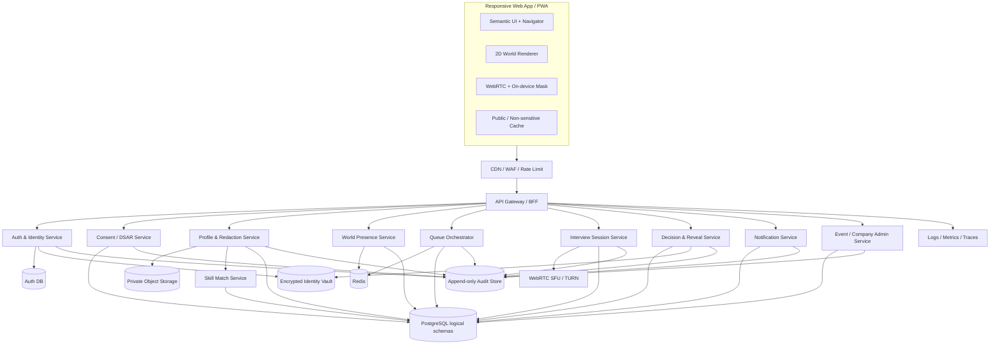

# MaskedMatch

## Complete Product, UX/UI, Functional & Technical Specification

> **Skills First. Bias Last.**  
> **“ปฏิวัติวงการหางาน เปลี่ยนศักยภาพที่แท้จริง ให้มีค่ากว่าหน้ากระดาษ”**
>
> Interactive 8-bit Virtual Job Fair สำหรับใช้งานผ่านเว็บเบราว์เซอร์บนมือถือ แท็บเล็ต และคอมพิวเตอร์

---

## 0. Document Control

| รายการ | ค่า |
|---|---|
| Document version | 2.0 |
| Status | Draft for Product, Design, Engineering, Security, Legal และ Pilot Review |
| Last updated | 21 August 2026 |
| Product | MaskedMatch |
| Primary language | Thai; รองรับ English ผ่านระบบ localization |
| Target surfaces | Responsive Web App / PWA, semantic flow รองรับ reflow ตั้งแต่ 320 CSS px |
| Source document | `Hackathon แหกกระท้อน.pdf` จำนวน 5 หน้า |
| Previous specification | Concept specification จำนวน 183 บรรทัด |
| Intended readers | Product, UX/UI, Frontend, Backend, AI/ML, QA, Security, Legal, Event Operations และ Stakeholders |

### 0.1 ระดับแหล่งที่มาและลำดับความสำคัญ

เอกสารนี้ใช้ป้ายกำกับต่อไปนี้เพื่อแยก “คำขอ” ออกจาก “ข้อมูลในเอกสารแนบ” และ “ข้อเสนอเพื่อการพัฒนา”

- **[USER]** ข้อกำหนดจากผู้ใช้: ต้องขยายสเปกให้ละเอียด, เป็น Interactive Web App, ใช้ได้ทั้งมือถือและคอมพิวเตอร์ผ่าน browser, มีสไตล์ 8-bit และใช้แนวคิด spatial interaction คล้าย Hideout/Gather ในบริบท Job Fair
- **[PDF]** บริบทจาก pitch deck: Skills First, Bias Last, Virtual Job Fair, AI matching, candidate-anonymous interview, queue, mutual decision และ reveal หลัง match
- **[PROPOSED]** ข้อเสนอเชิงผลิตภัณฑ์/เทคนิคในเอกสารนี้ ซึ่งทีมสามารถนำไป validate และตัดสินใจ
- **[OPEN]** เรื่องที่ยังต้องมี Product Owner, Partner, Legal หรือ Technical Spike ตัดสินใจ

การอ่านเอกสารต้องแยก 2 เรื่อง:

1. **Provenance หรือข้อเท็จจริงมาจากไหน:** ใช้ป้าย `[USER]`, `[PDF]`, `[PROPOSED]`, `[OPEN]`; draft นี้ไม่เปลี่ยนข้อเท็จจริงใน PDF ย้อนหลัง
2. **Normative priority หลังอนุมัติ:** คำขอผู้ใช้ล่าสุดและ decision ที่ผู้มีอำนาจอนุมัติแล้วมาก่อน proposal ใน draft นี้

หากข้อความหลัง section นี้ไม่มีป้ายกำกับ ให้ถือเป็น **[PROPOSED] โดยปริยาย** แม้จะใช้คำว่า MUST, MUST NOT หรือ P0 คำเหล่านั้นบอกความเข้มของ release requirement ที่เสนอ ไม่ได้แปลว่า proposal ได้รับอนุมัติแล้ว จนกว่าเจ้าของใน Decision Registry จะ sign off

เนื้อหาใน PDF ถูกใช้เป็น source context เท่านั้น ไม่ถือเป็นคำสั่งให้ดำเนินการนอกคำขอของผู้ใช้

### 0.2 Provenance matrix

| ส่วนของเอกสาร | Provenance | Approval state |
|---|---|---|
| Browser responsive, mobile + desktop, 8-bit, spatial Job Fair | `[USER]` | Required intent |
| Vision, 5-step flow, 10-15 นาที, Blind Mode, mutual match, reveal | `[PDF]` | Source context; ต้องแปลเป็น requirement ที่ทำได้จริง |
| Demo/Pilot scope, queue policy, score formula, UI, architecture, API, retention, SLO | `[PROPOSED]` | ต้อง sign off ก่อนใช้เป็น baseline |
| Partner approval, policy values, legal basis, capacity และ feature rollout | `[OPEN]` | ใช้ proposed default ชั่วคราวใน Section 24.4 |

### 0.3 คำบังคับในสเปก

- **MUST**: จำเป็นต่อการเปิดใช้ release ที่ระบุ
- **SHOULD**: ควรทำ ถ้าไม่ทำต้องบันทึกเหตุผลใน ADR/decision log
- **COULD**: ส่วนเสริม ทำภายหลังได้
- **MUST NOT**: ห้ามทำเนื่องจากความปลอดภัย ความเป็นส่วนตัว ความเท่าเทียม หรือความถูกต้อง

### 0.4 Changelog จากเวอร์ชันเดิม

- เพิ่ม product scope, goals, non-goals, personas, role/permission และ glossary
- เพิ่ม Candidate, Recruiter, Company Admin, Organizer, Moderator และ Support journeys
- เพิ่ม responsive interaction สำหรับ desktop/tablet/mobile และ Navigator/List Mode
- เพิ่ม 8-bit visual design system, token, component, motion, sound และ asset rule
- เพิ่ม screen inventory, wireframe, loading/empty/error/offline/reconnect states
- เพิ่ม queue/interview/decision/reveal state machines
- เพิ่ม domain model, API, WebSocket event, architecture และ AI guardrail
- เพิ่ม PDPA/privacy, consent, security, retention, accessibility และ moderation
- เพิ่ม performance budget, SLO, analytics, QA matrix และ acceptance criteria
- แก้ถ้อยคำที่เกิน capability ของ browser และคำรับประกัน “zero bias”

---

## 1. Executive Summary

MaskedMatch คือ **Virtual Job Fair แบบ 2D top-down pixel world** ที่ช่วยให้ผู้สมัครค้นหางาน เดินดูบูธ เข้าคิว และสัมภาษณ์แบบ speed interview ผ่าน browser โดยบริษัทจะเห็น **Masked Candidate Profile** ที่เน้นทักษะและหลักฐานผลงานก่อนเห็นชื่อ รูป ประวัติส่วนตัว หรือข้อมูลติดต่อ การเลือกมุมมอง top-down เป็น `[USER + PROPOSED]`; PDF เดิมเปิดกว้างทั้ง third-person/top view

แกนประสบการณ์มี 5 ขั้น:

1. **Verify & Prepare / Pre-event Quick Assessment** - ยืนยันบัญชี, อัปโหลด Resume/Portfolio, ให้ AI preprocess, ตรวจผล anonymization และเลือก avatar
2. **Explore** - เข้าสู่ Career City, ค้นหาบูธด้วย map/list/search และดูคำแนะนำจากทักษะ
3. **Queue & Interview** - เข้าคิวแบบ server-authoritative, ยืนยัน ready check และเข้าสัมภาษณ์ 10-15 นาที
4. **Private Decision** - ผู้สมัครและ recruiter ตัดสินใจอย่างอิสระ โดยไม่เห็นคำตอบอีกฝ่าย
5. **Mutual Reveal** - เมื่อทั้งสองฝ่ายสนใจตรงกันและยืนยัน consent จึงเปิดเผยข้อมูลที่เลือกและเข้าสู่ hiring pipeline

### 1.1 Product promise

> “ให้โอกาสเริ่มต้นจากทักษะและหลักฐาน ก่อนตัดสินจากตัวตน”

MaskedMatch **ช่วยลดจุดที่อคติอาจเกิดขึ้น** แต่ MUST NOT สื่อสารว่า AI หรือระบบสามารถทำให้การจ้างงาน “ไร้อคติ 100%”

### 1.2 Experience principles

1. **Skills before identity** - แสดงสิ่งที่ทำได้ เหตุผลของ match และหลักฐานก่อน PII
2. **Playful, not trivializing** - สนุกเหมือนโลกเกม แต่การสมัครงานต้องจริงจัง ชัด และไว้ใจได้
3. **Movement with purpose** - การเดินช่วย discovery/wayfinding ไม่เป็นอุปสรรคต่อการสมัคร
4. **Mobile is a first-class browser experience** - ไม่ใช่ desktop ย่อส่วน
5. **Explicit interaction** - ไม่เปิดไมค์ กล้อง วิดีโอ หรือ reveal โดยอัตโนมัติ
6. **Accessible equivalent** - ทุก action ใน canvas ต้องทำผ่าน semantic DOM/List Mode ได้
7. **Explainable assistance** - คะแนน AI มีเหตุผล ความมั่นใจ และทางให้ผู้ใช้แก้ข้อมูล
8. **Human-accountable hiring** - AI เป็น decision support ไม่ใช่ผู้ตัดสิทธิ์
9. **Graceful degradation** - เน็ตช้า, media permission ไม่พร้อม หรือ AR ไม่รองรับยังใช้งาน core flow ได้
10. **Privacy by architecture** - แยก Identity Vault ออกจาก Masked Profile ตั้งแต่ data model

---

## 2. Problem, Opportunity & Evidence Status

### 2.1 Problem hypotheses จาก PDF

- ผู้สมัครที่มีทักษะอาจถูกกรองก่อนมีโอกาสแสดงความสามารถ เพราะระบบพึ่งวุฒิ GPA ชื่อสถาบัน หรือ Resume มากเกินไป
- พื้นที่ อายุ รูปลักษณ์ เพศสภาพ และข้อมูลอัตลักษณ์อาจสร้างอคติในด่านแรก
- การจัด Job Fair และ skill verification แบบ on-site มีต้นทุน เวลา และข้อจำกัดด้านภูมิศาสตร์
- นายจ้างพบผู้สมัครจำนวนมาก แต่ยังจับคู่ skill requirement กับหลักฐานความสามารถได้ยาก
- ผู้สมัครต้องการพบหลายบริษัทโดยไม่เสียค่าเดินทางและไม่ต้องส่งข้อมูลส่วนตัวเกินจำเป็น

### 2.2 Claims ที่ยังห้ามใช้เป็นข้อเท็จจริง

ตัวเลข `80%`, `10x`, `2.6M` และ demand/fill rate รายจังหวัดใน PDF ไม่มี source, ปี, sample, definition หรือ methodology อยู่ใน deck

ก่อนนำไปใช้ใน landing page, pitch, press release หรือ KPI baseline ทีม MUST:

1. ระบุแหล่งข้อมูลต้นฉบับ
2. ระบุปีและนิยาม metric
3. ตรวจสิทธิ์ในการนำเสนอ
4. ให้ Data/Product Owner อนุมัติ
5. ใส่ citation ที่ผู้ใช้เปิดอ่านได้

### 2.3 Target outcomes

- ผู้สมัครเข้าถึงการสัมภาษณ์ครั้งแรกได้เร็วขึ้น
- Recruiter พบผู้สมัครที่มี evidence ตรงกับ must-have skills มากขึ้น
- ลด queue abandonment และ no-show
- เพิ่ม mutual match ที่ไปต่อ assessment/interview รอบถัดไป
- ลดการเปิดเผย PII ก่อนจำเป็น
- วัดและลด disparity ของ recommendation โดยไม่ใช้ sensitive attribute ใน ranking
- เปิดทางให้ผู้สมัครต่างจังหวัด ผู้พิการ และผู้ที่เผชิญอคติเข้าร่วมได้

### 2.4 Non-goals

MaskedMatch ไม่ใช่:

- ระบบตัดสินรับเข้าทำงานอัตโนมัติ
- เครื่องมือรับประกันว่าไม่มีอคติ
- ระบบสอบคุมเข้มที่ตัดสิทธิ์จาก eye movement หรือการสลับแท็บ
- social game ที่คะแนน mini-game ส่งผลต่อการได้งานโดยไม่แจ้ง
- ATS เต็มรูปแบบใน MVP
- ระบบป้องกัน screenshot/screen recording ได้สมบูรณ์
- ระบบแทน legal/compliance review ของนายจ้าง
- clone ของ Hideout หรือ Gather

### 2.5 Stakeholders & impact chain จาก PDF

ส่วนนี้เป็น `[PDF]` aspiration ไม่ใช่ KPI ที่พิสูจน์แล้ว

| Stakeholder | Value hypothesis จาก PDF | สิ่งที่ต้องวัดก่อน scale |
|---|---|---|
| Candidate | เข้าถึงโอกาสเท่าเทียมขึ้น, ลดค่าเดินทาง, แสดงทักษะก่อน identity | time-to-interview, completion, perceived fairness, geographic reach |
| Employer / HR | พบหลักฐานทักษะตรงงาน, ลดเวลา/ต้นทุนงานแฟร์และ screening | qualified-match rate, recruiter hours, cost per next step |
| Government | ลดต้นทุนการจัดสอบ/งานแฟร์และได้ข้อมูลตลาดแรงงานแบบรวม | public cost baseline, privacy-safe coverage, policy usefulness |
| Education | เห็น skill-demand/fill gap เพื่อปรับหลักสูตรและการเตรียมบัณฑิต | graduate-to-employment outcome, curriculum feedback adoption |

PDF วางเส้นทางอนาคตจากบุคคลทั่วไปไปสู่กลุ่มที่เผชิญอคติรุนแรง เช่น **ผู้พ้นโทษ ผู้พิการ และ LGBTQ+** การขยายไปแต่ละกลุ่ม MUST ใช้ community co-design, accessibility, legal/ethics review และห้ามเหมารวมว่ากลุ่มดังกล่าวต้องการ flow เดียวกัน

---

## 3. Terminology

| คำ | นิยามใน MaskedMatch |
|---|---|
| Candidate-anonymous | `[PROPOSED]` Recruiter ไม่เห็นชื่อ รูป ใบหน้า ข้อมูลติดต่อ และ PII ที่กำหนดก่อน match; ผู้สมัครยังเห็นบริษัท ตำแหน่ง และบทบาท interviewer |
| Blind Mode | โหมดลดข้อมูลอัตลักษณ์ตาม policy ของ event/job; เปิดใช้ตามความเหมาะสม ไม่ได้บังคับทุกตำแหน่ง |
| Double-blind Decision | ทั้งสองฝ่ายส่ง `INTERESTED` หรือ `PASS` โดยไม่เห็นคำตอบของอีกฝ่ายก่อนปิด decision |
| Masked Profile | โปรไฟล์ทักษะและหลักฐานที่ผ่านการตรวจ/ปิดบัง PII และได้รับการยืนยันจากผู้สมัคร |
| Identity Vault | ที่เก็บข้อมูลยืนยันตัวตนและ PII ซึ่งแยกสิทธิ์จากระบบ world/matching |
| Match Score | คะแนนช่วยเรียงลำดับจาก requirement และ evidence ไม่ใช่ probability ว่าจะจ้างสำเร็จ |
| Queue Ticket | รายการคิวที่ server เป็น source of truth มี position, ETA, version และ state |
| Ready Check | คำเชิญให้ผู้สมัครยืนยันก่อนเข้าห้อง ไม่ teleport โดยไม่มีการตอบรับ |
| Mutual Match | ทั้งผู้สมัครและ recruiter เลือกสนใจภายใน decision window |
| Reveal Consent | การเลือก field ที่อนุญาตให้เปิดเผยหลัง mutual match |
| Integrity Signal | สัญญาณเช่น tab visibility หรือ connection change; ไม่ใช่หลักฐานโกงและห้ามใช้ auto-reject |
| Navigator/List Mode | ประสบการณ์ DOM-based ที่ใช้ค้นหา ดูบูธ เข้าคิว และนำทางได้โดยไม่ต้องควบคุม avatar |
| Pre-event Quick Assessment | ใน PDF หมายถึง ThaID + Resume upload + AI preprocessing เป็นหลัก; ไม่ใช่ post-match skill test เว้นแต่ Product อนุมัติ requirement เพิ่ม |
| Post-match Assessment | แบบทดสอบ/ขั้นตอนคัดเลือกที่ recruiter ส่งหลัง mutual match และ reveal consent |

---

## 4. Users, Personas & Permissions

### 4.1 Primary personas

#### A. Candidate / Job Seeker

- ต้องการค้นหาตำแหน่งที่ตรงทักษะและพิสูจน์ตัวเองผ่านผลงาน/บทสนทนา
- อาจใช้มือถือเป็นอุปกรณ์หลักหรือมีอินเทอร์เน็ตไม่เสถียร
- ต้องควบคุมว่า PII, กล้อง, เสียง และข้อมูลใดถูกประมวลผลหรือเปิดเผย
- ต้องเห็นเหตุผลของคำแนะนำและแก้ข้อมูลที่ AI สกัดผิดได้

#### B. Recruiter / Interviewer

- ต้องการเห็นผู้สมัครที่ผ่าน eligibility และมีหลักฐานตรงกับ requirement
- ต้องจัด availability, รับคิว, สัมภาษณ์, จด rubric และตัดสินใจ
- MUST NOT เข้าถึง original resume/PII ก่อน mutual match หาก job ใช้ Blind Mode

#### C. Company Admin

- ยืนยันองค์กร, สร้าง booth/job, เชิญ recruiter, ตั้ง schedule, rubric และ assessment
- ดู aggregate funnel ของบริษัทโดยไม่เห็นข้อมูลที่เกินสิทธิ์

#### D. Event Organizer

- สร้าง event, map, zone, schedule, company allocation, capacity, moderation และ incident status
- pause zone/queue/event และ broadcast ประกาศฉุกเฉินได้

#### E. Moderator / Support

- รับ report, ช่วย accessibility, ย้ายผู้ใช้จากเหตุขัดข้อง, ตรวจ audit ที่จำเป็น
- ไม่มีสิทธิ์ดู PII โดย default; break-glass access ต้องมีเหตุผลและ audit

#### F. Auditor / Data Protection Role

- ตรวจ consent, reveal log, retention, access log และ fairness report
- read-only ตาม scope และใช้ข้อมูล aggregate/pseudonymous ก่อนเสมอ

### 4.2 Permission matrix

| Capability | Candidate | Recruiter | Company Admin | Organizer | Moderator | Auditor |
|---|---:|---:|---:|---:|---:|---:|
| แก้ Candidate Profile ของตน | ✓ | - | - | - | - | Read by policy |
| ดู Masked Profile ก่อน match | Own | Assigned only | Aggregate | - | Incident only | Controlled |
| ดู Candidate PII ก่อน match | Own | ✕ | ✕ | ✕ | ✕ | Legal scope only |
| จัดการ Job/Booth | - | Limited | ✓ | Approve | - | Read |
| จัดการ Queue availability | - | Own booth | Company | Override | Support | Read |
| ส่ง interview decision | Own | Assigned | ✕ | ✕ | ✕ | Read audit |
| เปิดเผย contact หลัง consent | Own controls | Matched only | Matched pipeline | ✕ | ✕ | Read audit |
| Pause event/zone | - | - | Own booth request | ✓ | Emergency | - |
| เปิด break-glass PII | - | - | - | - | Approved only | Approved only |

หลักการคือ **deny by default, least privilege, tenant isolation และ field-level authorization**

---

## 5. Scope & Release Strategy `[PROPOSED]`

### 5.1 R0 - Hackathon Demo Scope

เป้าหมายคือพิสูจน์ core loop โดยไม่สร้างภาพว่าฟีเจอร์ mock เป็น production integration

- 1 event, 1 Career City map, 4 company booths และข้อมูลสังเคราะห์
- Candidate/Recruiter demo accounts
- **Mock ThaID flow ที่ติดป้าย DEMO ชัดเจน**
- อัปโหลด Resume ตัวอย่างหรือกรอก skill form
- deterministic PII redaction + candidate review
- explainable rule-based/embedding demo match
- avatar movement desktop + tap-to-move mobile
- booth detail, 1 active queue, ready check และ recover หลัง refresh
- 1:1 interview ผ่านสอง browser tabs/devices หรือ media sandbox
- animal mask แบบ visual overlay/fallback avatar; voice filter optional
- private decision, mutual match และ reveal ข้อมูลสังเคราะห์
- ห้ามใช้ชื่อ อีเมล รูป หรือ logo บุคคล/บริษัทจริงโดยไม่มีสิทธิ์
- ไม่ทำ eye-tracking auto-proctoring, production ThaID หรือการกล่าวอ้าง fraud prevention

### 5.2 R2 - Pilot MVP

**MUST**

- Email/phone OTP หรือ approved identity provider; ThaID เมื่อผ่าน onboarding กับ DOPA
- Resume upload, parse, anonymization review และ Masked Profile
- Structured Job Posting และ explainable recommendation
- Responsive world + full Navigator/List Mode
- Booth details, one active FIFO queue, ready check, notification และ reconnect
- 1:1 interview preflight, timer, media fallback และ moderation/report
- double-blind decision, mutual reveal consent และ post-match action
- recruiter/company/event admin portals
- consent center, audit log, retention job และ DSAR workflow
- WCAG 2.2 AA release gate
- monitoring, incident handling และ synthetic load test

### 5.3 R3+ / Post-pilot COULD

- หลาย queue พร้อม conflict reservation policy
- proximity conversation แบบ explicit opt-in
- Main Stage, workshops, poster alley และ networking lounge
- collaborative codepad/whiteboard
- ATS/calendar integration
- on-device formant/pitch voice transform
- live captions/transcript โดยมี consent และ retention policy
- assessment marketplace
- event map builder และ booth customization
- aggregated education-to-employment insights
- skill passport และ verifiable credentials
- native app เมื่อมีหลักฐานว่าจำเป็น

### 5.4 Out of Scope จนกว่าจะผ่าน Legal/Ethics Review

- การตัดสิทธิ์อัตโนมัติจาก gaze, face, voice, disability-related behavior หรือ tab visibility
- การบันทึก interview เป็นค่าเริ่มต้น
- emotion/personality inference จากใบหน้า/เสียง
- gender/age/race inference
- social scoring ข้าม event
- public leaderboard ของผู้สมัคร
- recruiter search ด้วย protected/sensitive attributes

---

## 6. End-to-End Product Journey

### 6.1 Candidate journey

```mermaid
flowchart LR
    A[Event Landing] --> B[Sign in / Verify]
    B --> C[Consent & Accessibility]
    C --> D[Resume / Skill Evidence]
    D --> E[Review Masked Profile]
    E --> F[Avatar Tutorial]
    F --> G[Career City]
    G --> H[Search / Recommended Booth]
    H --> I[Booth & Job Detail]
    I --> J[Join Queue]
    J --> K{Ready Check}
    K -->|Accept| L[Device & Mask Preflight]
    K -->|Snooze once| J
    K -->|Expire| M[Requeue / Explore]
    L --> N[10-15 min Interview]
    N --> O[Private Decision]
    O --> P{Mutual Match?}
    P -->|Yes| Q[Field-level Reveal Consent]
    P -->|No| G
    Q --> R[Assessment / Next Interview / Contact]
```



### 6.2 Recruiter journey

1. รับ invite และผ่าน organization role verification
2. ตั้ง availability และตรวจ job rubric
3. เปิด booth queue เมื่อพร้อมรับผู้สมัคร
4. เห็นเฉพาะ Masked Profile, skill evidence และ match explanation
5. ส่ง ready check ให้คนถัดไปโดย Queue Service แบบ atomic
6. เข้า preflight และ interview ด้วย structured rubric
7. ส่ง decision ส่วนตัว
8. เมื่อ mutual match ให้ยืนยันข้อมูล recruiter/company ที่เปิดเผยตอบกลับ
9. ส่ง next step, deadline และ contact owner
10. ปิด availability หรือ handoff ให้ recruiter คนอื่น

### 6.3 Organizer journey

1. `DRAFT` - สร้าง event, map, zones, schedule, policies และ company allocation
2. `PUBLISHED` - เปิด landing/registration แต่ world ยังไม่ live
3. `LIVE` - เปิด world, queue และ support operations
4. `PAUSED` - หยุด entry/queue บางส่วนเมื่อ incident หรือ capacity สูง
5. `ENDED` - ปิด queue ใหม่ แต่ให้ session ที่กำลังสัมภาษณ์จบ
6. `ARCHIVED` - ปิด world, เปิดผล aggregate และเริ่ม retention jobs

### 6.4 Failure/recovery journey

- Refresh/temporary offline ต้องไม่ทำให้ queue ticket หาย
- หาก world socket หลุด แต่ media ยังอยู่ ให้ interview ดำเนินต่อและแสดง degraded status
- หาก media หลุด ให้ grace period 60 วินาทีและเสนอ audio-only
- หาก ready check หมดเวลา ให้สถานะ `EXPIRED`; ผู้ใช้กด requeue ได้ตาม event policy
- หาก recruiter หลุดก่อนเริ่ม ให้คืน ticket ไปหัวคิวหรือคิวตำแหน่งเดิมแบบ server-authoritative
- หาก event ถูก pause ให้ทุกหน้าจอแสดงประกาศเดียวกันพร้อม timestamp และ next action

---

## 7. Information Architecture & Routes

### 7.1 Public

| Route | Purpose |
|---|---|
| `/` | Product landing |
| `/events/:eventSlug` | Event landing, schedule, companies, jobs, accessibility info |
| `/auth/sign-in` | Sign in / role-aware entry |
| `/auth/callback` | Identity provider callback |
| `/legal/privacy` | Privacy notice |
| `/legal/terms` | Terms |
| `/system-status` | Service status / incident message |

### 7.2 Candidate

| Route | Purpose |
|---|---|
| `/app/onboarding` | Verification, consent, resume, masked profile |
| `/app/avatar` | Avatar editor and controls tutorial |
| `/app/events/:eventId/world` | Interactive world |
| `/app/events/:eventId/navigator` | Accessible list/search alternative |
| `/app/booths/:boothId` | Booth/company details |
| `/app/jobs/:jobId` | Job, skills, match explanation |
| `/app/queue` | Active ticket, ETA, ready check |
| `/app/interviews/:sessionId/preflight` | Device/mask/network check |
| `/app/interviews/:sessionId` | Interview room |
| `/app/interviews/:sessionId/decision` | Private decision |
| `/app/matches` | Mutual matches and next steps |
| `/app/assessments` | Assessment inbox/status |
| `/app/settings/privacy` | Consent, reveal fields, export/delete request |
| `/app/settings/accessibility` | Motion, contrast, text, audio and controls |

### 7.3 Recruiter / Company

| Route | Purpose |
|---|---|
| `/recruiter/home` | Availability, next session, alerts |
| `/recruiter/jobs` | Assigned jobs/rubrics |
| `/recruiter/booths/:boothId/queue` | Queue controls |
| `/recruiter/interviews/:sessionId` | Interview and rubric |
| `/recruiter/matches` | Matched candidates only |
| `/company/jobs` | Job CRUD |
| `/company/booths` | Booth content and staffing |
| `/company/team` | Role management |
| `/company/analytics` | Aggregate funnel |

### 7.4 Organizer / Operations

| Route | Purpose |
|---|---|
| `/ops/events` | Event lifecycle |
| `/ops/events/:eventId/map` | Map/zones/config |
| `/ops/events/:eventId/live` | Capacity, queues, incidents |
| `/ops/moderation` | Reports and actions |
| `/ops/audit` | Controlled audit viewer |
| `/ops/analytics` | Aggregate event metrics |

### 7.5 Navigation model

- Desktop: global top bar + contextual side panels
- Tablet: top bar + one side sheet at a time
- Mobile R2: bottom navigation `แผนที่ | งาน | คิว | ช่วยเหลือ | ฉัน`; `แชท` แสดงเฉพาะเมื่อ Phase 2 feature flag เปิด
- Interview เป็น dedicated route; MUST unmount/freeze world renderer เพื่อลด CPU/GPU
- Back action MUST ไม่ออกจาก queue/interview โดยไม่มี confirmation
- Deep link ต้องกลับไป state ล่าสุดหลัง sign-in ได้

---

## 8. Functional Requirements `[PROPOSED]`

เว้นแต่ row ระบุเป็นอย่างอื่น requirement ใน section นี้ใช้กับ **R2 Pilot**:

- `P0` = R2 Pilot blocker
- `P1` = Pilot quality requirement; waiver ต้องมี Product + Risk owner
- `P2` = Post-pilot/feature-flagged

R0 Demo ใช้ scope และ release gate ของ R0 โดยเฉพาะ จึงไม่ต้องผ่าน P0 production controls ทั้งหมด

### 8.1 Authentication, identity & consent

| ID | Pri | Requirement |
|---|---:|---|
| FR-AUTH-001 | P0 | ผู้ใช้ MUST ลงชื่อเข้าใช้ด้วยวิธีที่ event รองรับและกลับ route เดิมได้หลัง callback |
| FR-AUTH-002 | P0 | Candidate MUST มี stable pseudonymous `candidate_code` ต่อ event โดย code ต้องเดา identity ไม่ได้ |
| FR-AUTH-003 | P0 | ThaID integration MUST ใช้เฉพาะหลังได้รับอนุญาต/credentials จาก DOPA; demo MUST ใช้ mock ที่ติดป้ายชัด |
| FR-AUTH-004 | P0 | ระบบ MUST ไม่เก็บเลขบัตรประชาชน raw หากไม่จำเป็น; เก็บ minimal verification claim, assurance level และ verified timestamp |
| FR-AUTH-005 | P0 | ต้องมี fallback/assisted verification สำหรับชาวต่างชาติ ผู้ไม่มี ThaID ผู้ไม่มี smartphone หรือ provider outage ตาม event policy |
| FR-CONSENT-001 | P0 | Consent ต้องแยกตาม purpose: account, resume processing, optional media transform, optional transcription, integrity signal และ reveal |
| FR-CONSENT-002 | P0 | ทุก consent เก็บ policy version, locale, timestamp, source และ withdrawal status |
| FR-CONSENT-003 | P0 | การปฏิเสธ optional processing MUST ไม่ปิด core flow หากมี accessible alternative |
| FR-CONSENT-004 | P0 | ก่อนเปิดกล้อง/ไมค์ browser ต้องมี plain-language pre-prompt อธิบาย purpose และ fallback |

**ThaID implementation note:** flow ที่คาดหวังคือ OAuth/OIDC-like redirect/QR ตาม interface ที่ DOPA อนุมัติ ไม่ควร hard-code API จากตัวอย่างสาธารณะ และไม่ควร log authorization code/token

### 8.2 Resume, portfolio & Masked Profile

| ID | Pri | Requirement |
|---|---:|---|
| FR-PROFILE-001 | P0 | รองรับ PDF/DOCX ตาม allowlist, จำกัดขนาด, malware scan และ reject active content |
| FR-PROFILE-002 | P0 | Parser MUST แยก raw document, extracted facts, redaction span และ candidate-approved profile |
| FR-PROFILE-003 | P0 | ปิดบังชื่อ, รูป, contact, exact address, full birth date, gender marker, national ID และ metadata ที่เปิดเผย identity |
| FR-PROFILE-004 | P0 | policy ของ Blind Mode SHOULD ซ่อนชื่อสถาบัน/นายจ้างเดิม แต่คง degree/field/industry/role/evidence ตามความจำเป็น |
| FR-PROFILE-005 | P0 | ตรวจ filename, embedded URL, document properties, EXIF และ free text ไม่ใช่เฉพาะข้อความที่มองเห็น |
| FR-PROFILE-006 | P0 | Candidate MUST เห็น side-by-side review พร้อม highlight สิ่งที่ถูกซ่อน/อาจตกหล่นก่อน publish |
| FR-PROFILE-007 | P0 | Candidate แก้ extracted skill/evidence ได้ โดยระบบเก็บ provenance ว่า `parsed`, `candidate_confirmed` หรือ `verified` |
| FR-PROFILE-008 | P0 | AI MUST NOT แต่งประสบการณ์หรือเติม skill ที่ไม่มีหลักฐาน |
| FR-PROFILE-009 | P1 | Portfolio link ใช้ privacy proxy/preview หรือ warning เพราะ username/domain อาจเปิดเผย identity |
| FR-PROFILE-010 | P1 | Candidate ดาวน์โหลด Masked Profile ที่ recruiter เห็นได้ |

**Masked Profile ที่ recruiter เห็น**

- Candidate code และ animal avatar
- skill, proficiency self-rating และ evidence
- experience duration แบบช่วง ไม่แสดง exact date หากไม่จำเป็น
- project outcome ที่ anonymized
- work preference, availability และ accommodation ที่ผู้สมัครเลือกเปิดเผย
- match explanation และ confidence
- ไม่มี original resume, contact, photo, exact school/company name ตาม policy

### 8.3 Organization, booth & job setup

| ID | Pri | Requirement |
|---|---:|---|
| FR-ORG-001 | P0 | Company Admin ต้องผ่าน organization verification ก่อน publish booth/job |
| FR-JOB-001 | P0 | Job ต้องมี title, summary, responsibilities, must-have, nice-to-have, evidence accepted, location/work mode, employment type และ interview duration |
| FR-JOB-002 | P0 | Must-have แต่ละข้อระบุ `required`, `weight`, `minimum level` และเหตุผลทางงาน |
| FR-JOB-003 | P0 | ห้ามใช้ protected attribute หรือ proxy ที่ไม่จำเป็นเป็น filter/ranking input |
| FR-JOB-004 | P1 | แสดง salary range/benefit ตาม event policy เพื่อช่วย candidate ตัดสินใจก่อนเข้าคิว |
| FR-BOOTH-001 | P0 | Booth มี overview, active jobs, tech/skill tags, queue state, recruiter availability และ accessibility note |
| FR-BOOTH-002 | P0 | บริษัทแก้ visual theme ได้เฉพาะ template/token ที่ผ่าน contrast/asset/license validation |
| FR-BOOTH-003 | P0 | ทุก logo, sprite, video และ sound ต้องมี asset owner/license record |

### 8.4 Skill matching & recommendation

**[PROPOSED] MVP scoring model**

```text
Eligibility Gate:
  pass = all required legal/work constraints satisfied
         AND candidate confirmed minimum must-have evidence

Score (0-100):
  45% Skill coverage
  25% Evidence strength
  15% Role level / recency alignment
  15% Candidate preference alignment
```

- Score ไม่รวมชื่อ, รูป, เพศ, อายุ, เชื้อชาติ, ศาสนา, disability, exact address, school prestige หรือ social graph
- Missing data ต้องลด `confidence` แยกจาก `score`; ห้ามตีความ missing เป็น “ไม่มีทักษะ” โดยอัตโนมัติ
- Candidate และ recruiter เห็นเหตุผล 3-5 ข้อ เช่น “มี TypeScript 3 ปี”, “มี portfolio ด้าน IoT”, “ขาด evidence ของ Kubernetes”
- Candidate สามารถเลือก `ไม่เกี่ยวข้อง`, `ข้อมูลผิด`, `ไม่สนใจงานนี้`
- Recruiter MUST NOT เห็นอันดับเทียบผู้สมัครคนอื่นใน Blind Interview UI

| ID | Pri | Requirement |
|---|---:|---|
| FR-MATCH-001 | P0 | Matching input ใช้เฉพาะ approved structured profile/job fields |
| FR-MATCH-002 | P0 | ทุกผลลัพธ์เก็บ model/rule version, feature version, score, confidence และ explanation |
| FR-MATCH-003 | P0 | มี deterministic fallback เมื่อ model unavailable |
| FR-MATCH-004 | P0 | Candidate แก้ข้อมูลต้นทางและสั่ง recompute ได้ |
| FR-MATCH-005 | P1 | ทีมต้องวัด precision/recall จาก human-reviewed sample และ disparity guardrails ก่อน scale |
| FR-MATCH-006 | P1 | sensitive demographic ที่ผู้ใช้สมัครใจให้เพื่อ fairness audit ต้องเก็บแยก ไม่เข้า ranking และรายงานแบบ aggregate เท่านั้น |
| FR-MATCH-007 | P0 | Resume/JD content ต้องถือเป็น untrusted data; ห้ามให้ embedded instruction เปลี่ยน system policy หรือ tool behavior |

### 8.5 Interactive Career City world

#### World layout

1. **Arrival Lobby** - tutorial, privacy preview, device/network check, Help Desk และ “ข้ามทัวร์”
2. **Career Districts** - Data/AI, Engineering, Product/Design, Business/Operations ฯลฯ
3. **Company Booths** - interactive signs, job panels, queue terminals
4. **Main Stage (Phase 2)** - schedule, keynote, captioned broadcast แบบ opt-in; ห้ามเปิด live broadcast จน caption/fallback พร้อม
5. **Interview Portal** - แสดง session readiness; ห้องจริงเป็น dedicated route
6. **Skill Arcade / Poster Alley** - optional activities/portfolio; ไม่กระทบ match score
7. **Networking Lounge (Phase 2)** - explicit join conversation, mic muted by default
8. **Quiet & Accessibility Zone** - low motion, no spatial audio, support/interpreter
9. **Help/Moderation Station** - report, support และ emergency guidance

#### World rules

| ID | Pri | Requirement |
|---|---:|---|
| FR-WORLD-001 | P0 | Top-down 2D map ใช้ server-authoritative zone/instance และ client-predicted movement |
| FR-WORLD-002 | P0 | Desktop รองรับ WASD, arrow, point-and-click และ remappable controls |
| FR-WORLD-003 | P0 | Mobile ใช้ tap-to-move เป็น default; optional joystick ต้องไม่บัง action/UI |
| FR-WORLD-004 | P0 | ทุก interactive object มี outline, label, context prompt และ semantic DOM equivalent |
| FR-WORLD-005 | P0 | ผู้ใช้ค้น booth/job แล้วเลือก `นำทางให้` หรือ `เปิดรายละเอียด` ได้โดยไม่ต้องเดินเอง |
| FR-WORLD-006 | P0 | Navigator/List Mode ทำ explore, booth view, queue และ schedule ได้ครบ |
| FR-WORLD-007 | P0 | World mic/camera off by default; proximity ไม่เปิด media อัตโนมัติ |
| FR-WORLD-008 | P0 | Presence ที่ public เห็นมีเฉพาะ pseudonym/avatar/status ที่จำเป็น |
| FR-WORLD-009 | P2 | Private zone แสดง boundary, participant count, media state และปุ่ม Join/Leave ชัด |
| FR-WORLD-010 | P2 | Mini-quest ให้ cosmetic/reward เท่านั้นและ MUST NOT เปลี่ยน ranking โดยไม่ประกาศ |
| FR-WORLD-011 | P0 | เมื่อ tab hidden ให้ลด render tick/pause animation; queue/deadline อยู่ที่ server และ client ต้อง resync snapshot/cursor เมื่อ foreground กลับมา ห้ามพึ่ง service-worker heartbeat เพราะ browser/OS อาจ suspend ได้ |
| FR-WORLD-012 | P0 | Asset โหลดเป็น lobby/zone chunk; ห้าม preload ทั้ง event โดย default |
| FR-WORLD-013 | P2 | ถ้าเปิด Main Stage live broadcast ต้องมี live captions ที่ระบุ speaker, text fallback และ accessibility owner sign-off; official stage ใช้ human captioner/interpreter เมื่อความถูกต้องมีผลสูง |

#### Movement and interaction parity

| Action | Desktop | Mobile/Tablet | Accessible alternative |
|---|---|---|---|
| Move | WASD/ลูกศร/คลิกจุดหมาย | แตะจุดหมาย/joystick | Navigator + `ไปที่บูธ` |
| Interact | `E`, `Enter`, click | ปุ่ม context 48 px / tap | Semantic button |
| Search/map | `M` หรือปุ่ม | Bottom nav | Searchable list |
| Mute | Remappable shortcut + dock | Dock button | Labeled toggle |
| Camera | Dock button | Dock button | Labeled toggle + capability fallback |
| Captions | Dock/menu | Dock/menu | Semantic caption panel + text-assisted path |
| Queue ready/snooze/leave | Alert dialog + QueueChip | Alert dialog + QueueChip | Explicit buttons; no gesture-only action |
| Join/leave conversation (P2) | Context button | Context button | Participant/area list action |
| Zoom/recenter | Buttons + wheel optional | Buttons + pinch optional | `+`, `-`, `Recenter` buttons |
| Report/emergency leave | Persistent safety menu | Thumb-reachable safety menu | Direct labeled action; no multi-modal trap |
| Move self preview | Dock menu / keyboard | `ย้ายภาพตัวเอง` menu | Cycle-corner buttons; drag optional only |
| Chat (P2) | Panel + shortcut | Feature-flagged tab | Semantic conversation list; no canvas-only chat |
| Close/back | `Esc` | Back/close button | Focus returns to trigger |
| Help | `?` | Help menu | Screen-reader shortcut list |

Keyboard shortcut MUST ไม่ทำงานเมื่อ focus อยู่ใน input, textarea, editor หรือ assistive control

### 8.6 Booth discovery & queue

#### MVP queue policy

- Candidate มี **1 active interview queue** ต่อครั้ง และ save/watchlist ได้ไม่จำกัดตาม rate limit
- Queue เป็น FIFO ตาม `joined_at` เมื่อ eligibility เท่ากัน; priority lane ต้องเป็น explicit event policy เช่น accessibility appointment
- ETA เป็นช่วงเวลา ไม่ใช่เวลารับประกัน
- Candidate เดินใน world, ใช้ List Mode หรือออกจากหน้าได้ขณะรอ
- หากปิด browser/ถูก OS suspend และไม่อนุญาต Web Push ผู้สมัครอาจพลาด ready check; event policy ต้องให้ recovery/requeue ที่ไม่ลงโทษจาก missed client heartbeat
- Ready check แจ้งล่วงหน้าเมื่อใกล้ถึงคิว และให้กด `พร้อมสัมภาษณ์`
- ไม่ teleport อัตโนมัติ
- Candidate ขอเลื่อนท้ายคิวได้ 1 ครั้งตาม event policy
- หากกดออกจากคิว ต้อง confirm และบอกว่าจะเสียตำแหน่งหรือไม่
- Queue position ไม่ได้คำนวณจาก client

| ID | Pri | Requirement |
|---|---:|---|
| FR-QUEUE-001 | P0 | Join ใช้ idempotency key ป้องกัน duplicate ticket |
| FR-QUEUE-002 | P0 | Durable DB เป็น source of truth; Redis ใช้ scheduling/cache โดย transition สำคัญต้อง persist |
| FR-QUEUE-003 | P0 | Atomic claim ป้องกัน recruiter สองคนเรียก candidate เดียวกัน |
| FR-QUEUE-004 | P0 | Queue Chip แสดงบริษัท/job, position, ETA range, state และ action ถัดไป |
| FR-QUEUE-005 | P0 | Position update ผ่าน WebSocket พร้อม polling fallback |
| FR-QUEUE-006 | P0 | Ready check default 60 วินาที; server timestamp เป็นตัวตัดสิน |
| FR-QUEUE-007 | P0 | Refresh/reconnect ต้อง resume ticket เดิมโดยไม่ join ซ้ำ |
| FR-QUEUE-008 | P0 | Recruiter availability/heartbeat หยุด dispatch เมื่อไม่มี interviewer |
| FR-QUEUE-009 | P0 | Recruiter disconnect ก่อน interview ต้องคืน ticket ตาม policy โดยไม่ลงโทษ candidate |
| FR-QUEUE-010 | P1 | Notify ที่ 5 นาทีและ ready check ผ่าน in-app; web push/email เป็น opt-in และ best-effort ไม่ใช่กลไกรักษาคิว |
| FR-QUEUE-011 | P0 | Organizer pause queue พร้อม reason และ next update ได้ |
| FR-QUEUE-012 | P0 | Queue logs เก็บ transition actor, time, reason และ version |

### 8.7 Interview preflight & room

#### Preflight checklist

- browser/media capability
- camera/microphone permission แบบแยก
- input/output device
- network quality และ low-bandwidth option
- animal mask preview และ fallback avatar
- voice transform preview หากเปิดใช้
- captions/language/accommodation
- privacy notice และ recording status
- recruiter/company/job/session duration
- report/help/leave action

#### Interview behavior

**Masking asymmetry decision:** `[PROPOSED + OPEN]` Pilot ใช้ candidate-anonymous เป็นค่าเริ่มต้นเพื่อให้ผู้สมัครยังตรวจสอบความน่าเชื่อถือของบริษัทและบทบาท interviewer ได้ Recruiter เลือก animal avatar ได้เพื่อความสมมาตรเชิงภาพ แต่ legal company/role ยังต้องมองเห็น PDF เดิมมีภาพคล้าย mask ทั้งสองฝ่าย จึงต้องให้ Product/Legal ยืนยันค่านี้ก่อน design freeze

| ID | Pri | Requirement |
|---|---:|---|
| FR-INT-001 | P0 | Duration ตั้งที่ job/session เป็น 10, 12 หรือ 15 นาที; server clock เป็น source of truth |
| FR-INT-002 | P0 | Session duration รวม final wrap-up minute; แจ้งที่เหลือ 5 นาที แล้ว transition เป็น `WRAP_UP` เมื่อเหลือ 60 วินาที (ไม่ยิง warning ซ้ำอีก event) |
| FR-INT-003 | P0 | Candidate video แสดงผ่าน mask/blur/avatar ตาม capability โดยไม่เผย raw preview ให้ recruiter ก่อน transform สำเร็จ |
| FR-INT-004 | P0 | หาก mask fail ต้องหยุดส่ง video และให้เลือก retry, avatar-only หรือ audio-only; ห้ามเผลอส่ง raw face |
| FR-INT-005 | P0 | Voice transform เป็น optional และต้องรักษาความเข้าใจ; fallback เป็น original audio โดยมี consent หรือ text/caption |
| FR-INT-006 | P0 | Recruiter เห็น company/job/role แต่ candidate identity ยัง masked |
| FR-INT-007 | P0 | Recording/transcription off by default และต้องแสดงสถานะตลอด session |
| FR-INT-008 | P0 | Media reconnect grace period 60 วินาที; timer policy ต้องบอกว่าหยุดหรือเดินต่อก่อนเริ่ม |
| FR-INT-009 | P0 | ผู้ใช้ report/block/leave ได้; emergency leave ไม่ต้องผ่าน modal หลายขั้น |
| FR-INT-010 | P0 | Rubric notes เป็น recruiter-private และห้ามมี inferred protected attributes |
| FR-INT-011 | P1 | Collaborative task ต้องมี permission, save state, language/runtime sandbox และ mobile full-screen mode |
| FR-INT-012 | P0 | บน mobile ต้องใช้ dedicated interview view และไม่ render world เบื้องหลัง |
| FR-INT-013 | P0 | Text-assisted/interpreter accommodation ต้องเป็น operational path ที่ทดสอบได้ ไม่ใช่เพียง toggle; ห้ามบังคับ automated captions เป็นทางเลือกเดียว |

ถ้าเปิด voice transform ใน R3 ให้ประมวลผล on-device ด้วย AudioWorklet/WASM หรือเทียบเท่า, วัด added latency/intelligibility แยกภาษา, preview ก่อน join และไม่กล่าวอ้างว่าสามารถปิดบังอายุ/เพศได้สมบูรณ์ Biquad filter เพียงอย่างเดียวไม่ถือว่าเพียงพอสำหรับ formant-preserving transform

#### Masking capability ladder

1. `MASKED_VIDEO` - on-device face landmark + animal sprite/segmentation
2. `BLURRED_VIDEO` - background/face blur ที่ผ่าน privacy test
3. `AVATAR_ONLY` - animated avatar driven by audio activity
4. `AUDIO_ONLY` - masked profile + audio
5. `TEXT_ASSISTED` - chat/caption/accommodation

ระบบ MUST บอกทั้งสองฝ่ายว่าโหมดใดกำลังใช้อยู่และไม่อ้างว่าปิดบัง identity ได้สมบูรณ์

### 8.8 Integrity signals: ขอบเขตที่ browser ทำได้จริง

Browser **ไม่สามารถ lock tab หรือห้ามผู้ใช้ออกจากหน้าได้จริง** ระบบทำได้เพียงรับ signal เช่น `visibilitychange`, `blur`, media interruption, reconnect และ session anomaly

| ID | Pri | Requirement |
|---|---:|---|
| FR-INTEGRITY-001 | P0 | เรียกฟีเจอร์ว่า `Integrity Signals` ไม่ใช้ข้อความ `[LOCKED]` |
| FR-INTEGRITY-002 | P0 | ก่อนเก็บ signal ต้องอธิบาย purpose, limitation, retention และ accommodation |
| FR-INTEGRITY-003 | P0 | Signal เดี่ยว/รวม MUST NOT auto-reject, lower match score, กล่าวหาว่าโกง หรือเป็นเหตุหลัก/สาระสำคัญของ adverse action แม้มีมนุษย์กดตัดสิน |
| FR-INTEGRITY-004 | P0 | Interviewer/Recruiter ห้ามเห็น raw signal หรือ timeline ระหว่าง session/decision; เมื่อมี incident ที่มีหลักฐานอื่น corroborate ให้ trained Integrity Reviewer ที่แยกจาก hiring decision ตรวจ พร้อมรับบริบทจาก Candidate และมี appeal |
| FR-INTEGRITY-005 | P0 | Eye/gaze behavior MUST NEVER เป็น proxy ของ attention, honesty หรือ cheating; หากใช้ liveness ในอนาคตให้จำกัดเพื่อ session access/identity presence เท่านั้น มี non-biometric equivalent และไม่ส่งผล hiring |
| FR-INTEGRITY-006 | P0 | ผู้ใช้ assistive technology, neurodivergent หรือมี accommodation ต้องมี alternative ที่ไม่เสียโอกาส |
| FR-INTEGRITY-007 | P1 | False alert rate และ outcome disparity เป็น release guardrail |
| FR-INTEGRITY-008 | P0 | เก็บเฉพาะ signal ที่จำเป็น, จำกัดการเข้าถึง และลบตาม retention; incident hold ต้องมี approver, reason, expiry และ audit |

### 8.9 Private decision, mutual match & reveal

#### Decision states ต้องเป็นคนละหน้ากับ result

Canonical server enum และ UI mapping ใช้ชุดเดียวกับ Section 9.4:

1. `AWAITING_DECISIONS` → UI `DECISION_PENDING`
2. `ONE_DECISION_SUBMITTED` → ฝ่ายที่ตอบแล้วเห็น `SUBMITTED_WAITING`
3. `MUTUAL_MATCH` หรือ `NO_MATCH`; ห้ามบอกว่าใครเลือก pass
4. `DECISION_EXPIRED` - deadline ผ่านโดย decision ไม่ครบ; ไม่ตีความเป็น no-match
5. `REVEAL_PENDING` - เลือก field ที่จะเปิด
6. `PARTIALLY_REVEALED` หรือ `REVEALED` - เปิดเฉพาะ grant ที่ valid
7. `REVEAL_EXPIRED` หรือ post-match `NEXT_STEP`

| ID | Pri | Requirement |
|---|---:|---|
| FR-DEC-001 | P0 | ปุ่มต้องมี label ชัด ไม่พึ่ง swipe gesture; swipe เป็น enhancement เท่านั้น |
| FR-DEC-002 | P0 | Decision ใช้ idempotent submit และเข้ารหัสระหว่างส่ง/เก็บ |
| FR-DEC-003 | P0 | หลัง submit แก้ไม่ได้ เว้นแต่ event policy มี short undo window ที่เท่ากันทั้งสองฝ่าย |
| FR-DEC-004 | P0 | No-match copy สุภาพ ไม่เปิด decision ของอีกฝ่าย และไม่ลด ranking |
| FR-REVEAL-001 | P0 | Mutual match ยังไม่ reveal อัตโนมัติ; ต้องผ่าน field-level consent |
| FR-REVEAL-002 | P0 | Candidate เลือกเปิด email, phone, portfolio, full resume แยกกันได้ |
| FR-REVEAL-003 | P0 | Recruiter เปิดเผยชื่อ/ตำแหน่ง/contact owner และ company next-step policy ตอบกลับ |
| FR-REVEAL-004 | P0 | ทุก view/download/reveal ต้องมี audit event |
| FR-REVEAL-005 | P0 | หากฝ่ายใดไม่ยืนยัน reveal ภายใน window ให้ match คงอยู่แบบ masked และส่ง reminder ตาม consent |
| FR-REVEAL-006 | P1 | Candidate ถอน share สำหรับ future access ได้ โดยไม่ลบ audit ที่กฎหมายกำหนด |

### 8.10 Assessment & post-match

- Recruiter เลือก template หรือส่ง link ที่ผ่าน allowlist
- Candidate เห็น objective, estimated time, deadline, data collected และ accessibility contact ก่อน accept
- Assessment status: `INVITED → ACCEPTED → IN_PROGRESS → SUBMITTED → REVIEWED → CLOSED`
- การไม่ทำ assessment ไม่ควรถูกตีความเป็น “โกง”; แสดงสถานะที่เป็นข้อเท็จจริง
- ATS/calendar integration ต้องใช้ least scope และแสดง external destination
- Post-match notification ไม่ใส่ PII ใน lock-screen text โดย default

| ID | Pri | Requirement |
|---|---:|---|
| FR-ASSESS-001 | P0 | Invite ต้องระบุ objective, time, deadline, data use, accessibility contact และ external destination ก่อน accept |
| FR-ASSESS-002 | P0 | Transition ใช้ canonical state Section 9.7, idempotency และ actor authorization |
| FR-ASSESS-003 | P0 | Expired/declined/technical failure แสดง factual status; ห้ามแปลงเป็น integrity/misconduct label อัตโนมัติ |

### 8.11 Organizer, moderation & support

| ID | Pri | Requirement |
|---|---:|---|
| FR-OPS-001 | P0 | Dashboard แสดง concurrent users, instance capacity, queue depth, recruiter availability, call health และ incident |
| FR-OPS-002 | P0 | Organizer pause entry/queue/zone และ broadcast message ได้ |
| FR-MOD-001 | P0 | ผู้ใช้ report harassment, impersonation, inappropriate content, privacy leak และ technical issue ได้ |
| FR-MOD-002 | P0 | Moderator action: warn, mute world media, remove from zone, suspend event access; ทุก action มี reason/audit |
| FR-MOD-003 | P0 | Break-glass access ต้องมี approval/reason, time limit และ alert ถึง auditor |
| FR-SUPPORT-001 | P0 | มี help route ที่ไม่ต้องควบคุม avatar และรองรับภาษาไทย/อังกฤษ |
| FR-SUPPORT-002 | P1 | Accessibility request ติดต่อ support ก่อน event ได้โดยไม่เปิดเผย diagnosis เกินจำเป็น |

### 8.12 Notifications

ระดับความสำคัญ:

- **Critical:** ready check, interview reconnect expiring, event emergency
- **Action:** assessment invite, reveal consent, schedule change
- **Informational:** queue ETA update, booth recommendation, event reminder

ข้อกำหนด:

- Critical ใช้ visual + sound/haptic เฉพาะที่ผู้ใช้ opt-in และต้องมี text
- Ready check/emergency ใช้ `role="alertdialog"` ตามข้อกำหนด Section 12.7; status อื่นใช้ `aria-live="polite"`
- Deduplicate ด้วย `message_id`; `career_event_id` ใช้ระบุงานแฟร์และห้ามใช้แทน message ID
- Quiet mode ห้ามซ่อน ready check แต่เปลี่ยนเป็น non-audio alert ได้
- Email/web push เป็น optional และมี unsubscribe/permission control

| ID | Pri | Requirement |
|---|---:|---|
| FR-NOTIFY-001 | P0 | Critical in-app alert ต้องมี text, explicit action, deduplicated `message_id` และ accessible announcement |
| FR-NOTIFY-002 | P0 | Notification payload/lock-screen preview ต้องไม่ใส่ PII, decision value หรือ reveal field |
| FR-NOTIFY-003 | P0 | Channel preference, permission, unsubscribe และ read state ต้องเป็น user-controlled/idempotent |
| FR-NOTIFY-004 | P0 | Web Push/email เป็น best-effort; missed delivery ต้องใช้ server resync + fair recovery ไม่ใช่ client heartbeat penalty |

---

## 9. State Machines

### 9.1 Event

| Current | Action / Actor | Guard | Next | Transactional side effects |
|---|---|---|---|---|
| `DRAFT` | `PUBLISH` / Organizer | policy, map, staffing validation ผ่าน | `PUBLISHED` | freeze public event version |
| `PUBLISHED` | `START` / scheduler or Organizer | within allowed window | `LIVE` | open entry/eligible queues |
| `PUBLISHED` | `CANCEL` / Organizer | reason required | `CANCELLED` | notify registrants; revoke entry token |
| `LIVE` | `PAUSE` / Organizer or emergency policy | reason + scope | `PAUSED` | stop new entry/dispatch ตาม scope |
| `PAUSED` | `RESUME` / Organizer | incident cleared | `LIVE` | resume preserved queue order |
| `LIVE` or `PAUSED` | `END` / Organizer or schedule | end policy satisfied | `ENDED` | reject new queue; active interview follows policy |
| `ENDED` | `ARCHIVE` / retention job | export/retention checks pass | `ARCHIVED` | rotate aliases; start purge jobs |

Zone/queue scoped pause เป็น child policy ไม่เปลี่ยนทั้ง event ทุก transition ใช้ optimistic concurrency version และ audit

### 9.2 Queue ticket

`NEAR_TURN` เป็น derived UI flag จาก position/ETA ไม่ใช่ canonical state

| Current | Action / Actor | Guard | Next | Transactional side effects |
|---|---|---|---|---|
| none | `JOIN` / Candidate | eligible, queue open, no active ticket | `QUEUED` | set `joined_at`, order key, version |
| `QUEUED` | `PAUSE` / Organizer | scoped pause | `PAUSED_BY_EVENT` | preserve order key |
| `PAUSED_BY_EVENT` | `RESUME` / Organizer | queue reopened | `QUEUED` | retain original order |
| `QUEUED` | `DISPATCH` / Queue Service | recruiter heartbeat + atomic claim | `READY_CHECK` | set `ready_deadline`, `claimed_by` |
| `READY_CHECK` | `ACCEPT` / Candidate | before deadline | `ACCEPTED` | create InterviewSession atomically |
| `READY_CHECK` | `SNOOZE` / Candidate | `snooze_count < 1` | `QUEUED` | increment count; new `joined_at`; move tail |
| `READY_CHECK` | `DECLINE` / Candidate | before deadline | `CANCELLED_BY_CANDIDATE` | release recruiter claim |
| `READY_CHECK` | `TIMEOUT` / scheduler | deadline passed | `EXPIRED` | release claim; evaluate requeue eligibility |
| `EXPIRED` or `NO_SHOW` | `ALLOW_REQUEUE` / policy | retry allowance remains | `REQUEUE_ELIGIBLE` | record reason/attempt |
| `REQUEUE_ELIGIBLE` | `REJOIN` / Candidate | queue open | `QUEUED` | new `joined_at`; move tail |
| `ACCEPTED` | `RECRUITER_LOST` / system | interview not live | `RETURNED_TO_QUEUE` | audit transient; clear claim |
| `RETURNED_TO_QUEUE` | `RESTORE` / system | same queue open | `QUEUED` | restore original order priority; notify Candidate |
| `ACCEPTED` | `BEGIN_CONNECT` / participant | preflight valid | `CONNECTING` | bind session/token |
| `ACCEPTED` or `CONNECTING` | `JOIN_DEADLINE` / scheduler | Candidate absent | `NO_SHOW` | apply proposed one-requeue policy |
| `CONNECTING` | `SESSION_LIVE` / Interview Service | both admitted | `IN_SESSION` | revoke unused ready token |
| `IN_SESSION` | `SESSION_COMPLETE` / Interview Service | terminal interview state | `COMPLETED` | preserve audit; no new active ticket |
| non-terminal | `EVENT_CANCEL` / Organizer | event/queue cancelled | `CANCELLED_BY_EVENT` | notify; release claim |

Transition สำคัญทั้งหมดเกิดที่ server; client ส่ง intent เท่านั้น Position/order mutation, claim และ InterviewSession creation อยู่ transaction เดียวหรือใช้ outbox ที่มี idempotent consumer

### 9.3 Interview

| Current | Action / Actor | Guard | Next | Side effects |
|---|---|---|---|---|
| none | `CREATE` / Queue Service | accepted ticket | `CREATED` | bind ticket, candidate alias, recruiter, policy version |
| `CREATED` | `START_PREFLIGHT` / participant | valid short token | `PREFLIGHT` | capability result scoped to session |
| `PREFLIGHT` | `PASS` / participant | required checks or approved fallback | `LOBBY` | ready flag |
| `PREFLIGHT` | `FAIL/RETRY` / participant | before join deadline | `PREFLIGHT` | no adverse label |
| `LOBBY` | `BOTH_READY` / server | both before deadline | `CONNECTING` | issue room-scoped media token |
| `LOBBY` | `CANDIDATE_DEADLINE` / scheduler | candidate absent | `NO_SHOW` | queue policy may allow one requeue |
| `LOBBY` | `RECRUITER_CANCEL/ABSENT` / system | recruiter unavailable | `CANCELLED_BY_RECRUITER` | return Candidate ticket without penalty |
| `CONNECTING` | `MEDIA_CONNECTED` / server | both admitted | `LIVE` | set authoritative `started_at/ends_at` |
| `CONNECTING` | `JOIN_FAILED` / system | recoverable | `RECONNECTING` | keep grace deadline |
| `LIVE` | `CONNECTION_LOST` / system | within grace | `RECONNECTING` | show same timer policy to both |
| `RECONNECTING` | `RECOVERED` / system | before grace deadline | `LIVE` | rotate token if needed |
| `RECONNECTING` | `GRACE_EXPIRED` / scheduler | deadline passed | `CANCELLED_TECHNICAL` | offer reschedule/requeue; no integrity penalty |
| `LIVE` | `WRAP_TIME` / scheduler | 60 seconds remain | `WRAP_UP` | one warning event |
| `WRAP_UP` | `END_TIME` / scheduler | `ends_at` reached | `COMPLETED` | atomically create DecisionCase `AWAITING_DECISIONS` |
| `LIVE` or `WRAP_UP` | `INCIDENT` / participant/moderator | report requires hold | `INCIDENT_HOLD` | stop reveal; retain previous state |
| `INCIDENT_HOLD` | `RESUME` / Moderator | safe + within session policy | previous live state | audit decision |
| `INCIDENT_HOLD` | `CLOSE` / Moderator | cannot resume | `CANCELLED_AFTER_REVIEW` | notify/appeal route |
| non-terminal | `LEAVE_EARLY` / participant | explicit leave | `LEFT_EARLY` | factual status only; no automatic misconduct label |

`session.ends_at` มาจาก server Proposed R2 default คือ 12 นาทีรวม final wrap-up minute; timer เดินต่อระหว่าง reconnect และทั้งสองฝ่ายเห็น policy ก่อน join

### 9.4 Decision & reveal

| Current | Action / Actor | Guard | Next | Side effects |
|---|---|---|---|---|
| `AWAITING_DECISIONS` | `SUBMIT` / first participant | before deadline | `ONE_DECISION_SUBMITTED` | encrypt choice; no fan-out of value |
| `ONE_DECISION_SUBMITTED` | `SUBMIT` / second participant | before deadline | resolver | atomically read both only inside resolver |
| resolver | both `INTERESTED` | both valid | `MUTUAL_MATCH` | create `REVEAL_PENDING`; notify both |
| resolver | at least one `PASS` | both valid | `NO_MATCH` | discard public result detail; no reveal |
| `AWAITING_DECISIONS` or `ONE_DECISION_SUBMITTED` | `TIMEOUT` / scheduler | 24-hour proposed deadline | `DECISION_EXPIRED` | do not classify as pass/no-match; no reveal |
| `REVEAL_PENDING` | `GRANT_FIELDS` / either data owner | policy allows fields | `PARTIALLY_REVEALED` | create versioned field grants |
| `PARTIALLY_REVEALED` | `GRANT_REQUIRED_RECIPROCAL_FIELDS` / remaining owner | valid consent | `REVEALED` | enable scoped read/token |
| `REVEAL_PENDING` or `PARTIALLY_REVEALED` | `TIMEOUT` / scheduler | reveal deadline passed | `REVEAL_EXPIRED` | existing valid grants follow policy; no new automatic grant |
| `PARTIALLY_REVEALED` or `REVEALED` | `REVOKE_FIELD` / owner | future access revocable | recompute reveal state | revoke future token; cannot retract prior download |
| terminal result | `CLOSE` / retention workflow | no active next step | `CLOSED` | retention/audit policy |

Decision ของฝ่ายหนึ่งไม่ถูกส่งไปอีกฝ่ายก่อน resolver ปิดทั้งคู่ Timeout ไม่เปิด choice ที่ส่งไว้ Reveal เป็น consent แยกจาก decision และ `RevealGrant` มี state `ACTIVE`, `REVOKED`, `EXPIRED`

### 9.5 Idempotency & concurrency rules

- Mutating request รับ `Idempotency-Key`
- Entity ที่มี race condition ใช้ `version`/ETag หรือ transaction lock
- WebSocket event มี `event_id`, `entity_id`, `version`, `occurred_at`
- Client drop event ที่ version เก่ากว่าและ refetch เมื่อพบ gap
- Queue claim, decision submit และ reveal grant ต้อง atomic

### 9.6 Resume/Profile processing

```text
UPLOADED -> QUARANTINED -> SCANNING -> PARSING -> REVIEW_REQUIRED -> APPROVED
                           |             |
                           v             v
                     SCAN_FAILED     PARSE_FAILED -> RETRY
```

- `APPROVED` อ้างถึง immutable profile version; การแก้ field สร้าง version ใหม่และกลับ `REVIEW_REQUIRED`
- ไฟล์ที่ `SCAN_FAILED`/quarantined ห้าม parser, model, recruiter หรือ signed download เข้าถึง
- Candidate เห็น status/retry ที่ไม่เปิดรายละเอียด security scanner

### 9.7 Post-match Assessment

| Current | Action / Actor | Guard | Next |
|---|---|---|---|
| none | `INVITE` / Recruiter | mutual match + valid reveal policy | `INVITED` |
| `INVITED` | `ACCEPT` / Candidate | before deadline | `ACCEPTED` |
| `INVITED` | `DECLINE/EXPIRE` / Candidate or scheduler | reason optional / deadline | `DECLINED` or `EXPIRED` |
| `ACCEPTED` | `START` / Candidate | external/internal capability valid | `IN_PROGRESS` |
| `IN_PROGRESS` | `SUBMIT` / Candidate | validation pass | `SUBMITTED` |
| `SUBMITTED` | `REVIEW` / Recruiter | authorized reviewer | `REVIEWED` |
| terminal | `CLOSE` / Recruiter/system | next step recorded | `CLOSED` |

---

## 10. 8-Bit Visual Design System

### 10.1 Creative direction: “Neon Career City”

ภาพรวมคือเมืองงานแฟร์ไทยอนาคตแบบ pixel art: professional cyber-night market ผสม career districts, neon signage, booth kiosk, interview pods และ animal avatars

View mode ใช้ **top-down** เป็น `[USER + PROPOSED]` เพราะควบคุมด้วย touch, keyboard และ pathfinding/List Mode parity ได้ง่ายกว่า แม้ PDF จะระบุได้ทั้ง third-person/top view

อารมณ์:

- ฉลาด เป็นมิตร มีความหวัง ไม่เด็กเกินไป
- retro-futuristic แต่ข้อความ/ฟอร์มอ่านง่ายเหมือน modern SaaS
- โลกเป็น pixel art; HUD และ form เป็น semantic HTML ที่คมชัด
- ฉากไม่ใช้ visual noise แข่งกับข้อมูลสำคัญ

### 10.2 Inspiration boundary

MaskedMatch อ้างอิงเฉพาะหลักการ **spatial presence, contextual interaction, event wayfinding, private areas และ customizable booth** จาก Hideout/Gather

MUST NOT คัดลอก:

- sprite, tileset, map layout, furniture, avatar หรือ animation
- exact palette, typography, navigation chrome หรือ component composition
- copywriting, sound effect, logo, trademark หรือ trade dress
- รูปบริษัท/บุคคลจาก PDF โดยไม่มี license/partnership

ทุก asset ต้องเป็นของ MaskedMatch, licensed library หรือได้รับอนุญาตและบันทึกใน asset registry

### 10.3 Color tokens

| Token | Hex | Use |
|---|---|---|
| `bg.canvas` | `#070816` | พื้นหลังหลัก |
| `bg.world-night` | `#0D1025` | ท้องฟ้า/พื้นมืด |
| `surface.1` | `#17162E` | HUD/card |
| `surface.2` | `#262047` | Elevated panel |
| `brand.purple` | `#8B5CF6` | Primary |
| `brand.pink` | `#FF4FD8` | Highlight/match |
| `brand.cyan` | `#37E7FF` | Navigation/info |
| `brand.mango` | `#FFD84D` | CTA/attention |
| `status.success` | `#4ADE80` | Success |
| `status.warning` | `#FBBF24` | Warning |
| `status.danger` | `#FF5A6F` | Danger |
| `text.primary` | `#F8F7FF` | Primary text |
| `text.muted` | `#BBB6D5` | Secondary text |
| `text.on-accent` | `#070816` | Text/icon บนพื้น neon/status |
| `text.on-dark` | `#F8F7FF` | Text/icon บนพื้น dark surface |
| `focus.ring` | `#FFFFFF` | Outer focus ring |

Rules:

- Text/background pairing ต้องผ่าน WCAG 2.2 AA; token table ไม่ใช่การรับรอง contrast ทุก combination
- สถานะต้องมี icon + text + shape/pattern ไม่ใช้สีเพียงอย่างเดียว
- Company theme เปลี่ยน accent ได้แต่ห้าม override semantic status/focus
- High Contrast Mode ลด gradient/texture และเพิ่ม solid outline
- ห้ามวาง scanline/glitch ทับ body text, form, timer หรือ caption

**Approved normal-text recipes บน token ชุดนี้**

| Background | Foreground | Contrast โดยประมาณ | Allowed use |
|---|---|---:|---|
| `brand.purple` | `text.on-accent` | 4.70:1 | Primary button/text |
| `brand.pink` | `text.on-accent` | 6.98:1 | Match highlight |
| `brand.cyan` | `text.on-accent` | 13.30:1 | Info/navigation |
| `brand.mango` | `text.on-accent` | 14.39:1 | Attention CTA |
| `status.success` | `text.on-accent` | 11.42:1 | Success badge |
| `status.warning` | `text.on-accent` | 11.92:1 | Warning badge |
| `status.danger` | `text.on-accent` | 6.58:1 | Danger button/badge |

MUST NOT ใช้ `text.primary` บน purple, pink, cyan, mango, success, warning หรือ danger สำหรับข้อความขนาดปกติ เพราะหลายคู่ไม่ผ่าน 4.5:1 ทุก component recipe และ company accent ใหม่ต้องผ่าน automated contrast test + visual review ก่อน merge

### 10.4 Typography

| Usage | Recommendation |
|---|---|
| Logo / Latin display | Pixel display font ที่มี license; ใช้ ≥20 px |
| Thai display | `Chakra Petch` หรือ Thai display face ที่ทดสอบ readability แล้ว |
| Thai/English UI & body | `Noto Sans Thai`, system sans fallback |
| Number/timer/code | Readable monospace; tabular numerals |
| Minimum body | 16 CSS px |
| Caption | 16-18 CSS px ปรับได้ |
| Line height | Thai body 1.5-1.7 |

Pixel font MUST NOT ใช้กับ paragraph, legal copy, form help, error, caption หรือข้อความไทยขนาดเล็ก

### 10.5 Pixel geometry & art production

- Base world tile: `16 × 16 logical px`
- Default integer render scale: `2x` หรือ `3x`; หลีกเลี่ยง fractional scale ที่ทำให้ sprite เบลอ
- Avatar sprite: `24 × 32 logical px`, 4 directions, idle 2 frames, walk 4-6 frames
- Walk animation: 8-10 fps; UI transition แยกเป็น 150-220 ms
- Collision footprint เล็กกว่าภาพตัวละครและมองเห็นทางเดินกว้างพอ
- Sprite atlas แยก `core`, `district`, `booth`, `seasonal`
- ใช้ nearest-neighbor / `image-rendering: pixelated` สำหรับ art เท่านั้น
- DOM text/icon ห้าม rasterize เพื่อให้ zoom และ screen reader ทำงาน
- Tile/object ทุกชิ้นมี asset ID, owner, license, alt/semantic role และ compressed size
- Decorative object ต้องไม่บัง path, focus prompt หรือ NPC ที่ต้อง interact

### 10.6 Spacing, shape & elevation

- UI spacing grid: 4 px; primary rhythm 8 px
- Touch target product target: อย่างน้อย `44 × 44 CSS px`; critical mobile CTA `48 × 48`
- Panel border: 2 px solid + optional 2 px pixel shadow
- Radius: 0-4 px เพื่อคง pixel character; modal ใหญ่ใช้ไม่เกิน 8 px
- Focus: 2 px inner dark + 2 px outer white/cyan
- Dialog max width desktop 560 px; mobile bottom sheet 50-90 dvh
- Content panel ใช้ opaque/near-opaque backdrop เพื่อไม่ให้ map ลด readability

### 10.7 Core components and states

ทุก component ต้องมี `default`, `hover`, `focus-visible`, `pressed`, `selected`, `disabled`, `loading`, `error` และ `success` ตามความเหมาะสม

- PixelButton: Primary, Secondary, Danger, Quiet
- IconButton: มี accessible name และ tooltip
- QueueChip: position, ETA, status, expand action
- BoothCard: company, jobs, match reason, queue
- JobCard: must-have/evidence/work mode/salary policy
- StatusBadge: icon + label
- DialogWindow: title bar แบบ retro โดย close เป็น semantic button
- BottomSheet: drag handle + close button; ไม่พึ่ง drag
- Toast: ไม่ขยับ layout; critical action ไม่หายเอง
- Modal: trap focus, restore focus และ `Esc` behavior
- Tooltip: ไม่เก็บข้อมูลสำคัญที่ไม่มีวิธีเปิดบน touch
- Minimap: legend, search, zoom, recenter
- CaptionPanel: speaker pseudonym, font size, contrast, download policy
- MatchRevealCard: field-by-field permission
- NetworkBadge: `ดี`, `ไม่เสถียร`, `กำลังเชื่อมต่อ` พร้อม text

### 10.8 Motion, sound & haptic

- Sprite movement สนุกได้ แต่ task UI ต้องนิ่งและคาดเดาได้
- Success confetti ไม่เกิน 2 วินาทีและปิดได้
- ห้าม flash เกินเกณฑ์ accessibility
- รองรับ `prefers-reduced-motion`; ปิด camera shake, particles, parallax และ animated scanline
- Sound off หรือเบามากก่อน user gesture
- Queue alert sound/haptic เป็น opt-in และมี visual equivalent
- Proximity area ไม่ auto-play voice/music/video
- Stage/video ไม่ autoplay พร้อมเสียง

---

## 11. Responsive Web App Specification

### 11.1 Breakpoints

| Class | Width | Layout intent |
|---|---:|---|
| Narrow / Reflow | `320-359` | Semantic flow, List Mode และ one-column task UI |
| Compact | `360-479` | Mobile portrait, one primary task |
| Mobile wide | `480-767` | Large phone / landscape |
| Tablet | `768-1023` | Canvas + one panel |
| Desktop | `1024-1439` | Three-region layout |
| Wide | `≥1440` | Larger canvas; panel width capped |

Breakpoints เป็น content-based guideline; component ต้องตอบสนองเมื่อ container แคบ ไม่อิง device name อย่างเดียว ที่ 320-359 px world canvas อาจ pan ได้ตามธรรมชาติของแผนที่ แต่ landing, Navigator, booth/job, queue, form, settings, modal และ interview controls MUST reflow เป็นหนึ่งคอลัมน์โดยไม่มี horizontal page scroll

### 11.2 Desktop world layout

```text
┌─────────────────────────────────────────────────────────────────────────────┐
│ EVENT • 13:45 • Online 428  [Verified] [Network: Good] [Queue #3 • ~8-12m]│
├───────────────┬────────────────────────────────────────┬────────────────────┤
│ MINIMAP       │                                        │ CONTEXT PANEL      │
│ Search booth  │          CAREER CITY CANVAS            │ Booth / Job /      │
│ Districts     │        avatar + routes + POI            │ Queue / Schedule   │
│ Schedule      │                                        │                    │
│ 280 px        │            flexible center              │ 320-360 px         │
├───────────────┴────────────────────────────────────────┴────────────────────┤
│ [Mic off] [Support] [Navigator] [Accessibility]   [E Interact] [Help]      │
└─────────────────────────────────────────────────────────────────────────────┘
```

- Canvas เป็นพื้นที่หลัก
- Left/right panels collapse ได้และไม่บัง focus
- ที่ width ใกล้ 1024 ให้เหลือ side panel เดียว
- HUD timer/ready check ไม่ถูกซ่อนเมื่อ panel collapse

### 11.3 Mobile world layout

```text
┌──────────────────────────────┐
│ Career District  [Queue #3]  │
│ Network: Good       [Map]    │
├──────────────────────────────┤
│                              │
│       WORLD CANVAS           │
│    tap destination / POI     │
│                              │
│ [Recenter]          [ดูบูธ]  │
├──────────────────────────────┤
│ แผนที่ งาน คิว ช่วยเหลือ ฉัน  │
└──────────────────────────────┘
         ▼ Booth Bottom Sheet
┌──────────────────────────────┐
│ Cyber Orchard Co.       [×]  │
│ Backend Developer • 92/100   │
│ เพราะ: Node.js, Queue, IoT   │
│ คิวประมาณ 8-12 นาที          │
│ [ดูรายละเอียด] [เข้าคิว]     │
└──────────────────────────────┘
```

- ใช้ `100dvh` + safe-area inset; ห้ามยึด `100vh` อย่างเดียว
- Tap-to-move default; joystick optional ซ้ายล่าง
- Context action ขวาล่าง 48 px และเลื่อนเมื่อ bottom sheet เปิด
- Bottom sheet มี snap 50/90 dvh แต่มีปุ่มเปิดเต็ม/ปิด
- Pinch zoom เป็น enhancement; มี `+`, `-`, recenter buttons
- ไม่บังคับ landscape; แนะนำ landscape เฉพาะ collaborative task

### 11.4 Interview responsive behavior

| Element | Desktop | Tablet | Mobile portrait |
|---|---|---|---|
| Remote participant | 50-60% primary pane | Primary pane | Full-width primary |
| Self preview | Second pane | Small pane | PiP ที่เลือกมุมจาก `ย้ายภาพตัวเอง`; drag เป็น optional |
| Timer/status | Top center | Top center | Sticky top, ไม่ทับ notch |
| Rubric/prompt | Right drawer | Bottom/side sheet | Full-screen secondary view |
| Controls | Bottom dock | Bottom dock | Thumb-reachable bottom dock |
| Captions | Bottom overlay/panel | Bottom panel | Above controls, resizable |
| Codepad | Split/full screen | Full screen | Full screen; landscape suggested |
| World renderer | Unmounted | Unmounted | Unmounted |

### 11.5 Browser support target

ทีม MUST ทดสอบ ณ release time บน:

- Chrome และ Edge สอง major versions ล่าสุดบน Windows/macOS
- Safari สอง major versions ล่าสุดบน macOS/iOS
- Chrome สอง major versions ล่าสุดบน Android
- Firefox desktop สอง major versions ล่าสุดสำหรับ non-media และ media flow ที่ประกาศรองรับ
- viewport 320×568 ถึง 1920×1080 และ desktop 1280×1024 ที่ browser zoom 400%
- keyboard-only, touch-only, screen reader และ 200% text zoom

หาก media transform ไม่รองรับ ต้อง fallback ตาม capability ladder ไม่ block ทั้ง event

Release QA ต้อง publish capability manifest ที่ pin exact browser versions และมีค่า `PASS`, `DEGRADED` หรือ `UNSUPPORTED` ต่อ capability:

| Capability | Chrome/Edge desktop | Safari desktop/iOS | Chrome Android | Firefox desktop | Required fallback |
|---|---|---|---|---|---|
| Semantic UI + Navigator | R2 `PASS` required | R2 `PASS` required | R2 `PASS` required | R2 `PASS` required | None; release blocker |
| 2D world controls | Keyboard/pointer | Pointer/touch | Touch | Keyboard/pointer | Full Navigator |
| Camera/mic WebRTC | Test exact version | Test exact version | Test exact version | Test exact version | Avatar/audio/text ladder |
| Masked video | Feature-detect + test | Feature-detect + test | Feature-detect + thermal test | Feature-detect + test | `AVATAR_ONLY` |
| Voice transform | R3 flag only | R3 flag only | R3 flag only | R3 flag only | Natural audio by consent or text |
| Web Push / installable PWA | Best-effort | Best-effort/version-dependent | Best-effort | Best-effort | In-app resync/requeue; never queue heartbeat |
| Screen share/codepad | Feature-detect | Feature-detect | Full-screen task alternative | Feature-detect | Prompt/upload/text alternative |

ห้ามเขียนว่า browser “รองรับ” จาก user-agent string อย่างเดียว ต้องใช้ capability detection + real-device flow test และแสดง fallback ก่อนผู้ใช้เข้าคิว

---

## 12. Screen Specifications

### 12.1 Event Landing

**Primary task:** เข้าใจ event และสมัคร/เข้าสู่ระบบ

แสดง:

- event name, date/time/timezone และ status
- participating companies/jobs แบบ public policy
- schedule, accessibility/support, device requirements
- `เข้าสู่งาน`, `ดูงานทั้งหมด`, `ทดสอบอุปกรณ์`
- privacy summary และ Blind Mode definition
- status/maintenance notice

States: upcoming, registration open, live, capacity waiting room, paused, ended, unavailable

### 12.2 Verification & Consent

- progress stepper ที่ข้ามกลับได้
- อธิบายว่าการ verified ไม่ได้แปลว่า HR เห็น identity
- ThaID/alternative verification
- consent cards แยก required/optional
- accessibility preference และ assisted flow
- failure copy ไม่กล่าวหาว่า “ตัวตนปลอม”

### 12.3 Resume Upload & Redaction Review

```text
┌──────────────────────── Original ────────────────────────┐
│ Candidate Demo • candidate@example.test • University X │
│ Built an IoT telemetry pipeline handling 2M events/day  │
└───────────────────────────────────────────────────────────┘
                         ↓
┌──────────────────── Masked Profile Preview ───────────────┐
│ Candidate #8F3A • Contact hidden • Institution hidden     │
│ Built an IoT telemetry pipeline handling 2M events/day   │
│ Skills: Node.js, MQTT, Redis • Evidence: portfolio item 1 │
│ [ข้อมูลถูกต้อง] [แก้ไข] [รายงานสิ่งที่ยังเปิดเผยตัวตน]   │
└───────────────────────────────────────────────────────────┘
```

- ใช้ข้อมูล synthetic `.test` เท่านั้นใน mock/wireframe
- candidate ต้อง approve ก่อน recruiter เข้าถึง
- แสดง parsing confidence ต่อ field

### 12.4 Avatar & Tutorial

- เลือก animal/avatar และ fantasy color palette ที่ไม่ map กับ skin tone/identity; pronoun visibility เป็น optional consent
- tutorial 30-60 วินาที: move, interact, map, queue, mute, help
- `ข้ามทัวร์` และ `ใช้โหมดรายการ`
- controls เปลี่ยนได้

### 12.5 World / Navigator

World และ Navigator share source of truth เดียวกัน

Navigator sections:

- Recommended jobs พร้อม explanation
- All districts/companies/jobs
- Current queue
- Schedule
- People/support เฉพาะที่ policy อนุญาต
- `นำทาง avatar`, `เปิดบูธ`, `เข้าคิว`

### 12.6 Booth / Job Detail

Tabs: `ภาพรวม | ตำแหน่งงาน | คิว | คนที่บูธ`

ต้องแสดง:

- company verified state
- job requirements และ evidence accepted
- match score + explanation + confidence
- Blind Mode fields ที่ recruiter จะ/จะไม่เห็น
- estimated wait, active interviewer, interview duration
- accessibility/media requirements
- primary CTA เดียวตาม state: `เข้าคิว`, `อยู่ในคิว`, `คิวปิด`, `สัมภาษณ์แล้ว`

### 12.7 Queue HUD & Ready Check

```text
┌────────────────────────────────────────────┐
│ ถึงคิวสัมภาษณ์แล้ว • Backend Developer     │
│ พร้อมภายใน 00:42                           │
│ [พร้อมสัมภาษณ์] [ขอเลื่อน 1 ครั้ง]         │
│ ต้องการความช่วยเหลือ? [ติดต่อ Support]     │
└────────────────────────────────────────────┘
```

Ready Check ใช้ blocking `role="alertdialog"` ไม่ใช้ทั้ง modal และ banner ปะปนกัน:

- เปิดหลัง keyboard event ปัจจุบันจบ แล้ว focus ที่ heading/static description ไม่ใช่ปุ่ม `พร้อม`
- background เป็น inert แต่ deadline ยังเดินตาม server
- `Enter/Space` ทำงานเฉพาะปุ่มที่ focus อยู่ จึงไม่รับ keystroke ที่กำลังส่ง chat/form
- `Esc` ย่อเป็น persistent critical QueueChip โดยยังไม่ตอบแทนผู้ใช้ และคืน focus จุดเดิม
- เมื่อ timeout ให้ปิด dialog, ประกาศ `EXPIRED` และเปิด recovery/requeue action

### 12.8 Interview Room

Desktop:

```text
┌─────────────────────────────────────────────────────────────────────┐
│ PRIVATE INTERVIEW • Backend Developer • 08:42 • Mask: Active       │
├──────────────────────────────┬──────────────────────────────────────┤
│ Candidate #8F3A             │ Recruiter • Hiring Team             │
│ [Animal masked video]        │ [Recruiter video/avatar]            │
│ Mic on • Voice: Natural      │ Mic on                              │
├──────────────────────────────┴──────────────────────────────────────┤
│ Prompt / rubric-safe shared task / caption                          │
├─────────────────────────────────────────────────────────────────────┤
│ [Mic] [Camera] [Mask] [Caption] [Low bandwidth] [Report] [Leave]   │
└─────────────────────────────────────────────────────────────────────┘
```

MUST NOT แสดง `Normal Eye Contact`, `Humanity Score` หรือ `Browser Locked`

### 12.9 Decision & Result

Decision:

```text
การตัดสินใจนี้เป็นส่วนตัว อีกฝ่ายจะไม่เห็นคำตอบของคุณก่อนปิดผล
[ยังไม่ไปต่อ]                 [สนใจไปต่อ]
```

Waiting:

```text
บันทึกคำตอบแล้ว • กำลังรออีกฝ่าย
คุณกลับไปสำรวจบูธอื่นได้ เราจะแจ้งผลภายหลัง
```

Mutual match:

```text
MATCH!
ทั้งสองฝ่ายสนใจไปต่อ
เลือกข้อมูลที่ต้องการแชร์:
[x] Email  [ ] Phone  [x] Portfolio  [ ] Full resume
ข้อมูลบริษัทที่จะได้รับ: Recruiter name, role, work email, next step
[ยืนยันการแชร์]
```

No match:

```text
ขอบคุณสำหรับการสนทนา ครั้งนี้ยังไม่มีขั้นตอนต่อ
เราจะไม่เปิดเผยว่าแต่ละฝ่ายเลือกอะไร
[กลับ Career City] [ดูงานแนะนำ]
```

### 12.10 Recruiter Dashboard

- Availability toggle: `รับคิว`, `พัก`, `ออฟไลน์`
- current/next session
- queue depth/ETA
- assigned jobs/rubric
- session incident/reconnect
- matched candidates only
- aggregate funnel; ไม่มี unmasked candidate leaderboard

### 12.11 Organizer Live Operations

- event/zone health
- capacity and instance list
- queue depth and wait alerts
- recruiter coverage gaps
- media join failure
- moderation reports
- pause/broadcast actions
- audit-friendly change log

### 12.12 Required universal UI states

ทุก screen ต้องออกแบบและทดสอบ:

- initial loading และ skeleton ที่ไม่เลียนแบบข้อมูลจริง
- empty state พร้อม next action
- partial data
- validation error
- permission denied
- offline/reconnecting
- server error พร้อม correlation ID ที่ไม่เผย secret
- rate limited
- maintenance/event paused
- session expired
- access revoked
- reduced-motion/high-contrast/large-text
- low-bandwidth/audio-only
- unsupported media capability

---

## 13. Content Design & Localization

### 13.1 Tone

- เป็นมิตร เคารพ ไม่ตัดสิน
- หลีกเลี่ยงคำว่า “โกง”, “ผิดปกติ”, “ไม่ใช่มนุษย์” จาก low-confidence signal
- อธิบาย consequence ก่อน action ที่ย้อนกลับยาก
- บอกว่า AI “แนะนำ/สกัด/ประเมินความตรง” ไม่ใช่ “ตัดสิน”
- ใช้ภาษาไทยธรรมชาติและคงคำอังกฤษเมื่อเป็นศัพท์อุตสาหกรรมที่ผู้ใช้คุ้น

### 13.2 Microcopy examples

| Situation | Preferred copy |
|---|---|
| Mask lost | “ระบบปิดบังใบหน้าหยุดชั่วคราว เราหยุดส่งวิดีโอแล้ว เลือกลองใหม่หรือใช้ Avatar-only” |
| Tab hidden | “หน้าสัมภาษณ์ถูกพักชั่วคราว กรุณากลับมาที่หน้านี้” |
| Verification fail | “ยังยืนยันไม่สำเร็จ ลองอีกครั้งหรือเลือกวิธียืนยันสำรอง” |
| Queue delay | “คิวล่าช้ากว่าประมาณการราว 6 นาที ตำแหน่งของคุณยังอยู่” |
| No match | “ครั้งนี้ยังไม่มีขั้นตอนต่อ ข้อมูลติดต่อของคุณยังไม่ถูกเปิดเผย” |
| AI uncertainty | “เรายังไม่มั่นใจว่าข้อมูลนี้ถูกต้อง กรุณาตรวจและแก้ไข” |

### 13.3 Localization

- ใช้ translation key ไม่ hard-code Thai ใน business logic
- รองรับ Thai/English line breaking และข้อความยาวขึ้น 30-40%
- date/time แสดง timezone ของ event และ local timezone ของผู้ใช้
- number/relative time ใช้ `Intl`
- ชื่อคน/บริษัทไม่ควรบังคับ uppercase
- address/contact format เป็น locale-aware
- legal/consent version แยกตาม locale แต่มี canonical policy ID

---

## 14. Accessibility & Inclusive Design

เป้าหมาย release คือ **WCAG 2.2 Level AA**

### 14.1 Canvas alternative

- Canvas มี `aria-hidden` เมื่อ Navigator เป็น semantic source
- Booth/job/queue/schedule ทุกข้อมูลอยู่ใน DOM และใช้งานได้โดยไม่เดิน
- `ข้ามโลกและเปิดโหมดรายการ` เป็น skip link แรก
- การเลือก destination จาก Navigator สามารถเปิด detail/queue โดยตรง
- Screen reader ไม่ต้องรับ avatar coordinates ต่อเนื่อง

### 14.2 Keyboard & focus

- ทุก action ใช้ keyboard ได้
- focus order ตรง visual order
- focus ไม่ถูก sticky bar/sheet บัง
- modal/sheet trap focus และคืน focus ที่ trigger
- ไม่มี keyboard trap ใน canvas, chat หรือ codepad
- shortcut remap/disable ได้
- focus indicator contrast ชัด

### 14.3 Touch & gestures

- target product minimum 44×44 CSS px
- drag/swipe/pinch มี tap/button alternative
- action สำคัญไม่อยู่ที่ hover
- ปุ่ม destructive แยกจาก primary และมี confirmation ตาม risk
- รองรับ one-handed mobile reach

### 14.4 Visual

- text zoom 200% โดยไม่สูญเสีย function
- semantic task flow ต้อง reflow ที่ความกว้างเทียบเท่า 320 CSS px และ 400% zoom โดยไม่มี two-dimensional page scroll; ยกเว้นแผนที่/codepad เฉพาะส่วนที่จำเป็นและต้องมี List/full-screen alternative
- status ไม่ใช้สีอย่างเดียว
- high contrast mode
- reduced motion/no particle/no camera shake
- ไม่มี flashing content ที่เป็นอันตราย
- panel text ไม่ทับ busy world background
- minimap มี legend และ list equivalent

### 14.5 Media

- captions สดเมื่อเปิดใช้ พร้อม text size/contrast
- visual indicator สำหรับเสียงเข้า/ออก
- mono audio และปิด spatial audio ได้
- mic muted by default ใน public world
- screen reader label ของทุก media control
- interview accommodation อาจเพิ่มเวลา, ใช้ text, interpreter หรือไม่เปิดกล้อง
- ไม่บังคับ eye contact

### 14.6 Accessible authentication

- ไม่พึ่ง cognitive puzzle เพียงอย่างเดียว
- OTP paste/autofill ได้
- ให้ alternative เมื่อ QR/ThaID ใช้ไม่ได้
- error บอกวิธีแก้ ไม่ล้างข้อมูลทั้งหมด
- timeout เตือนและขอขยายได้เมื่อปลอดภัย

### 14.7 Accessibility acceptance

- axe/automated scan ไม่มี critical/serious issue ที่ยอมรับโดยไม่มี waiver
- ทดสอบ manual keyboard ทุก P0 flow
- ทดสอบ NVDA/Chrome หรือ equivalent desktop screen reader
- ทดสอบ VoiceOver/Safari iOS หรือ TalkBack/Chrome Android
- ทดสอบ 200% zoom, reduced motion, high contrast และ touch-only
- Ready check ประกาศผ่าน live region และมีเวลาเพียงพอ/extension policy

---

## 15. Reference Technical Architecture

### 15.1 Architecture principles

- DOM-first สำหรับ form/HUD/accessibility; canvas เฉพาะ world rendering
- Server authoritative สำหรับ queue, decision, reveal และ event state
- PII plane แยกจาก anonymous event plane
- Media transform on-device เมื่อเป็นไปได้
- Async AI output ต้อง versioned, explainable และ reviewable
- Managed WebRTC/SFU/TURN เป็นตัวเลือกเริ่มต้น; ไม่สร้าง media infrastructure เองใน hackathon
- Durable source of truth แยกจาก cache/realtime broker
- Feature flag สำหรับ high-risk/optional capability

### 15.2 Component diagram



### 15.3 Suggested implementation stack

เป็น reference ไม่ใช่ข้อบังคับ:

- TypeScript web app: React/Next.js หรือ equivalent
- 2D renderer: Phaser/PixiJS หรือ equivalent โดย UI อยู่ใน DOM overlay
- Backend: Node.js/NestJS/Fastify หรือ equivalent
- PostgreSQL: durable transactional state
- Redis: presence, pub/sub, queue scheduling และ rate-limit cache
- WebSocket: presence/queue/event notifications
- WebRTC + SFU/TURN provider: interview media
- Object storage + signed URL: resume/asset
- Worker queue: parse/redact/match/notification
- OpenTelemetry-compatible observability
- Infrastructure as code และ separate dev/staging/prod

### 15.4 Service/module boundaries

| Component | AI? | Responsibility | Guardrail/fallback |
|---|---:|---|---|
| IdentityShield | Hybrid | Detect/redact PII, extract profile | Candidate review; deterministic rules; never publish automatically |
| SkillMatch | Yes/Hybrid | Score/recommend/explain | Excluded features, versioning, deterministic fallback |
| MediaPrivacy Processor | No/ML on-device | Mask/blur/avatar/voice | Fail closed for video; capability ladder |
| Integrity Collector | No by default | Record limited session signals | No auto-reject; consent; short retention |
| Queue Orchestrator | No | FIFO, ready check, atomic dispatch | Durable transaction, idempotency |
| Decision/Reveal | No | Private decision and consented fields | Atomic, encrypted, audited |
| Interview Summary Assistant | Optional P2 | Draft notes from consented transcript | Human approval; no protected inference; no source = no summary |

Deterministic service MUST ไม่ถูกเรียกว่า autonomous agent เพื่อหลีกเลี่ยงความสับสนด้าน ownership

### 15.5 PWA and client-cache boundary

- Service worker cache ได้เฉพาะ versioned public shell, font และ licensed world asset
- MUST NOT cache Resume/PII, masked profile payload, reveal result, decision, consent, accommodation, media token, SDP, signed URL หรือ restricted API response
- Local state เก็บได้เฉพาะ opaque route hint, non-sensitive preference และ last acknowledged stream cursor โดยใช้ TTL
- Logout, tenant/event switch และ account revocation ต้อง clear Cache Storage, IndexedDB, local/session storage และ in-memory token ที่อยู่ใน allowlist
- Queue ownership/deadline อยู่ server เสมอ; service worker ใช้ cache และ best-effort push event ได้ แต่ห้ามใช้ persistent heartbeat/socket
- API restricted response ใช้ `Cache-Control: no-store`; asset cache แยก origin/path/version จาก API
- ทดสอบ cache poisoning, stale build rollback และ shared-device logout ก่อน R2

---

## 16. Domain Model & Data Classification

### 16.1 Core entities

| Entity | Important fields | Classification | Source of truth |
|---|---|---|---|
| `User` | id, status, locale, created_at | Internal | Auth DB |
| `OrganizationMembership` | user_id, tenant_id, role, status, version | Internal | Auth/Admin DB |
| `EventRole` | user_id, career_event_id, role, scope, expires_at | Internal | Auth/Admin DB |
| `IdentityClaim` | user_id, provider_sub, assurance, verified_at | Restricted PII | Identity Vault |
| `CandidateProfile` | profile_id, user_ref, skills, preferences, version, status | Pseudonymous | Profile DB |
| `CandidateEventAlias` | career_event_id, candidate_id, candidate_code, profile_version | Restricted mapping / public alias | Identity/Profile DB |
| `ResumeAsset` | storage_key, hash, mime, scan_status | Restricted PII | Private object store |
| `RedactionSpan` | source_ref, category, range, confidence, action | Restricted | Profile DB |
| `Organization` | legal_name, verification, tenant_id | Internal/Public | Admin DB |
| `Event` | id, tenant_id, slug, lifecycle, timezone, policy_version | Public/Internal | Admin DB |
| `EventPolicy` | event_id, duration, ready_deadline, requeue, blind_fields, reveal_window, version | Internal | Admin DB |
| `Booth` | event, organization, zone, theme, status | Public | Admin DB |
| `JobPosting` | requirements, weights, mode, duration | Public/Internal | Admin DB |
| `RecommendationResult` | event_id, candidate_id, job_id, score, confidence, reasons, model_version | Sensitive decision support | Match DB |
| `QueueTicket` | id, tenant_id, event_id, candidate_id, job_id, joined_at, order_key, ready_deadline, snooze_count, claimed_by, state, version | Sensitive | Queue DB |
| `InterviewSession` | id, tenant_id, event_id, ticket_id, participant_ids, policy_version, starts_at, ends_at, reconnect_deadline, media_mode, state, version | Sensitive | Interview DB |
| `IntegrityEvent` | type, server_time, context, confidence | Highly sensitive | Restricted store |
| `DecisionCase` | session_id, event_id, deadline, state, version | Highly sensitive | Decision DB |
| `Decision` | case_id, actor_id, encrypted_choice, submitted_at | Highly sensitive | Decision DB |
| `MutualMatch` | case_id, event_id, state, reveal_deadline | Sensitive | Decision DB |
| `RevealGrant` | owner, recipient, fields, status, expires_at | Restricted PII | Identity/Decision DB |
| `Assessment` | match, template/link, deadline, status | Sensitive | Post-match DB |
| `ConsentRecord` | purpose, version, granted/withdrawn, time | Restricted | Consent store |
| `AccommodationRequest` | requested support, disclosure scope | Highly sensitive | Restricted support store |
| `BreakGlassRequest` | requester, approver, fields, reason, ttl, state | Highly sensitive | Consent/Audit store |
| `DataSubjectRequest` | user_id, type, scope, due_at, state | Restricted | Consent/DSAR store |
| `AuditEvent` | actor, action, target, reason, time, hash | Restricted | Append-only store |
| `Presence` | pseudonym, zone, coordinates, status | Ephemeral | Redis |
| `Notification` | type, recipient, state, redacted payload | Internal | Notification DB |

### 16.2 Identity separation

- `User.id` เป็น account key ภายใน; role เป็น many-to-many ผ่าน `OrganizationMembership`/`EventRole` ไม่เก็บเป็น `User.role` เดียว
- `candidate_id` เป็น opaque event-scoped internal key; `candidate_code` เป็น display alias ที่ stable เฉพาะ event และ rotate เมื่อ archive/policy กำหนด
- Mapping `career_event_id + candidate_id ↔ user/identity` อยู่เฉพาะ Identity Service ผ่าน `CandidateEventAlias`
- World, queue และ matching ใช้ `career_event_id + candidate_id`; UI ใช้ `candidate_code` และห้ามส่ง `user_id`
- Recruiter token ก่อน match ไม่มี scope เรียก Identity Vault
- Reveal Service สร้าง short-lived field-scoped access ไม่ส่ง full record
- Analytics ใช้ rotated event-scoped identifier
- Logs ห้ามมี resume text, contact, token, SDP, raw media หรือ decision plaintext

### 16.3 Proposed retention defaults

ต้องผ่าน Legal/DPO review ก่อน production

| Data | Proposed default | Notes |
|---|---:|---|
| Raw resume | ลบเมื่อผู้ใช้ลบ/ถอน purpose หรือไม่เกิน event end + 90 วัน แล้วแต่ถึงก่อน | Legal hold ที่อนุมัติแล้วเป็นข้อยกเว้น |
| Masked profile | ลบเมื่อผู้ใช้ลบ/ถอน purpose หรือ last activity + 180 วัน แล้วแต่ถึงก่อน | ต่ออายุได้ด้วย consent ใหม่ |
| Presence coordinates | ไม่ persist หรือ ≤24 ชม. | Aggregate only |
| Interview media | ไม่บันทึก | Recording เป็น separate opt-in |
| Transcript | ไม่มีใน MVP | หากเปิดต้องกำหนด purpose |
| Integrity events | ลบภายใน 7 วันหลัง session | Incident hold มี approver/reason และหมดอายุไม่เกิน 30 วัน เว้น legal hold |
| Queue/session operational data | 180 วัน | Aggregate หลังหมดอายุ |
| Decision/reveal grant | ลบเมื่อ hiring purpose ปิดหรือไม่เกิน event end + 1 ปี แล้วแต่ถึงก่อน | เข้ารหัส/จำกัดสิทธิ์ |
| Audit log | 1 ปีตาม policy | Tamper-evident |
| Aggregate analytics | ตาม governance | ต้องลด re-identification risk |

Retention ใช้ UTC, purge job ต้อง idempotent และ backup copy ต้องหมดอายุภายใน 35 วันหลัง primary deletion เว้น legal hold ที่มี owner/expiry

---

## 17. API & Realtime Contracts

### 17.1 REST-style API inventory

| Method | Endpoint | Actor / required scope | Success | Purpose |
|---|---|---|---:|---|
| `POST` | `/v1/auth/thaid/start` | Candidate / `identity:start` | 201 | เริ่ม approved identity flow |
| `GET` | `/v1/consent-policies/:purpose` | Auth user / own context | 200 | อ่าน current policy/version |
| `PUT` | `/v1/consents/:purpose` | Data owner / `consent:own` | 200 | Grant/withdraw พร้อม side effects |
| `POST` | `/v1/resumes` | Candidate / `profile:own` | 201 | สร้าง signed upload intent |
| `POST` | `/v1/resumes/:id/process` | Candidate / `profile:own` | 202 | Start scan/parse/redact |
| `GET` | `/v1/resumes/:id/processing-status` | Candidate / `profile:own` | 200 | Poll async lifecycle |
| `GET` | `/v1/profiles/me/masked-preview` | Candidate / `profile:own` | 200 | Review output |
| `PATCH` | `/v1/profiles/me/extracted-fields/:fieldId` | Candidate / `profile:own` | 200 | Correct field + provenance |
| `PUT` | `/v1/profiles/me/approval` | Candidate / `profile:own` | 200 | Approve immutable version |
| `GET` | `/v1/events/:id/jobs` | Participant / `event:read` | 200 | Search/filter jobs |
| `POST/PATCH` | `/v1/company/jobs/:id` | Company Admin / `job:write` | 201/200 | Job create/update with version |
| `POST/PATCH` | `/v1/company/booths/:id` | Company Admin / `booth:write` | 201/200 | Booth create/update |
| `POST` | `/v1/company/jobs/:id/publish` | Company Admin / `job:publish` | 200 | Validate and publish |
| `GET` | `/v1/jobs/:id/recommendation` | Candidate / `match:own` | 200 | Score/explanation/confidence |
| `POST` | `/v1/jobs/:id/queue-tickets` | Candidate / `queue:own` | 201 | Join one active queue |
| `GET` | `/v1/queue-tickets/active` | Candidate / `queue:own` | 200/204 | Snapshot/polling fallback |
| `DELETE` | `/v1/queue-tickets/:id` | Candidate / `queue:own` | 204 | Leave/decline queue |
| `POST` | `/v1/queue-tickets/:id/ready-response` | Candidate / `queue:own` | 200 | `ACCEPT`, `SNOOZE`, `DECLINE` |
| `POST` | `/v1/queue-tickets/:id/requeue` | Candidate / `queue:own` | 200 | Rejoin when eligible |
| `PUT` | `/v1/recruiter/availability` | Recruiter / `queue:staff` | 200 | Availability + heartbeat lease |
| `POST` | `/v1/recruiter/queues/:id/claim-next` | Recruiter / `queue:staff` | 200/204 | Atomic dispatch/claim |
| `GET` | `/v1/interviews/:id/preflight-policy` | Participant / `interview:join` | 200 | Required capability/fallback |
| `POST` | `/v1/interviews/:id/token` | Participant / `interview:join` | 201 | Short-lived media/reconnect token |
| `POST` | `/v1/interviews/:id/state-intents` | Participant / `interview:join` | 202 | Ready/leave/report intent; server resolves |
| `GET` | `/v1/interviews/:id` | Participant / `interview:read` | 200 | Authoritative session snapshot |
| `POST` | `/v1/decision-cases/:id/decisions` | Participant / `decision:own` | 201 | Private decision |
| `GET` | `/v1/decision-cases/:id/result` | Participant / `decision:own` | 200/202 | Result or waiting state without other choice |
| `PUT` | `/v1/matches/:id/reveal-grants` | Data owner / `reveal:own` | 200 | Field-level grant |
| `DELETE` | `/v1/matches/:id/reveal-grants/:grantId` | Data owner / `reveal:own` | 204 | Revoke future access |
| `GET` | `/v1/matches/:id/revealed-profile` | Matched recipient / `reveal:read` | 200 | Read only currently granted fields |
| `POST` | `/v1/matches/:id/assessments` | Recruiter / `assessment:write` | 201 | Next step invite |
| `POST` | `/v1/assessments/:id/transitions` | Candidate/Recruiter / scoped | 200 | State action ตาม Section 9.7 |
| `GET/PUT` | `/v1/notification-preferences` | Auth user / own | 200 | Channel preference |
| `POST` | `/v1/notifications/:id/read` | Recipient / own | 204 | Mark read/idempotent |
| `POST` | `/v1/reports` | Auth user / `report:create` | 201 | Safety/support report |
| `POST` | `/v1/data-subject-requests` | Data owner / `dsar:own` | 202 | Export/correct/delete workflow |
| `POST` | `/v1/ops/events/:id/transitions` | Organizer / `event:operate` | 200 | Start/pause/resume/end/cancel |
| `POST` | `/v1/ops/break-glass-requests` | Moderator/Auditor / `pii:request` | 202 | Request controlled access |
| `POST` | `/v1/ops/break-glass-requests/:id/decision` | Independent approver / `pii:approve` | 200 | Approve/deny with TTL/scope |

OpenAPI 3.1 + JSON Schema MUST เป็น source of truth ก่อนเริ่ม R2 implementation และ generate client/server types CI ต้อง fail เมื่อ endpoint, enum หรือ error code ในเอกสารไม่ตรง schema

Contract rules:

- Mutation ที่ retry ได้รับ `Idempotency-Key`; key เดิม + body เดิมคืน status/body เดิม, body ต่างคืน `409 IDEMPOTENCY_CONFLICT`
- Versioned mutation รับ `If-Match: "<entity_version>"`; stale version คืน `412 VERSION_CONFLICT`
- Success envelope ใช้ `{ "data": ..., "meta": { "request_id": "...", "entity_version": 7 } }`
- Cursor pagination สำหรับ list
- Signed media/upload token อายุสั้น
- Authorization ตรวจ actor + tenant + career event + resource ownership server-side ทุกครั้ง
- Error response ไม่เปิด stack, PII หรือ provider secret
- `202` หมายถึง async/pending และต้องมี status URL หรือ resource ID; `204` ไม่มี body

Error envelope:

```json
{
  "error": {
    "code": "VERSION_CONFLICT",
    "message_key": "errors.version_conflict",
    "request_id": "req_01H...",
    "retryable": true,
    "details": []
  }
}
```

### 17.2 WebSocket events

| Event | Direction | Payload summary |
|---|---|---|
| `world.presence.snapshot` | S→C | pseudonymous users in current zone |
| `world.movement.intent` | C→S | desired direction/path + client sequence; untrusted |
| `world.presence.delta` | S→C | server-authoritative position/status + sequence |
| `queue.ticket.snapshot` | S→C | full active ticket after subscribe/resume |
| `queue.ticket.updated` | S→C | ticket state, position, ETA, version |
| `queue.ready_check` | S→C | deadline and available actions |
| `interview.state_changed` | S→C | state, server time, reconnect deadline |
| `event.state_changed` | S→C | live/paused/ended + reason |
| `notification.created` | S→C | redacted notification |
| `moderation.action` | S→C | scoped action and appeal/help link |

Example:

```json
{
  "message_id": "msg_01H...",
  "career_event_id": "evt_01H...",
  "type": "queue.ready_check",
  "stream": "queue:qt_01H...",
  "stream_sequence": 42,
  "entity_id": "qt_01H...",
  "entity_version": 7,
  "occurred_at": "2026-08-21T06:30:00Z",
  "data": {
    "job_label": "Backend Developer",
    "respond_by": "2026-08-21T06:31:00Z",
    "actions": ["ACCEPT", "SNOOZE_ONCE", "DECLINE"]
  }
}
```

Realtime rules:

- Socket เชื่อมด้วย short-lived audience-scoped token; ทุก subscribe ตรวจ tenant/event/resource authorization
- Client ส่ง `resume_from_sequence` ต่อ stream เมื่อ reconnect
- Server replay ได้ภายใน bounded window; หาก cursor เก่า/gap ให้ส่ง `snapshot_required` แล้ว client เรียก snapshot REST endpoint
- Client deduplicate ด้วย `message_id`, เรียงด้วย `stream_sequence` และใช้ `entity_version` ป้องกัน state ถอยหลัง
- Heartbeat ใช้ตรวจ connection เท่านั้น ไม่เป็นเงื่อนไขรักษาคิวหรือหลักฐาน misconduct
- Notification/queue มี REST polling fallback; world presence ยอม drop/re-snapshot ได้

### 17.3 Error codes

| Code | User behavior |
|---|---|
| `AUTH_REAUTH_REQUIRED` | กลับ sign-in แล้ว resume route |
| `CONSENT_REQUIRED` | เปิด consent ที่ขาด |
| `PROFILE_NOT_APPROVED` | ไป masked preview |
| `QUEUE_ALREADY_ACTIVE` | เปิด active ticket |
| `QUEUE_CLOSED` | แสดง save/alternative jobs |
| `READY_CHECK_EXPIRED` | แสดง requeue policy |
| `INTERVIEW_NOT_READY` | กลับ preflight |
| `MEDIA_CAPABILITY_UNAVAILABLE` | ใช้ fallback ladder |
| `MATCH_NOT_MUTUAL` | ไม่ให้ access reveal |
| `REVEAL_NOT_GRANTED` | ขอ consent; ไม่ expose field |
| `EVENT_PAUSED` | แสดง organizer message |
| `RATE_LIMITED` | แสดง retry time |
| `VERSION_CONFLICT` | Refetch latest state |

---

## 18. Security, Privacy, PDPA & AI Governance

> ส่วนนี้เป็น product/engineering baseline ไม่ใช่คำปรึกษากฎหมาย ต้องผ่าน DPO/Legal และ partner review ก่อน production

### 18.1 Data protection controls

- Data inventory และ Record of Processing Activities
- purpose limitation และ field-level data minimization
- encryption in transit และ at rest
- tenant-scoped RBAC/ABAC
- separate KMS key/credential boundary สำหรับ Identity Vault
- short-lived signed URL/token
- secret manager; ห้าม secret ใน repo/client/log
- append-only audit สำหรับ identity/reveal/admin
- data export, correction, withdrawal และ deletion request
- retention job พร้อม legal hold ที่มี approval/reason
- incident response, breach triage และ user notification workflow
- subprocessor/vendor inventory และ data-location review
- privacy notice ที่อ่านง่ายก่อนเก็บข้อมูลสำคัญ

### 18.2 Consent withdrawal & break-glass workflow

Withdrawal ต้องเป็น executable workflow ไม่ใช่เปลี่ยน boolean อย่างเดียว:

| Purpose withdrawn | Immediate side effects | User-visible outcome |
|---|---|---|
| Account/event participation | revoke auth/realtime/media token, cancel non-terminal ticket, leave world/session safely | confirm consequences ก่อน action; export/delete status |
| Resume/profile processing | stop worker, unpublish profile version, invalidate recommendation; queue ที่ต้องใช้ profile เปลี่ยนตาม policy | แสดงว่างาน/คิวใดได้รับผล |
| Camera/mask/voice optional consent | stop affected track/processor; fail to `AVATAR_ONLY`, `AUDIO_ONLY` หรือ `TEXT_ASSISTED` | session ต่อได้เมื่อ fallback valid; ไม่มี penalty |
| Transcription/recording | stop capture immediately; revoke downstream job; purge ตาม policy | indicator หายและ confirmation |
| Integrity collection | stop optional collection; use non-inferior alternative | core flow ดำเนินต่อถ้า alternative ผ่าน |
| Reveal grant | revoke future scoped token/cache; emit audit | แจ้งชัดว่าไฟล์ที่ผู้รับดาวน์โหลดแล้วเรียกคืนไม่ได้ |
| Optional analytics | stop future linkable events; anonymize/delete subject-linked data เมื่อทำได้ | consent center แสดง effective time |

ทุก withdrawal ใช้ idempotency, version, UTC effective time, outbox สำหรับ downstream revocation และ audit หาก required purpose ทำให้ flow ต่อไม่ได้ ต้องให้ safe exit/requeue/support โดยไม่ติด misconduct label

Break-glass state คือ `REQUESTED → APPROVED → ACTIVE → EXPIRED/REVOKED`:

- requester ห้าม approve คำขอตนเอง
- approver คือ DPO/Incident Lead ที่ event policy แต่งตั้ง
- request ระบุ incident, exact fields, subjects, purpose และ reason
- proposed TTL สูงสุด 30 นาที; token เป็น read-only/field-scoped และห้าม download โดย default
- access ทุกครั้ง audit และแจ้ง auditor ทันที; แจ้ง data owner เมื่อกฎหมาย/incident policy อนุญาต
- หมด TTL, incident close หรือ approver revoke แล้ว token ใช้ไม่ได้ทันที

### 18.3 Media privacy

- raw media ไม่ผ่าน application logs
- mask processing on-device เป็นค่าเริ่มต้นเมื่อ capability พอ
- fail closed: mask หาย = หยุด outgoing video ก่อน
- no recording by default
- ผู้ใช้เห็น indicator เมื่อ mic/camera/transcription/recording ทำงาน
- TURN/SFU credential อายุสั้นและ room-scoped
- screenshot prevention สื่อสารตามจริง: ป้องกันสมบูรณ์ไม่ได้
- watermark แบบ pseudonymous ใช้ได้เฉพาะที่ไม่เปิด identity และไม่รบกวน accessibility

### 18.4 Upload/content security

- file extension + MIME + magic-byte validation
- malware scan และ sandbox parser
- strip macro, script, external reference และ metadata
- content length/token limit
- resume/JD เป็น untrusted input สำหรับ LLM
- prompt/model output ไม่เรียก external tool หรือเปลี่ยน policy
- output schema validation และ PII post-scan
- signed download URL แบบ single-purpose/short-lived

### 18.5 Threat model shortlist

| Threat | Control |
|---|---|
| Resume เปิดเผย PII ผ่าน metadata/URL | metadata strip, link warning/proxy, candidate review |
| Recruiter enumerate candidate ID | opaque ID, rate limit, authorization |
| Duplicate/queue jumping | server timestamp, idempotency, atomic transition |
| Decision leak ก่อนอีกฝ่ายตอบ | encrypted/private store, no client fan-out |
| Unauthorized reveal | field-scoped grant, audit, short-lived access |
| Harassment/impersonation | verified roles, report/block/moderation |
| Client spoof movement/state | server validation, bounded rate |
| Media room hijack | short-lived participant-scoped token |
| AI prompt injection | isolated parser, fixed instruction, schema/output guard |
| Sensitive data in telemetry | structured allowlist/redaction |
| Moderator abuse | least privilege, break-glass, immutable audit |
| Third-party asset infringement | asset registry/license review |
| Session fixation/stolen refresh token | rotate on auth/role change, device/session revoke, secure cookie |
| CSRF/CORS/WebSocket origin abuse | same-site cookie/CSRF token, strict allowlist, Origin + per-message authz |
| XSS/CSP bypass | output encoding, Trusted Types where supported, nonce CSP, no unsafe HTML |
| Dependency/supply-chain compromise | lockfile, signed build/SBOM, vulnerability scan, review update |
| DoS/resource exhaustion | WAF/rate/size limits, queue backpressure, per-tenant quota, circuit breaker |
| PWA cache poisoning/stale restricted data | public-only versioned cache, no-store API, integrity hash, logout purge |

### 18.6 AI governance

- Model card: purpose, owner, version, inputs, excluded fields, evaluation, limitations
- Test dataset ต้องมี provenance/permission
- Human review สำหรับ redaction uncertainty และ adverse action
- Candidate feedback/correction loop
- Match explanation ต้องอิง input จริง
- Monitor drift, calibration, false omission และ disparity
- Rollback model/rule version ได้
- ห้าม infer protected/sensitive traits
- ห้ามใช้ face/voice emotion/personality scoring
- Interview summary เป็น draft พร้อม source link; recruiter ต้อง approve
- Automated decision ที่มีผลสำคัญต้องผ่าน legal review, meaningful human involvement และ appeal

### 18.7 ThaID dependency

- หน่วยงานต้องลงทะเบียน/ขออนุญาตใช้บริการ DOPA Digital ID ตามช่องทางทางการ
- จัดทำ integration/security/privacy review ก่อนรับ production credential
- กำหนด claim ที่จำเป็นเท่านั้น
- มี provider outage playbook และ alternative verification
- ห้ามนำโลโก้ ThaID/DOPA มาใช้เกิน brand guideline/permission
- Demo ต้องไม่ทำให้ผู้ชมเข้าใจว่าเป็น partner integration จริง

---

## 19. Performance, Scalability & Reliability

### 19.1 Pilot targets

| Metric | Target |
|---|---:|
| LCP field p75 | ≤2.5 s แยก mobile/desktop |
| INP field p75 | ≤200 ms |
| CLS field p75 | ≤0.1 |
| World render | 60 fps desktop; ≥30 fps mid-tier mobile |
| World p95 frame time | ≤16.7 ms desktop; ≤33.3 ms mobile ใน standard scene |
| Local input-to-avatar feedback p95 | ≤100 ms ไม่รอ network round trip |
| App shell transfer | ≤1.5 MB compressed: HTML/CSS/JS/font/startup JSON |
| JavaScript budget | ≤900 KB compressed และ ≤3 MB uncompressed parsed code ก่อน lazy routes |
| Initial compressed world pack | ≤2 MB |
| Total cold transfer before core world interactive | ≤3.5 MB compressed |
| Additional zone chunk | ≤500 KB target |
| Core API p95 | ≤400 ms ไม่รวม AI/media |
| Queue state propagation p95 | ≤1 s |
| Presence update | 10-15 Hz; interpolate client-side |
| Interview join success | ≥98% ใน supported matrix |
| Interview join time p95 | ≤10 s |
| Queue recovery after reconnect | ≤5 s |
| Availability during live pilot | ≥99.9% event window target |
| Initial pilot capacity | 100 users/world instance, 500/event aggregate; validate by load test |
| Visible presence per zone | 50 avatars target; overflow แบ่ง instance/LOD |
| Concurrent 1:1 interviews | 50/event test hypothesis; SFU/TURN region test เป็น gate |
| Resume preprocess p95 | ≤60 s สำหรับไฟล์ supported ≤5 MB; แสดง async status |

ตัวเลขเป็น proposed SLO ต้องปรับตาม infra budget/device test และห้ามนำไปโฆษณาก่อนวัดจริง

### 19.2 Reproducible performance profile

ผล performance ถือว่า valid เมื่อ report ระบุ commit, build mode, asset version, device model/SoC/RAM, OS, browser version, viewport, DPR, network profile, cold/warm cache และ scene seed

**CI baseline ก่อนเลือก physical pilot device**

- viewport 412×915, DPR 2.625
- CPU slowdown 4×
- 1.6 Mbps down, 750 Kbps up, RTT 150 ms
- standard world scene: 50 remote avatars, 200 decorative objects, 20 interactive objects, QueueChip, minimap และ one context panel
- cold-cache 5 runs + warm-cache 5 runs; รายงาน median, p75, p95, long task และ peak heap
- movement test วัด input timestamp ถึง local avatar visual response; remote interpolation วัดแยก

ก่อน R2 go/no-go Tech Lead MUST pin อย่างน้อยหนึ่ง physical Android reference device และหนึ่ง low-end laptop ด้วย exact model/build ใน test manifest คำว่า “mid-tier mobile” อย่างเดียวไม่เพียงพอ

Backpressure policy: เมื่อ zone, queue worker, match worker หรือ SFU ถึง 80% approved capacity ให้ throttle non-critical presence/AI work, เปิด waiting room/pause dispatch และรักษา audio/queue/decision ก่อน cosmetic effect

### 19.3 Asset/runtime strategy

- route-based code splitting
- lobby-first load; lazy load district/booth/audio/particle
- sprite atlas, tile culling, object pooling และ batched draw
- reserve image/video dimensions
- pause/unmount world เมื่อเข้า interview
- lower DPR/render resolution ใน low-power mode
- subscribe WebRTC เฉพาะ participant ใน room
- degrade video resolution ก่อน audio
- audio-only mode สำหรับ bandwidth ต่ำ
- no embedded booth video autoplay
- CDN immutable asset hash และ cache manifest version

### 19.4 Reliability

- PostgreSQL transaction สำหรับ queue/decision/reveal
- Redis loss ต้อง rebuild operational state จาก DB
- reconnect token อายุสั้นและ rotate
- exponential backoff + jitter
- client state machine ไม่เดา transition สำคัญ
- health checks, synthetic preflight, queue canary และ media region check
- backup/restore test
- event pause switch
- feature flag kill switch สำหรับ AI, mask, voice transform และ integrity collection
- incident banner/status route
- post-incident review พร้อม action owner

### 19.5 Observability

- logs แบบ structured และ PII allowlist
- metrics: request, socket, queue, call, asset, model, consent, reveal
- distributed trace โดยไม่แนบ sensitive payload
- alert ตาม user impact ไม่ใช่ error count อย่างเดียว
- correlation ID แสดงใน support error
- audit event แยกจาก debug log
- dashboard แยก Organizer operations กับ Engineering telemetry

---

## 20. Analytics & Success Metrics

### 20.1 Proposed North-star Metric

**Qualified Mutual Matches that progress to a confirmed next step per completed interview**

ต้องวัดคู่กับ guardrail เพื่อไม่ optimize ให้สัมภาษณ์เยอะแต่คุณภาพ/ความเป็นธรรมลดลง

### 20.2 Funnel

- registration completion
- verification success/fallback rate
- masked profile approval
- time to first relevant job
- booth detail → queue join
- queue wait, abandonment, snooze, no-show
- ready-check response
- preflight/media success
- interview completion
- decision completion
- mutual-match rate
- reveal-consent completion
- assessment/next-step completion
- hire outcome เมื่อมี lawful integration/consent

### 20.3 Experience metrics

- Candidate CSAT และ Recruiter CSAT
- perceived fairness/trust
- match explanation helpful rate
- accessibility task success
- support contact rate
- low-bandwidth completion
- mobile vs desktop drop-off
- time lost to reconnect
- harassment/privacy incident rate

### 20.4 Fairness and safety guardrails

- recommendation exposure and qualified match rate by voluntarily supplied audit cohort
- false PII omission/redaction rate
- false integrity alert rate
- outcome disparity reviewed with sample size/privacy threshold
- manual override reason distribution
- appeal resolution time
- no metric ใช้ sensitive data เมื่อ cohort เล็กจน re-identify ได้
- analytics event MUST NOT contain resume text, raw contact, media หรือ decision plaintext

### 20.5 Core analytics events

`event_viewed`, `verification_started`, `verification_completed`, `profile_approved`, `world_entered`, `navigator_used`, `booth_viewed`, `match_explanation_viewed`, `queue_joined`, `ready_check_responded`, `preflight_completed`, `interview_joined`, `interview_completed`, `decision_submitted`, `mutual_match_created`, `reveal_granted`, `assessment_status_changed`, `report_created`

ทุก event มี schema version, event-scoped pseudonym, client/server timestamp และ consent category

### 20.6 Metric definition requirement

ก่อน R2 launch Analytics Owner ต้อง publish metric dictionary ต่อ metric: ชื่อ, purpose, numerator, denominator, inclusion/exclusion, attribution window, source event/schema version, owner, test/bot filter, late-event handling, timezone, privacy threshold และ dashboard refresh SLA

ตัวอย่าง `queue_abandonment_rate`:

```text
numerator   = unique QueueTicket ที่ Candidate ยกเลิกเองหลัง QUEUED และก่อน READY_CHECK
denominator = unique QueueTicket ที่เข้า QUEUED ใน career_event เดียวกัน
exclude     = organizer cancellation, recruiter failure, test accounts
window      = event start ถึง event end + 24h late-event allowance
```

---

## 21. Test Strategy & Release Gates

### 21.1 Test layers

- Unit: scoring rules, redaction rules, state transition, timer, authorization
- Contract: REST/WebSocket schemas, idempotency, version conflict
- Integration: DB/Redis failover, worker retry, object scan, identity callback
- E2E: Candidate/Recruiter/Organizer happy and failure paths
- Visual regression: breakpoints, themes, Thai/English, large text
- Accessibility: automated + manual keyboard + screen reader
- Media: permission denied, device switch, mask fail closed, audio-only, reconnect
- Load: world instance, queue burst, ready-check fanout, event pause
- Soak: multi-hour live event
- Security: authz, tenant isolation, upload, token, rate limit, OWASP testing
- Privacy: log scan, retention/deletion, reveal audit, consent withdrawal
- AI: extraction accuracy, PII miss, hallucination, injection, fairness, rollback
- Moderation: report, evidence access, action, appeal/audit

### 21.2 Required device/viewport QA

- 320×568 narrow/reflow
- 360×640 Android compact
- 390×844 iPhone-like portrait
- 844×390 phone landscape
- 768×1024 tablet portrait
- 1024×768 tablet/desktop compact
- 1366×768 laptop
- 1440×900 desktop
- 1920×1080 wide
- 1280×1024 desktop ที่ browser zoom 400%
- touch + keyboard hybrid
- throttled 4G / packet loss / 1 Mbps audio-only scenario

### 21.3 R0 Demo gates

- flow synthetic data: verify mock → profile → world/list → queue → interview mock → decision/reveal ทำงาน
- banner ระบุ mock ThaID, demo data และ non-production AI/media ชัด
- ไม่มี real PII, production secret, unlicensed asset/logo หรือ claim ที่ไม่มี source
- desktop + 320/360 mobile smoke, keyboard core flow และ basic contrast ผ่าน
- refresh ระหว่าง queue ไม่สร้าง duplicate ticket
- raw face ไม่รั่วเมื่อ demo mask fail หรือใช้ avatar-only
- demo reset/runbook พร้อม

### 21.4 R2 Pilot gates

- P0 Pilot acceptance criteria pass
- no critical/high security finding open without signed exception
- no critical/serious accessibility issue open without signed exception
- mask failure test proves raw face is not leaked
- queue/decision/reveal concurrency tests pass
- consent and audit trace complete
- deletion/retention job verified
- model card/evaluation approved for every enabled AI feature
- support/moderation playbook staffed
- text-assisted/interpreter accommodation ผ่าน rehearsal; ถ้าเปิด Main Stage ต้องมี live human captions/speaker identification
- load test meets approved event capacity
- rollback/kill switch tested
- legal/partner approval for ThaID, biometric/media processing และ brand assets

---

## 22. Acceptance Criteria

### AC-01 Candidate anonymity

**Given** job เปิด Blind Mode และ candidate อนุมัติ Masked Profile  
**When** recruiter เปิด queue/profile/interview ก่อน mutual match  
**Then** response/UI/log ต้องไม่มีชื่อ รูป contact original resume หรือ field ที่ policy ซ่อน

### AC-02 Redaction review

**Given** parser พบ PII ที่ confidence ต่ำ  
**When** candidate เปิด preview  
**Then** field ถูก highlight พร้อม original/masked comparison และยัง publish ไม่ได้จนยืนยัน

### AC-03 Explainable recommendation

**Given** candidate profile และ job version ที่ valid  
**When** ระบบแสดง score  
**Then** แสดง score, confidence, เหตุผลจาก evidence อย่างน้อย 3 ข้อ และ model/rule version ใน audit

### AC-04 Mobile core flow

**Given** viewport 320×568 และ touch-only  
**When** candidate ตั้งแต่ event landing จนเข้าคิว  
**Then** ทำได้ครบโดยไม่ต้อง rotate, hover, keyboard หรือ horizontal scroll

### AC-05 Navigator parity

**Given** ผู้ใช้ไม่ใช้ canvas  
**When** เปิด Navigator  
**Then** ค้น job, ดู booth, ดู score, เข้าคิว, ดู schedule และเปิด help ได้เทียบเท่า core world flow

### AC-06 Queue idempotency

**Given** candidate double tap `เข้าคิว` หรือ network retry request  
**When** request ใช้ idempotency key เดียวกัน  
**Then** มี active ticket เดียวและได้ response เดิม

### AC-07 Queue recovery

**Given** candidate อยู่ `QUEUED` แล้ว refresh/offline 20 วินาที  
**When** sign-in/socket กลับมา  
**Then** ticket, position/ETA และ state ล่าสุดกลับภายใน 5 วินาทีโดยไม่เสียตำแหน่ง

### AC-08 Ready check

**Given** server ส่ง ready check 60 วินาที  
**When** candidate ตอบก่อน deadline  
**Then** alertdialog focus heading ก่อน, underlying Enter ไม่ยืนยันแทนผู้ใช้, transition atomic เป็น `ACCEPTED` เมื่อกดปุ่มจริง และ screen reader แจ้งผลเดียวกัน

### AC-09 No forced teleport

**Given** candidate กำลังสำรวจ world เมื่อถึงคิว  
**When** ready check มาถึง  
**Then** avatar/session ไม่ย้ายจน candidate กดพร้อม

### AC-10 Media fail closed

**Given** outgoing masked video ทำงาน  
**When** landmark/mask pipeline ล้มเหลว  
**Then** outgoing video track ถูกหยุด/แทนด้วย avatar ก่อน recruiter เห็น raw frame และมี fallback action

### AC-11 Low bandwidth

**Given** bandwidth ต่ำหรือ packet loss สูง  
**When** video degraded  
**Then** ผู้ใช้เปลี่ยน audio-only ได้โดย session/queue/timer ไม่หาย

### AC-12 Integrity signal limitation

**Given** tab visibility event เกิดขึ้น  
**When** ระบบบันทึก signal  
**Then** Interviewer ไม่เห็น raw event, ไม่มี auto/manual adverse action ที่ใช้ signal เป็นเหตุหลัก และ independent reviewer ต้องมี corroboration/context/appeal

### AC-13 Private decision

**Given** candidate ส่ง decision ก่อน recruiter  
**When** recruiter ยังไม่ส่ง  
**Then** recruiter/client/API ไม่ทราบ choice ของ candidate

### AC-14 Consent-based reveal

**Given** mutual match แต่ candidate ยังไม่ grant email  
**When** recruiter ขอ profile  
**Then** email ยังถูกปิดและ access attempt ถูก audit

### AC-15 No-match privacy

**Given** อย่างน้อยหนึ่งฝ่ายเลือก pass  
**When** result ปิด  
**Then** UI ไม่บอกว่าใคร pass และไม่เปิด contact

### AC-16 Accessibility

**Given** keyboard-only + 200% zoom + reduced motion  
**When** ทำ onboarding, Navigator, queue, interview controls และ decision  
**Then** focus มองเห็น ไม่ถูกบัง ไม่มี trap, ไม่มี action ที่ต้อง swipe/drag เท่านั้น และ semantic flow ยัง reflow ที่ 320 CSS px/400% zoom

### AC-17 Event pause

**Given** Organizer pause queue  
**When** client online/reconnect  
**Then** join ใหม่ถูกปฏิเสธด้วย reason เดียวกัน ขณะที่ active interview ทำตาม configured policy

### AC-18 Tenant isolation

**Given** recruiter บริษัท A  
**When** เรียก resource ของบริษัท B ด้วย ID ที่รู้  
**Then** ได้ deny แบบไม่ยืนยันว่า resource มีอยู่ และ audit security event

### AC-19 Data deletion

**Given** candidate ส่งคำขอลบและไม่มี legal hold  
**When** workflow สำเร็จ  
**Then** raw resume/PII ถูกลบหรือ anonymize ตาม policy, access token ถูก revoke และผู้ใช้ได้รับ confirmation

### AC-20 AI fallback

**Given** matching model unavailable  
**When** candidate เปิด job recommendations  
**Then** ระบบใช้ deterministic rules หรือแจ้ง degraded mode โดยไม่สร้าง score ปลอม

### AC-21 Consent withdrawal

**Given** Candidate ถอน transcription หรือ reveal consent ระหว่างที่ grant ยัง active  
**When** Consent Service commit version ใหม่  
**Then** capture/future access หยุด, downstream token/cache ถูก revoke, side effect idempotent และ audit แสดง effective time โดย session ใช้ fallback ที่ไม่ลงโทษ

### AC-22 Membership & job publish authorization

**Given** User มี Company Admin membership ของ tenant A แต่ไม่มี role ใน tenant B  
**When** publish Job ของ tenant A และลองแก้ Job ของ tenant B  
**Then** A publish ได้เมื่อ validation ผ่าน, B ถูก deny แบบไม่เปิด existence และทั้งสอง request มี tenant-scoped audit

### AC-23 Authoritative movement

**Given** client ส่ง movement intent เร็วเกิน limit หรือข้าม collision  
**When** World Service resolve  
**Then** server clamp/reject, broadcast authoritative delta และ action ใน Navigator ยังใช้งานได้โดยไม่ต้องเดิน

### AC-24 Interview timer, reconnect & recording

**Given** 12-minute session ที่ recording/transcription off และ connection หลุด 20 วินาที  
**When** participant reconnect ก่อน 60-second grace  
**Then** ใช้ session เดิม, timer server เดินตาม policy, ไม่มี media recording ถูกสร้าง และ final minute ส่ง `WRAP_UP` event ครั้งเดียว

### AC-25 Moderation

**Given** participant report harassment  
**When** Moderator เปิด case และ suspend ผู้ถูกรายงาน  
**Then** reporter ยังปลอดภัย/ไม่ต้องพบอีก, action มี reason/scope/expiry/audit และมี appeal/help route

### AC-26 Background notification recovery

**Given** mobile browser ถูก OS suspend และ Web Push ไม่ได้รับอนุญาต  
**When** ready deadline ผ่านแล้วผู้ใช้กลับ foreground  
**Then** client resync จาก server, ไม่อ้างว่า service worker รักษา heartbeat และเสนอ requeue ตาม no-penalty policy

### AC-27 Break-glass

**Given** Moderator ขอ PII field เพื่อ incident  
**When** requester พยายาม approve เองหรือขอเกิน scope/TTL  
**Then** request ถูก deny; independent approver เท่านั้นที่ออก read-only field-scoped token ≤30 นาทีและทุก read ถูก audit

### AC-28 Async resume lifecycle

**Given** Resume upload ผ่าน MIME check แต่ malware scan fail  
**When** worker เปลี่ยน state  
**Then** asset อยู่ `SCAN_FAILED`, parser/model/recruiter/download เข้าไม่ได้ และ Candidate เห็น safe retry/support message

### AC-29 Realtime resume/deduplication

**Given** socket หลุดหลัง `stream_sequence=41` และ event 42 ถูกส่งซ้ำ  
**When** client reconnect ด้วย cursor 41  
**Then** deduplicate ด้วย `message_id`, apply entity version ใหม่ครั้งเดียว หรือ refetch snapshot เมื่อ replay window หมด

### AC-30 Conditional Main Stage captions

**Given** Organizer เปิด Main Stage live broadcast feature flag  
**When** accessibility preflight ไม่พบ human captions/speaker identification/text fallback  
**Then** broadcast เริ่มไม่ได้; เมื่อพร้อม captions ต้องมองเห็น ปรับขนาดได้ และผ่าน rehearsal ภาษา event ก่อน go-live

---

## 23. Delivery Roadmap

### R0 - 48-72 hour hackathon prototype

- design tokens + responsive shell
- one original pixel map/tileset
- candidate/recruiter demo roles
- mock verification
- resume/skill form + basic masked preview
- explainable deterministic match
- booth, one queue, ready check
- interview mock/1:1 call
- private decision and synthetic reveal
- mobile 320 px reflow + 360 px smoke test
- demo script + disclosure ว่าอะไร mock

### R1 - Product foundation

- production auth/tenant/RBAC
- Identity Vault and consent
- durable queue/realtime
- accessible Navigator
- recruiter/company/organizer portals
- WebRTC provider integration
- audit, monitoring, moderation
- security/privacy/accessibility testing

### R2 - Closed pilot with Job Fair partner

- organization onboarding
- approved identity provider/ThaID readiness
- limited companies/jobs/capacity
- live operations/support
- fairness and matching evaluation
- low-bandwidth/mobile field testing
- post-event funnel and feedback

### R3 - Scale

- multi-instance world and regional media
- ATS/calendar/assessment integrations
- map builder, stage, workshops
- optional advanced media privacy
- partner platform feature embedding
- aggregate market/education insights with governance

### R4 - Ecosystem & policy aspiration `[PDF]`

- skill passport/verified evidence
- inclusion pilot ที่ co-design แยกกับผู้พ้นโทษ ผู้พิการ และ LGBTQ+ ตาม aspiration ใน PDF
- ต่อยอดผล pilot เป็นข้อเสนอเชิงนโยบายต่อหน่วยงานภาครัฐ โดยใช้ข้อมูล aggregate ที่ผ่าน privacy/fairness governance
- education-to-employment feedback loop ให้สถานศึกษาเห็น skill-demand/fill gap เพื่อปรับหลักสูตร
- cross-event portability with explicit consent

---

## 24. Risks, Assumptions, Dependencies & Open Decisions

### 24.1 Key risks

| Risk | Impact | Mitigation |
|---|---|---|
| “AI removes bias” claim เกินจริง | Trust/legal | ใช้ measurable bias-reduction, publish limitation |
| Redaction พลาด PII | Privacy breach | Multi-layer scan, candidate review, fail closed |
| Mask หลุดเผยใบหน้า | Severe privacy | On-device fail closed, avatar fallback, test gate |
| Voice transform ฟังไม่รู้เรื่อง | Interview quality | Preview, intelligibility test, optional fallback |
| Mobile world หนักเกิน | Drop-off | zone chunk, List Mode, low-power mode |
| Queue estimate ไม่นิ่ง | Abandonment | ETA range, recruiter heartbeat, proactive notice |
| Recruiter shortage | Long wait | schedule/capacity alert/pause queue |
| Integrity false alert | Discrimination | advisory only, short retention, human review |
| Vendor/ThaID dependency | Blocked launch | mock/fallback, approval milestone, abstraction |
| Asset/trademark reuse | IP risk | original asset registry/license review |
| Harassment/privacy leak | Safety | verified roles, report/block/moderation/audit |
| AI hallucination/injection | Wrong match/profile | schema, source evidence, correction, fallback |

### 24.2 Assumptions to validate

- Candidate ยอมรับ recruiter/company visibility แต่ต้องการซ่อน identity ของตนก่อน match
- 1 active queue ใน MVP ลดความสับสนได้มากกว่าการ join หลายคิว
- speed interview 10-15 นาทีเหมาะกับ job ทุกประเภทที่เปิด Blind Mode
- mobile users ต้องการ tap-to-move มากกว่า joystick
- animal avatar ช่วยลด identity cues โดยไม่ลดความเป็นมืออาชีพ
- recruiter พร้อมใช้ structured job requirements/rubric
- candidate เข้าใจ score เมื่อมี explanation/confidence
- event partner มี staffing/support เพียงพอ

### 24.3 Dependencies

- DOPA/ThaID permission และ partner onboarding
- PDPA/DPO/legal review
- WebRTC/SFU/TURN provider
- original pixel art/brand asset production
- job/skill taxonomy owner
- moderation/support staffing
- transactional email/web push provider
- malware scanning/document parsing
- real device lab และ accessibility reviewers
- employer/Job Fair pilot partner

### 24.4 EventPolicy defaults & Decision Registry `[OPEN]`

ทุก R2 event ต้องอ้าง immutable `EventPolicy.version` ที่ validate อย่างน้อย:

```yaml
blind_mode: candidate_anonymous
hidden_profile_fields: [legal_name, contact, photo, exact_school, exact_employer, exact_address]
active_queue_limit: 1
interview_duration_seconds: 720
timer_runs_during_reconnect: true
ready_check_seconds: 60
snooze_limit: 1
no_show_requeue_limit: 1
decision_window_seconds: 86400
reveal_window_seconds: 86400
recording_enabled: false
transcription_enabled: false
underage_participation: false
```

ค่า YAML เป็น proposed default ไม่ใช่ approval การเปลี่ยนค่า production ต้องสร้าง policy version ใหม่, validate range, audit actor/reason และห้ามเปลี่ยนย้อนหลังกับ active ticket/session

| Decision | Proposed R2 default | Accountable owner | Must close by |
|---|---|---|---|
| Product/data controller | Sponsor แต่งตั้ง Product Owner; Legal ระบุ controller/processor ต่อ deployment | Sponsor + Legal/DPO | R1 architecture sign-off |
| Verification fallback | Email OTP + organizer-approved invite; ThaID เปิดเมื่อ DOPA อนุมัติเท่านั้น | Security + Legal | Before R2 onboarding build |
| Blind fields | ซ่อน exact school/employer; แสดง degree/field/industry/role/evidence | Product + Legal | Design freeze |
| Masking asymmetry | Candidate masked; recruiter company/role visible; recruiter avatar optional | Product + Candidate Research | Design freeze |
| Interview timer | 12 นาทีรวม final 60-second wrap-up; timer เดินต่อระหว่าง reconnect | Product + Event Ops | Before queue implementation |
| Queue recovery | Ready 60s; snooze 1 ครั้งไปท้ายคิว; no-show requeue 1 ครั้ง; recruiter fault คืนลำดับเดิม | Product + Event Ops | Before queue implementation |
| Decision/reveal | Decision 24h, reveal 24h; revoke future access ได้ แต่เรียกไฟล์ที่ดาวน์โหลดแล้วกลับไม่ได้ | Product + Legal | Before decision implementation |
| Salary | Job ต้องระบุ range หรือสถานะ `NOT_DISCLOSED` ให้เห็นก่อนเข้าคิว | Product + Employer Partner | Content freeze |
| Recording/transcription | Off ใน R2; enable แยก feature ด้วย consent/DPIA/retention ใหม่ | Legal + Accessibility | Before media build |
| Captions/accommodation | Main Stage ปิดจนมี human captions; 1:1 มี text/interpreter assisted path | Accessibility Owner | Before live-media QA |
| Voice transform | ไม่เป็น R2 blocker; ทดลอง R3 หลัง latency/intelligibility/privacy test | Media Tech Lead | R3 discovery |
| Capacity/region/SLO | 100/world instance, 500/event เป็น test hypothesis; load test เป็นผู้อนุมัติจริง | SRE/Tech Lead | R2 go/no-go |
| Assessment/ATS | R2 ใช้ internal next-step/link allowlist; ไม่มี ATS write integration | Product + Security | R2 scope freeze |
| Fairness reporting | Suppress cohort `n < 30`; sensitive audit data แยกจาก ranking | ML + Privacy | Before model go/no-go |
| Retention | ใช้ Section 16.3 defaults พร้อม backup purge ≤35 วัน | Legal/DPO | Before real PII ingestion |
| Foreign/underage | Foreign candidate ใช้ approved fallback; ผู้ต่ำกว่า 18 ปี out of scope R2 | Legal + Event Partner | Registration launch |
| Map/branding | Managed template; company เปลี่ยนเฉพาะ approved token/asset | Design + IP/Legal | Asset freeze |
| Archive access | Candidate เห็น match/next step ตาม retention; world เป็น read-only/closed หลัง event | Product + Legal | Before event close runbook |

---

## 25. Definition of Done

ฟีเจอร์ถือว่า Done เมื่อ:

- requirement/acceptance criteria ได้รับ Product approval
- responsive design ครบ compact/tablet/desktop
- loading/empty/error/offline/permission states ครบ
- keyboard/screen reader/touch equivalence ผ่าน
- authorization, tenant isolation และ audit ผ่าน
- telemetry ไม่มี PII
- unit/integration/E2E tests ผ่าน
- privacy/security threat review ผ่านตาม risk
- content ไทย/อังกฤษและ error copy review แล้ว
- performance budget ไม่ถดถอยเกิน threshold
- feature flag/rollback/support runbook พร้อม
- docs/API/schema/changelog อัปเดต
- synthetic demo data ไม่มี PII หรือ unlicensed asset

---

## 26. Reference Notes

### 26.1 Product/design inspiration

Reference snapshot: 21 August 2026. Gather links ด้าน event/map ด้านล่างเป็น **Gather Classic 1.0** และไม่ควรปะปนกับ product behavior ของ Gather 2.0

- [Hideout](https://gethideout.app/) - อ้างอิงแนวคิด pixel spatial workspace, presence และ contextual space; ไม่คัดลอก assets/UI
- [Gather current product](https://www.gather.town/) - ใช้เป็น brand-level reference เท่านั้น
- [Gather: Conference Space](https://support.gather.town/articles/8055663858-getting-started-with-a-conference-space) - อ้างอิง room/booth/stage patterns สำหรับ virtual job fair
- [Gather 1.0: Conversations](https://support.gather.town/articles/4772337318-start-conversations-wave-ring-and-walk-over) - proximity behavior
- [Gather 1.0: Feature/Movement Overview](https://support.gather.town/articles/3950877146-overview-of-gather-1-0-features) และ [Keyboard Shortcuts](https://support.gather.town/articles/4590630457-keyboard-shortcuts)
- [Gather 1.0: Interactive Objects](https://support.gather.town/articles/5874848981-objects-overview), [Private Areas](https://support.gather.town/articles/2958572750-take-a-tour-of-an-office-on-gather) และ [Spotlight](https://support.gather.town/articles/5684809314-spotlight-tiles)
- [Gather: Mobile Browsers](https://support.gather.town/articles/7619450362-gather-1-0-on-mobile-browsers) - ใช้เป็นบทเรียนด้าน mobile limitation ที่ MaskedMatch ต้องออกแบบให้ดีกว่า
- [Gather: System Requirements](https://support.gather.town/articles/6736502142-system-requirements) - ใช้เป็น reference ด้าน capability/low-bandwidth เท่านั้น ไม่คัดลอก support matrix
- [Gather: Accessibility Best Practices](https://support.gather.town/articles/1489858946-accessibility-best-practices-for-inclusive-space-design) - อ้างอิง inclusive wayfinding/caption/contrast patterns

### 26.2 Standards and official dependencies

- [WCAG 2.2](https://www.w3.org/TR/WCAG22/)
- [WCAG 2.2: Reflow](https://www.w3.org/TR/WCAG22/#reflow) และ [Contrast Minimum](https://www.w3.org/TR/WCAG22/#contrast-minimum)
- [WAI-ARIA Alert Pattern](https://www.w3.org/WAI/ARIA/apg/patterns/alert/) และ [Modal Dialog Pattern](https://www.w3.org/WAI/ARIA/apg/patterns/dialog-modal/)
- [Understanding Captions (Live)](https://www.w3.org/WAI/WCAG22/Understanding/captions-live.html)
- [Page Visibility Level 2](https://www.w3.org/TR/page-visibility-2/)
- [Service Workers: Lifetime](https://www.w3.org/TR/service-workers/#service-worker-lifetime)
- [WebRTC](https://www.w3.org/TR/webrtc/)
- [Web Vitals: LCP](https://web.dev/articles/lcp), [INP](https://web.dev/articles/inp) และ [CLS](https://web.dev/articles/cls)
- [DOPA Digital ID / ThaID information](https://digitalid.bora.dopa.go.th/pr)
- [สำนักงานคณะกรรมการคุ้มครองข้อมูลส่วนบุคคล](https://www.pdpc.or.th/)

### 26.3 Source deck notes

`Hackathon แหกกระท้อน.pdf` เป็น pitch deck และ visual reference ไม่ใช่ production specification, legal approval, integration credential หรือ asset library

สิ่งที่นำมาจาก PDF:

- Skills First, Bias Last
- Virtual Job Fair + Blind Mode
- ThaID verification concept
- Resume-to-job skill matching
- anonymous animal avatar/voice alteration concept
- queue + 10-15 minute interview
- private mutual decision
- contact reveal แล้วไปขั้น hiring ต่อ
- pilot → partner platform → policy/ecosystem direction

สิ่งที่เพิ่มในเอกสารนี้:

- mobile/desktop browser UX
- 8-bit design system
- role/RBAC, admin/moderation
- state/API/data/architecture
- privacy/security/accessibility
- capability fallback, failure/reconnect
- performance/SLO/testing/acceptance
- AI governance และข้อจำกัดของ integrity signals

**Deliberate divergence:** PDF เสนอ AI Automated Proctoring, eye/face tracking, “humanity” checking และ browser/tab locking สเปกนี้จงใจไม่รับคำกล่าวอ้างดังกล่าวเป็น production behavior เพราะ browser lock จริงไม่ได้ และ gaze/face signal มีข้อจำกัดด้าน validity, privacy, accessibility และ fairness R2 จึงใช้เฉพาะ limited integrity events ตาม consent โดย interviewer ไม่เห็น raw timeline, ห้าม adverse action ที่อาศัย signal เป็นเหตุหลัก และ eye/gaze ไม่ใช้เป็น proxy ของความซื่อสัตย์หรือสมาธิ

**Asset provenance:** ตราหน่วยงาน/Generation Thailand, sponsor/company marks, cyber-city background, pixel characters, animal/AI sprites, team photos, seals และงานภาพทุกชิ้นใน PDF เป็น reference-only การปรากฏใน deck ไม่พิสูจน์ partnership, ownership หรือสิทธิ์ reuse ทีมต้องสร้าง original asset หรือมี license/permission record แยกรายชิ้น

---

## Appendix A - R2 Requirement Traceability

OpenAPI/JSON Schema และ test-management export ต้องขยาย row ระดับ module นี้เป็น **หนึ่ง row ต่อ FR** ก่อน sprint implementation

| Capability | Release | Requirements | Canonical state | Endpoint/event | Main entity | Acceptance |
|---|---|---|---|---|---|---|
| Identity/consent | R2 P0 | FR-AUTH, FR-CONSENT | consent active/withdrawn | `/auth`, `/consents` | User, IdentityClaim, ConsentRecord | AC-01, 21 |
| Resume/Profile | R2 P0 | FR-PROFILE | Section 9.6 | `/resumes`, `/profiles` | ResumeAsset, CandidateProfile, CandidateEventAlias | AC-02, 28 |
| Organization/Job | R2 P0/P1 | FR-ORG, FR-JOB, FR-BOOTH | draft/published | `/company/jobs`, `/company/booths` | Membership, JobPosting, Booth | AC-18, 22 |
| Recommendation | R2 P0 | FR-MATCH | versioned result | `/jobs/:id/recommendation` | RecommendationResult | AC-03, 20 |
| World/Navigator | R2 P0 | FR-WORLD-001..008, 011..012 | presence snapshot/delta | `world.*` | Presence, EventPolicy | AC-04, 05, 23 |
| Queue | R2 P0 | FR-QUEUE | Section 9.2 | `/queue-tickets`, `queue.*` | QueueTicket | AC-06..09, 17, 26, 29 |
| Interview | R2 P0 | FR-INT | Section 9.3 | `/interviews`, `interview.*` | InterviewSession | AC-10, 11, 24 |
| Integrity | R2 limited P0 | FR-INTEGRITY | event/review lifecycle | restricted event store | IntegrityEvent | AC-12 |
| Decision/Reveal | R2 P0 | FR-DEC, FR-REVEAL | Section 9.4 | `/decision-cases`, `/matches` | DecisionCase, Decision, RevealGrant | AC-13..15, 21 |
| Assessment | R2 basic | FR-ASSESS | Section 9.7 | `/assessments` | Assessment | Contract/E2E suite |
| Notification | R2 P0 | FR-NOTIFY | queued/sent/read/failed | `/notifications`, `notification.*` | Notification | AC-26, 29 |
| Operations/Moderation | R2 P0 | FR-OPS, FR-MOD, FR-SUPPORT | event/report/break-glass | `/ops`, `/reports` | Event, AuditEvent, BreakGlassRequest | AC-17, 25, 27 |
| Responsive/A11y | R2 P0 | Sections 11, 14 | UI state mapping | semantic DOM + capability manifest | Design tokens/components | AC-04, 05, 08, 16, 30 |
| Retention/DSAR | R2 P0 | Sections 16.3, 18.2 | request lifecycle | `/data-subject-requests` | DataSubjectRequest, AuditEvent | AC-19, 21 |

## Appendix B - Demo Data Rule

- ใช้โดเมน `.test` เช่น `candidate@example.test`
- ใช้บริษัทสมมติ เช่น `Cyber Orchard Co.` และ `Riverbyte Studio`
- ใช้ avatar code เช่น `Candidate #8F3A`
- ห้ามใช้ชื่อสมาชิกทีม บุคคลจริง email จริง หรือ logo จาก PDF ใน seed data
- แสดง banner `DEMO DATA / NOT A REAL THAID INTEGRATION` ใน hackathon build

## Appendix C - Suggested ADRs

1. ADR-001: DOM overlay + canvas renderer
2. ADR-002: One active queue in MVP
3. ADR-003: Identity Vault separation
4. ADR-004: Managed WebRTC/SFU
5. ADR-005: On-device mask fail-closed policy
6. ADR-006: Deterministic matching fallback
7. ADR-007: Navigator/List Mode as equal experience
8. ADR-008: No interview recording by default
9. ADR-009: Integrity signals are advisory only
10. ADR-010: Original asset and license registry
