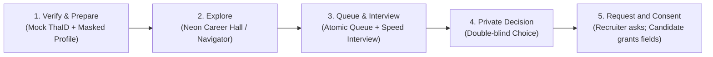

# 1. Executive Summary & Product Vision

> **Skills First. Bias Last.**  
> **“ปฏิวัติวงการหางาน เปลี่ยนศักยภาพที่แท้จริง ให้มีค่ากว่าหน้ากระดาษ”**
>
> Interactive 8-bit Virtual Job Fair สำหรับใช้งานผ่านเว็บเบราว์เซอร์บนมือถือ แท็บเล็ต และคอมพิวเตอร์

---

## 1.1 Product Overview

MaskedMatch คือ **Virtual Job Fair แบบ 2D top-down pixel world ภายในฮอลล์จัดงานขนาดใหญ่ (Neon Career Hall)** ที่ช่วยให้ผู้สมัครค้นหางาน เดินดูบูธ พูดคุยกับ NPC เจ้าหน้าที่และผู้สัมภาษณ์ เข้าคิว และสัมภาษณ์แบบ speed interview ผ่าน browser โดยบริษัทจะเห็น **Masked Candidate Profile** ที่เน้นทักษะและหลักฐานผลงานก่อนเห็นชื่อ รูป ประวัติส่วนตัว หรือข้อมูลติดต่อ การเลือกมุมมอง top-down และ indoor Career Hall เป็น `[USER + PROPOSED]`; PDF เดิมเปิดกว้างทั้ง third-person/top view

### 5-Step Core Experience Arc

1. **Verify & Prepare / Pre-event Quick Assessment** — ยืนยันบัญชี, อัปโหลด Resume/Portfolio, ให้ AI preprocess, ตรวจผล anonymization และเลือก avatar
2. **Explore** — เข้าสู่ Neon Career Hall ที่มีบูธ/NPC/props แบบ interactive, ค้นหาบูธด้วย map/list/search และดูคำแนะนำจากทักษะ
3. **Queue & Interview** — เข้าคิวแบบ server-authoritative, ยืนยัน ready check และเข้าสัมภาษณ์ 10–15 นาที
4. **Private Decision** — ผู้สมัครและ recruiter ตัดสินใจอย่างอิสระ โดยไม่เห็นคำตอบอีกฝ่าย
5. **Request and Consent** — เมื่อทั้งสองฝ่ายสนใจตรงกัน Recruiter ระบุ field + purpose ที่ต้องการก่อน Candidate grant บางส่วน/ทั้งหมดหรือ deny แล้วจึงเข้าสู่ follow-up pipeline

---

## 1.2 Product Promise & Experience Principles

### Product Promise

> “ให้โอกาสเริ่มต้นจากทักษะและหลักฐาน ก่อนตัดสินจากตัวตน”

MaskedMatch **ช่วยลดจุดที่อคติอาจเกิดขึ้น** แต่ **MUST NOT** สื่อสารว่า AI หรือระบบสามารถทำให้การจ้างงาน “ไร้อคติ 100%”

### Core Experience Principles

1. **Skills before identity** — แสดงสิ่งที่ทำได้ เหตุผลของ match และหลักฐานก่อน PII
2. **Playful, not trivializing** — สนุกเหมือนโลกเกม แต่การสมัครงานต้องจริงจัง ชัด และไว้ใจได้
3. **Movement with purpose** — การเดินช่วย discovery/wayfinding ไม่เป็นอุปสรรคต่อการสมัคร
4. **Mobile is a first-class browser experience** — ไม่ใช่ desktop ย่อส่วน
5. **Explicit interaction** — ไม่เปิดไมค์ กล้อง วิดีโอ หรือ reveal โดยอัตโนมัติ
6. **Accessible equivalent** — ทุก action ใน canvas ต้องทำผ่าน semantic DOM/List Mode ได้
7. **Explainable assistance** — คะแนน AI มีเหตุผล ความมั่นใจ และทางให้ผู้ใช้แก้ข้อมูล
8. **Human-accountable hiring** — AI เป็น decision support ไม่ใช่ผู้ตัดสิทธิ์
9. **Graceful degradation** — เน็ตช้า, media permission ไม่พร้อม หรือ AR ไม่รองรับยังใช้งาน core flow ได้
10. **Privacy by architecture** — แยก Identity Vault ออกจาก Masked Profile ตั้งแต่ data model

---

## 1.3 Problem Statement, Opportunity & Evidence Status

### Problem Hypotheses (จาก Pitch Deck Context)

- ผู้สมัครที่มีทักษะอาจถูกกรองก่อนมีโอกาสแสดงความสามารถ เพราะระบบพึ่งวุฒิ GPA ชื่อสถาบัน หรือ Resume มากเกินไป
- พื้นที่ อายุ รูปลักษณ์ เพศสภาพ และข้อมูลอัตลักษณ์อาจสร้างอคติในด่านแรก
- การจัด Job Fair และ skill verification แบบ on-site มีต้นทุน เวลา และข้อจำกัดด้านภูมิศาสตร์
- นายจ้างพบผู้สมัครจำนวนมาก แต่ยังจับคู่ skill requirement กับหลักฐานความสามารถได้ยาก
- ผู้สมัครต้องการพบหลายบริษัทโดยไม่เสียค่าเดินทางและไม่ต้องส่งข้อมูลส่วนตัวเกินจำเป็น

### Claims ที่ยังห้ามใช้เป็นข้อเท็จจริง `[PDF Context Guardrail]`

ตัวเลข `80%`, `10x`, `2.6M` และ demand/fill rate รายจังหวัดใน PDF ไม่มี source, ปี, sample, definition หรือ methodology อยู่ใน deck

ก่อนนำไปใช้ใน landing page, pitch, press release หรือ KPI baseline ทีม **MUST**:
1. ระบุแหล่งข้อมูลต้นฉบับ
2. ระบุปีและนิยาม metric
3. ตรวจสิทธิ์ในการนำเสนอ
4. ให้ Data/Product Owner อนุมัติ
5. ใส่ citation ที่ผู้ใช้เปิดอ่านได้

### Target Outcomes

- ผู้สมัครเข้าถึงการสัมภาษณ์ครั้งแรกได้เร็วขึ้น
- Recruiter พบผู้สมัครที่มี evidence ตรงกับ must-have skills มากขึ้น
- ลด queue abandonment และ no-show
- เพิ่ม mutual match ที่ไปต่อ assessment/interview รอบถัดไป
- ลดการเปิดเผย PII ก่อนจำเป็น
- วัดและลด disparity ของ recommendation โดยไม่ใช้ sensitive attribute ใน ranking
- เปิดทางให้ผู้สมัครต่างจังหวัด ผู้พิการ และผู้ที่เผชิญอคติเข้าร่วมได้

### Non-Goals (สิ่งที่ MaskedMatch ไม่ใช่)

MaskedMatch **ไม่ใช่**:
- ระบบตัดสินรับเข้าทำงานอัตโนมัติ
- เครื่องมือรับประกันว่าไม่มีอคติ
- ระบบสอบคุมเข้มที่ตัดสิทธิ์จาก eye movement หรือการสลับแท็บ
- Social game ที่คะแนน mini-game ส่งผลต่อการได้งานโดยไม่แจ้ง
- ATS เต็มรูปแบบใน MVP
- ระบบป้องกัน screenshot/screen recording ได้สมบูรณ์
- ระบบแทน legal/compliance review ของนายจ้าง
- Clone ของ Hideout หรือ Gather

---

## 1.4 Stakeholders & Impact Chain

| Stakeholder | Value hypothesis จาก PDF `[PDF]` | สิ่งที่ต้องวัดก่อน scale |
|---|---|---|
| **Candidate** | เข้าถึงโอกาสเท่าเทียมขึ้น, ลดค่าเดินทาง, แสดงทักษะก่อน identity | time-to-interview, completion, perceived fairness, geographic reach |
| **Employer / HR** | พบหลักฐานทักษะตรงงาน, ลดเวลา/ต้นทุนงานแฟร์และ screening | qualified-match rate, recruiter hours, cost per next step |
| **Government** | ลดต้นทุนการจัดสอบ/งานแฟร์และได้ข้อมูลตลาดแรงงานแบบรวม | public cost baseline, privacy-safe coverage, policy usefulness |
| **Education** | เห็น skill-demand/fill gap เพื่อปรับหลักสูตรและการเตรียมบัณฑิต | graduate-to-employment outcome, curriculum feedback adoption |

### Marginalized Groups Roadmap `[PDF Aspiration]`
PDF วางเส้นทางอนาคตจากบุคคลทั่วไปไปสู่กลุ่มที่เผชิญอคติรุนแรง เช่น **ผู้พ้นโทษ ผู้พิการ และ LGBTQ+** การขยายไปแต่ละกลุ่ม **MUST** ใช้ community co-design, accessibility, legal/ethics review และห้ามเหมารวมว่ากลุ่มดังกล่าวต้องการ flow เดียวกัน
