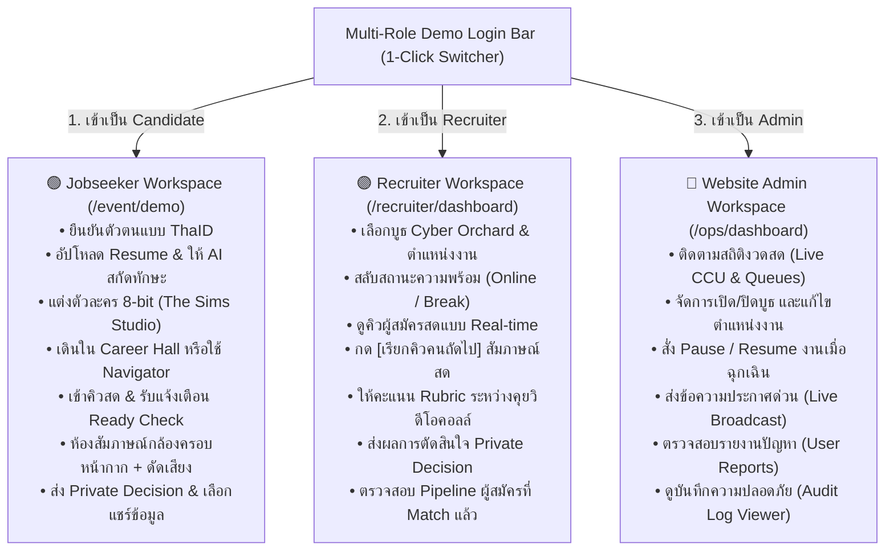

# 3. Users, Personas & Permission Matrix

---

## 3.1 Primary Personas & Design Jobs

### A. Candidate / Job Seeker
- **Goals & Needs:**
  - ค้นหาตำแหน่งงานที่ตรงทักษะและพิสูจน์ตนเองผ่านผลงานและบทสนทนาจริง
  - ต้องการความเท่าเทียม โดยไม่ถูกคัดออกจากอคติเรื่องเพศ อายุ สถาบัน หรือรูปลักษณ์
  - ควบคุมข้อมูลส่วนตัว (PII), กล้อง, เสียง และเลือก field ที่จะเปิดเผยหลัง match ได้
  - เห็นเหตุผลของคำแนะนำ AI และสามารถตรวจสอบ/แก้ไขข้อมูลที่ถูกสกัดผิดพลาดได้
- **Device Context:** สมาร์ทโฟนมือถือเป็นอุปกรณ์หลัก (Touch-first, 320–390 CSS px) หรือคอมพิวเตอร์/แท็บเล็ตที่มีความเสถียรของอินเทอร์เน็ตหลากหลาย
- **Key Design Jobs:**
  1. ยืนยันตัวตนผ่านระบบ Digital IDและตั้งค่าความเป็นส่วนตัว
  2. อัปโหลด/กรอก Resume และตรวจสอบ Masked Profile
  3. สำรวจบูธผ่าน Interactive World หรือ Navigator
  4. เข้าคิวสัมภาษณ์และรับ Ready Check
  5. สัมภาษณ์แบบ Speed Interview 10–15 นาทีพร้อม Privacy Fallback (Avatar-only)
  6. ส่งผลการตัดสินใจส่วนตัวและเลือกเปิดเผยข้อมูล (Consent-based Reveal)

### B. Recruiter / Interviewer
- **Goals & Needs:**
  - ค้นพบผู้สมัครที่มีทักษะและหลักฐานผลงานตรงตาม Requirement ที่แท้จริง
  - จัดการเวลา availability, รับคิว, ทำการสัมภาษณ์ด้วย Structured Rubric
  - ส่งผลการตัดสินใจอย่างเป็นอิสระ โดยไม่เห็นผลของผู้สมัครก่อน
- **Safety Invariant:** **MUST NOT** เข้าถึง Original Resume, ชื่อ, รูป, เบอร์โทร หรือ PII ใดๆ ก่อนเกิด Mutual Match เมื่อ Job นั้นเปิด Blind Mode
- **Key Design Jobs:**
  1. ตั้งสถานะความพร้อม (`รับคิว`, `พัก`, `ออฟไลน์`)
  2. ดู Masked Profile และ Evidence-based Match Explanation
  3. สัมภาษณ์ผู้สมัครและจดบันทึก Rubric ส่วนตัว
  4. ส่งผลการตัดสินใจแบบ Private
  5. รับข้อมูลติดต่อของผู้สมัครเมื่อเกิด Mutual Match และ Candidate ยินยอม

### C. Company Admin
- **Goals & Needs:**
  - ยืนยันตัวตนองค์กร (Organization Verification)
  - สร้างและจัดการบูธ (Booth CRUD) และตำแหน่งงาน (Job Posting)
  - เชิญและจัดการสิทธิ์ของทีม Recruiter
  - ติดตาม Aggregate Funnel ของบริษัทโดยไม่ละเมิดสิทธิ์ข้อมูลส่วนบุคคล

### D. Event Organizer
- **Goals & Needs:**
  - สร้างและกำหนดค่า Event, แผนที่, โซน, กำหนดการ และนโยบาย (EventPolicy)
  - จัดสรรพื้นที่บูธของบริษัท และบริหารจัดการ Capacity
  - ดูแลสถานการณ์สด (Live Operations): Pause/Resume โซนหรือคิวเมื่อเกิดเหตุขัดข้อง
  - ประกาศข้อความฉุกเฉิน (Broadcast Message)

### E. Moderator / Support
- **Goals & Needs:**
  - รับเรื่องร้องเรียน (User Reports: Harassment, Impersonation, Leak, Technical)
  - ให้ความช่วยเหลือด้าน Accessibility และจัดการปัญหาเทคนิค
  - ย้ายหรือระงับผู้ใช้งานที่ทำผิดกฎ
- **Safety Invariant:** ไม่มีสิทธิ์ดู PII โดยปริยาย การเปิดดูข้อมูลต้องผ่านกระบวนการ **Break-Glass Access** ที่มี Approval และ Audit บันทึกเสมอ

### F. Auditor / Data Protection Officer (DPO)
- **Goals & Needs:**
  - ตรวจสอบ Consent Record, Reveal Log, Retention/Deletion Purge และ Access Log
  - ตรวจสอบรายงานความเป็นธรรม (Fairness & Disparity Report)
  - สิทธิ์ Read-only ตามขอบเขต และใช้ข้อมูล Pseudonymous/Aggregate เสมอ

---

## 3.2 Canonical Demo Roles (R0 Hackathon Prototype)

| Role | Demo capability | Must not see / do |
|---|---|---|
| **Candidate** | Onboarding, profile review, world/list, queue, interview, decision, reveal consent | Recruiter rubric ส่วนตัว, decision ของอีกฝ่าย, ข้อมูล candidate คนอื่น |
| **Recruiter** | Availability, assigned job, queue/session, masked profile, interview, private decision | PII ก่อน reveal, raw resume, integrity timeline, candidate decision ก่อนปิดผล |
| **Organizer** | Event health และ pause/resume ใน optional admin demo | เปิด PII หรือแก้ decision |
| **Demo Controller** | Reset scenario, select preset (Happy, No match, Media denied, Queue timeout, Offline) และ speed dispatch | ปรากฏเป็น production role หรืออยู่ใน navigation ของผู้ใช้จริง |

---

## 3.3 RBAC Permission Matrix

| Capability | Candidate | Recruiter | Company Admin | Organizer | Moderator | Auditor |
|---|:---:|:---:|:---:|:---:|:---:|:---:|
| **แก้ Candidate Profile ของตน** | ✓ (Own) | — | — | — | — | Read by policy |
| **ดู Masked Profile ก่อน match** | ✓ (Own) | Assigned only | Aggregate | — | Incident only | Controlled |
| **ดู Candidate PII ก่อน match** | ✓ (Own) | ✕ | ✕ | ✕ | ✕ | Legal scope only |
| **จัดการ Job / Booth** | — | Limited | ✓ | Approve | — | Read |
| **จัดการ Queue availability** | — | Own booth | Company | Override | Support | Read |
| **ส่ง interview decision** | ✓ (Own) | Assigned | ✕ | ✕ | ✕ | Read audit |
| **เปิดเผย contact หลัง consent** | ✓ (Controls) | Matched only | Matched pipeline | ✕ | ✕ | Read audit |
| **Pause event / zone** | — | — | Own booth request | ✓ | Emergency | — |
| **เปิด break-glass PII** | — | — | — | — | Approved only | Approved only |

### Security Principles:
1. **Deny by default** — ทุก Request ต้องถูกปฏิเสธจนกว่าจะมี Policy อนุญาต
2. **Least privilege** — ผู้ใช้และ Service เข้าถึงเฉพาะข้อมูลที่จำเป็นต่อ Role นั้นๆ
3. **Tenant isolation** — ข้อมูลของแต่ละบริษัท/องค์กรถูกแยกขาดจากกัน
4. **Field-level authorization** — การเข้าถึง Profile แยกสิทธิ์ราย Field ชัดเจน (เช่น ทักษะ vs ข้อมูลติดต่อ)

---

## 3.4 Multi-Role Demo Login & 3 Production Workspaces (ทำงานได้จริงครบ 3 บทบาท)

เพื่อความสะดวกในการทดสอบ นำเสนอ และใช้งานจริง ระบบมี **Multi-Role One-Click Demo Login Bar** ที่หน้าแรก (`/` หรือ `/auth/sign-in`) ให้สามารถสลับเข้าใช้งานได้ทันทีใน 3 บทบาทหลักที่ **ทำงานได้จริง 100% (Fully Functional & Operable)**:

### 1. ฝั่งผู้สมัครงาน (Jobseeker / Candidate Workspace)
- **1-Click Demo Login:** เข้าเป็น `Candidate #8F3A` ได้ทันที (หรือล็อกอินด้วย Supabase Auth)
- **ฟังก์ชันทำงานจริง:**
  1. ยืนยันตัวตนผ่าน ThaID (พร้อมป้าย DEMO)
  2. นำเข้า Resume ให้ AI สกัดทักษะ พร้อมหน้าจอ Side-by-Side Review
  3. สตูดิโอสร้างตัวละคร 8-Bit (สุ่มเสื้อผ้า ทรงผม สีผิว หน้ากากสัตว์)
  4. เดินในฮอลล์งานแฟร์ Phaser 3 หรือเปิดโหมดรายการ Navigator
  5. ดูรายละเอียดบูธและคะแนนความตรงกัน 0–100 พร้อมคำอธิบาย AI
  6. กดเข้าคิวสัมภาษณ์สด และรับการแจ้งเตือน Ready Check (60s)
  7. เข้าห้องสัมภาษณ์ LiveKit WebRTC เปิดกล้องจริง ครอบหน้ากาก และดัดเสียง
  8. ส่งผลการตัดสินใจส่วนตัว และเลือกฟิลด์ข้อมูลติดต่อที่จะเปิดเผย

### 2. ฝั่งผู้สัมภาษณ์และบริษัท (Recruiter Workspace)
- **1-Click Demo Login:** เข้าเป็น `Recruiter #R12` (Cyber Orchard Co.) ได้ทันที
- **ฟังก์ชันทำงานจริง:**
  1. สลับสถานะความพร้อมรับคิว (`พร้อมรับคิว`, `กำลังสัมภาษณ์`, `พัก`, `ออฟไลน์`)
  2. หน้าจอ Live Queue Board แสดงรายชื่อผู้สมัครที่กำลังรอคิวแบบ Real-time
  3. ปุ่ม **`[เรียกผู้สมัครคนถัดไป]`** ส่งสัญญาณ Ready Check ไปยังผู้สมัครทันที
  4. เข้าห้องสัมภาษณ์ร่วมกับ Candidate ใน WebRTC Room เดียวกัน
  5. แผงประเมินรูบริก (Structured Rubric) และบันทึกโน้ตส่วนตัว
  6. ส่งผลการตัดสินใจส่วนตัว (Private Decision)
  7. ดูรายชื่อผู้สมัครที่เกิด Mutual Match พร้อมข้อมูลติดต่อที่ได้รับอนุญาตแล้ว

### 3. ฝั่งผู้ดูแลระบบและผู้จัดงาน (Website Admin & Operations Workspace)
- **1-Click Demo Login:** เข้าเป็น `Event Lead / System Admin` ได้ทันที
- **ฟังก์ชันทำงานจริง:**
  1. **Live Event Operations Dashboard:** ตรวจสอบผู้ใช้งานออนไลน์สด (CCU), ปริมาณคิวสะสม, สถานะเซิร์ฟเวอร์ และสถิติการเกิด Mutual Match
  2. **Booth & Job Manager:** เปิด/ปิดบูธ, แก้ไขรายละเอียดงาน, สลับตำแหน่งบูธในแผนที่ 2D
  3. **Emergency Controls:** สั่ง **Pause / Resume Event** หรือระงับการรับคิวชั่วคราว
  4. **Live Broadcast Banner:** ส่งข้อความประกาศด่วนแจ้งเตือนทุกคนในงานแบบ Real-time
  5. **Moderation & Incident Desk:** ตรวจสอบข้อร้องเรียน รายงานปัญหา และระงับผู้ใช้ที่ทำผิดกฎ
  6. **Security & Audit Viewer:** ตรวจสอบ Log การเปิดเผยข้อมูลและการเข้าถึงระบบ (Tamper-evident Audit)

