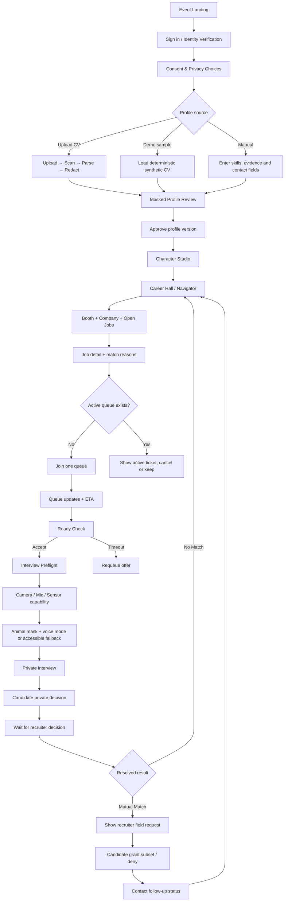
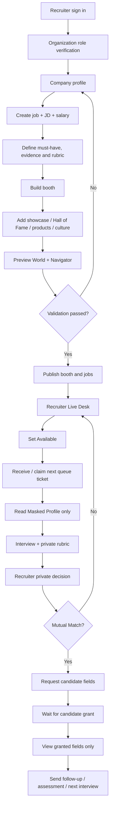

# End-to-End Role Journeys — Demo-Executable / API-Ready

> **Document role:** Canonical owner ของ flow ผู้ใช้ทั้งสามฝั่ง
> **Version:** 3.1 · 23 August 2026

ทุก flow ในเอกสารนี้ต้องทำงานได้สองโหมดโดยไม่เปลี่ยนหน้าจอหรือกฎธุรกิจ:

- `demo` — ใช้ synthetic fixtures, local demo adapter และ deterministic scenario engine; ต้องติดป้าย `DEMO DATA / MOCK SERVICE`
- `connected` — ใช้ REST/WebSocket/Object Storage/Identity/Media providers จริงผ่าน backend; ห้ามส่ง secret หรือ provider key ไป frontend

Demo ไม่ใช่ภาพกดต่อกันเฉยๆ ทุก action ต้องเรียก adapter, เปลี่ยน canonical state, persist/recover และคืน error envelope แบบเดียวกับ production

---

## 1. Job Seeker Journey

### 1.1 Complete happy path



### 1.2 Route and behavior contract

| Step | Canonical route | Demo behavior | Connected behavior |
|---|---|---|---|
| Event | `/events/:eventSlug` (demo: `/event/demo`) | synthetic schedule/companies | event API snapshot |
| Sign in / verify | `/auth/sign-in`, `/app/onboarding` (demo: `/demo/verify`) | create mock verified alias | OIDC/approved identity-provider callback |
| Consent | `/app/onboarding` | persist versioned local record | consent API + audit |
| CV/profile source | `/candidate/profile/import` | sample CV, manual form หรือ local file simulation | signed upload URL, malware scan, parser job |
| Processing | `/candidate/profile/processing/:resumeId` | deterministic progress through real lifecycle states | poll/WebSocket processing state |
| Masked review | `/candidate/profile/review` | synthetic extracted fields + redaction spans | immutable profile version from API |
| Avatar | `/candidate/avatar` | local persisted compositor options | save `AvatarAppearance` through profile API |
| Hall | `/app/events/:eventId/world` (demo: `/event/demo/world`) | Phaser world + local fixtures | presence/WebSocket + server-authoritative state |
| Booth/jobs | `/app/booths/:boothId`, `/app/jobs/:jobId` | same synthetic catalog used by World/Navigator | company/booth/job APIs |
| Queue | persistent Queue Chip + `/app/queue` | shared scenario store; exactly one active ticket | durable queue API + WebSocket |
| Preflight | `/app/interviews/:sessionId/preflight` | real browser permission checks where available; deterministic fallback | policy + short-lived media token |
| Interview | `/app/interviews/:sessionId` | same-device/two-tab simulated peer or configured media provider | WebRTC room; transformed tracks only |
| Decision | `/app/interviews/:sessionId/decision` | private per-role demo state | encrypted server decision |
| Result/reveal | `/app/matches/:matchId/result`, `/app/matches/:matchId/reveal` | resolver waits for both demo roles | atomic server resolver + reveal APIs |
| Recruiter console | `/recruiter/demo` (alias `/company/demo`) | company/job form, publish state, live synthetic queue, interview readiness, decision and contact-field request persist locally | organization, job, queue, interview, decision and reveal-request APIs |
| Operations console | `/operations/demo` (alias `/admin/demo`) | service-health board and resolvable synthetic support inbox | telemetry, audit, incident, support and privileged queue-control APIs |

### 1.2.1 Browser-visible implementation status

- Website-first local slice มี visible routes สำหรับ membership, Candidate profile/PDF analysis, fair directory/detail, Admin fair และ Recruiter company/booth/job พร้อม browser persistence
- local slice นี้ยังไม่ใช่ identity verification หรือ production authorization; Password hash และข้อมูลอยู่ใน browser เครื่องเดียว
- Candidate approval/versioning, Operations journey, mutual-decision resolver, per-field reveal grant, media, game และ connected domain adapters ยังไม่ถูกสร้าง
- ลำดับ implementation ใช้ [Implementation Execution Plan](../07-playbooks-and-operations/implementation-execution-plan.md)
- เมื่อสร้าง Phaser compositor ต้อง flush/render ตาม API ของ version ที่ pin และเพิ่ม regression test ครอบคลุม Player, NPC และ Avatar Preview ที่ใช้ compositor กลาง

### 1.3 CV and contact data contract

Candidate เลือกวิธีเริ่มต้นได้ 3 ทางและแก้ไขก่อน Approve เสมอ:

1. **Upload CV:** PDF/DOCX → quarantine → scan → parse → redact → review
2. **Use demo CV:** โหลดข้อมูลสังเคราะห์ที่มี `resumeId`, extracted facts, redaction spans และ processing history จริงใน demo store
3. **Manual profile:** กรอก role, skills, evidence, education summary และ contact fields ที่ต้องการเก็บใน Identity Vault

Contact fields ที่รองรับ: `legal_name`, `email`, `phone`, `resume_file`, `education_credentials`, `portfolio`, `location_region` และ `postal_address` โดย `postal_address` เป็นข้อมูลความเสี่ยงสูง ไม่อยู่ใน default request และต้องมีเหตุผลเฉพาะงาน

### 1.4 Queue, interview and result rules

- Candidate มี active queue ticket ได้ **หนึ่งใบต่อ event**; การกดบูธใหม่ต้องแสดง ticket เดิมและให้ยกเลิกอย่างชัดเจนก่อน
- Ready Check ใช้ server/demo authoritative countdown 60 วินาทีและ recover หลัง refresh
- Preflight ตรวจ camera, mic, output, bandwidth, face-landmark capability และ selected privacy mode
- กล้อง/ไมค์ปิดเริ่มต้น; raw face ห้ามส่งเมื่อ mask pipeline ยังไม่ valid
- fallback ที่ต้องทำงาน: animal-mask video, avatar-only, audio-only และ text-assisted
- หลังจบการคุยแต่ละฝ่ายส่ง `INTERESTED` หรือ `PASS` แบบส่วนตัว ระบบแสดงผลทันทีเมื่อคำตอบครบทั้งสองฝ่าย
- No Match แสดงผลสุภาพโดยไม่บอกว่าใครเลือก Pass แล้วกลับไปเดินบูธอื่น/ใช้ Navigator ได้ทันที
- Mutual Match ยังไม่เปิด PII จน recruiter ส่ง field request และ candidate อนุญาตเป็นรายฟิลด์

---

## 2. Recruiter / Company Journey

### 2.1 Company setup and publication



### 2.2 Required company data

| Area | Required fields |
|---|---|
| Company | legal/display name, registration verification status, industry, summary, website, work locations, contact owner |
| Job | title, JD summary, responsibilities, must-have, nice-to-have, evidence accepted, salary range, employment type, location/work mode, interview duration |
| Fairness rubric | job-related criteria, weights, minimum evidence, prohibited proxy review |
| Booth | template, dynamic sign, theme tokens, recruiter desk, active jobs, accessibility note, queue state |
| Showcase | title, type, short description, media/asset provenance, link, display order, publish status |
| Showcase types | product/demo, project, award, case study, team culture, benefits, Hall of Fame; ห้ามใช้บุคคลจริงโดยไม่มีสิทธิ์ |

Company Editor ต้อง Save Draft, Preview, Validate, Publish, Unpublish และ recover version conflict ได้จริง Demo ใช้ synthetic company fixture แต่ทำ transition ชุดเดียวกัน

### 2.3 Recruiter live operations

- Availability: `OFFLINE`, `AVAILABLE`, `BUSY`, `BREAK`
- Queue Board แสดงเฉพาะ alias, job, waiting time และ masked skill summary
- Claim/dispatch ต้อง atomic; recruiter สองคนห้ามรับ candidate เดียวกัน
- ก่อน interview recruiter เห็นเฉพาะ approved Masked Profile และ rubric ที่เกี่ยวกับงาน
- recruiter decision เป็นส่วนตัวและแก้ไม่ได้หลัง submit ตาม policy
- เมื่อ Mutual Match recruiter ต้องส่ง `RevealRequest` ก่อน โดยเลือกฟิลด์และให้เหตุผล
- default request template: `legal_name`, `email`, `phone`, `resume_file`; candidate สามารถอนุญาตเพียงบางรายการหรือปฏิเสธทั้งหมด
- `education_credentials`, `portfolio`, `location_region` เป็น optional; `postal_address` ไม่เป็น default และต้องมี justification + policy allowance
- Recruiter อ่านได้เฉพาะ field grants ที่ candidate อนุมัติ และต้องเห็นสถานะ `REQUESTED`, `PARTIALLY_GRANTED`, `GRANTED`, `DENIED`, `EXPIRED`

---

## 3. Organizer, Maintenance and Support Journey

Organizer/Support เป็นภาพรวมระบบ ไม่เข้าถึง raw decision, biometric landmarks, raw integrity timeline หรือ PII โดยอัตโนมัติ

| Workspace | Primary actions |
|---|---|
| Event Overview | create/publish/start/pause/resume/end event, capacity, active booths, session counts |
| Queue Health | queue depth, wait percentiles, recruiter availability, stuck ticket recovery |
| Interview Health | connecting/live/reconnecting counts, media provider status, technical cancellation |
| Company Moderation | verify organization, review booth/showcase provenance, suspend invalid content |
| Support Desk | create/assign/resolve support ticket, accessibility assistance, technical recovery |
| Incident Center | broadcast notice, pause affected zone/queue, audit operator actions |
| Maintenance | integration health, schema/version compatibility, job worker status, feature flags |
| Privacy Operations | DSAR status, retention/purge status, break-glass request with approval |

Demo dashboard ใช้ aggregate scenario metrics จาก state เดียวกับ Candidate/Recruiter tabs; production ใช้ scoped ops APIs และ append-only audit

---

## 4. Shared Demo Scenario Contract

สาม role ต้องเห็น state เดียวกันผ่าน `DemoScenarioStore` ไม่ใช้ค่าคนละชุดในแต่ละหน้า:

```text
DemoScenario
├── event + integration health
├── candidate identity/profile/avatar
├── company/jobs/booth/showcases
├── recruiter availability
├── active queue ticket + ready check deadline
├── interview session + preflight/media mode
├── private candidate decision
├── private recruiter decision
├── resolved match result
├── reveal request + candidate field grants
├── follow-up status
└── support/incidents/audit events
```

- Cross-tab sync ใช้ `BroadcastChannel` พร้อม `localStorage` snapshot fallback
- ทุก mutation มี idempotency key, entity version และ timestamp
- `/demo/control` reset/preset ได้ แต่ห้ามเปลี่ยน state ลับของอีก role จาก UI ปกติ
- Presets ขั้นต่ำ: Happy Match, No Match, Media Denied, Queue Timeout, Offline Recovery และ Reveal Partial Grant
- เปลี่ยน `VITE_APP_MODE=connected` แล้ว UI ต้องเรียก HTTP/WebSocket adapters โดยไม่ import demo store ใน production bundle path

---

## 5. Recovery and Completion Rules

| Failure | Required recovery |
|---|---|
| Refresh during profile processing | resume processing ID และ state ล่าสุด |
| Duplicate queue join | คืน active ticket เดิม ไม่สร้างใบใหม่ |
| Ready Check timeout | expire + one-time requeue offer โดยไม่ลงโทษ |
| Recruiter disconnect | return ticket พร้อม priority เดิม |
| Camera/mic denied | continue with avatar/audio/text fallback |
| Mask tracking lost | fail closed before raw frame; switch to avatar |
| Interview network loss | 60-second reconnect grace + state resync |
| One decision pending | ซ่อนอีกฝ่ายและแสดง waiting state |
| No Match | no PII reveal; allow continued booth exploration |
| Reveal request denied/partial | recruiter sees only granted fields; no coercive retry |
| API unavailable in connected mode | truthful offline/error state; never silently switch to demo data |

Flow จะถือว่า production-demo-complete เมื่อผู้ทดสอบทำ Happy Match และ No Match ได้ครบจาก visible controls ในสาม role tabs โดยไม่แก้ local storage หรือเรียก developer console ปัจจุบัน flow ทั้งหมดเป็น target และยังไม่ผ่าน gate ตาม section 1.2.1
