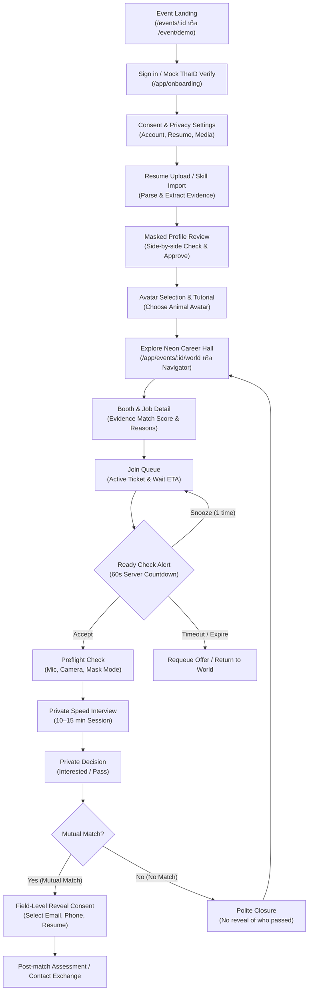
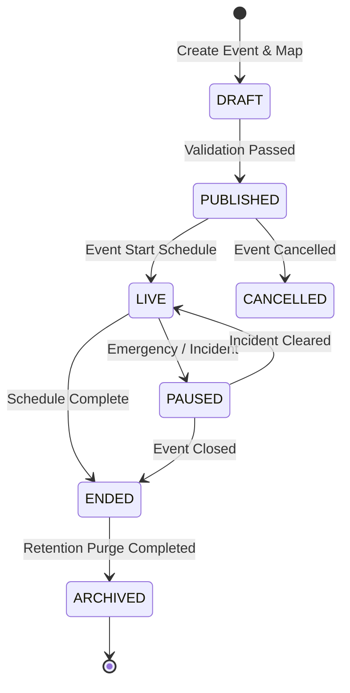

# 2. End-to-End User Journeys & Failure Handling

---

## 2.1 Candidate Journey

### Flowchart



### Canonical Candidate Happy Path (R0 Route Sequence)

```text
/event/demo
  → /demo/verify (Mock verification with DEMO banner)
  → /candidate/profile/import (Use sample resume or form)
  → /candidate/profile/review (Side-by-side redaction review & approve)
  → /candidate/avatar (Select animal avatar & controls tutorial)
  → /event/demo/world (Enter Neon Career Hall / Navigator)
  → /event/demo/booths/cyber-orchard/jobs/backend-developer (Inspect job & match score)
  → Join Queue (Queue HUD active: ticket queue-demo-001)
  → Ready Check (60s Alert Dialog) → Accept
  → /interviews/demo-session (Preflight & 12-min Interview with avatar/mask)
  → /decisions/demo-session (Submit private Interested decision)
  → /matches/demo-match/reveal (Select email + portfolio to reveal)
```

---

## 2.2 Recruiter Journey

### Core Steps

1. **Onboarding & Verification:** เข้าสู่ระบบและผ่านการยืนยันบทบาท Organization Recruiter
2. **Availability & Rubric Check:** ตั้งสถานะความพร้อม (`รับคิว`, `พัก`, `ออฟไลน์`) และตรวจทาน Job Rubric
3. **Queue Dispatch:** เปิดรับผู้สมัครตามลำดับ FIFO โดย Queue Orchestrator ส่งคำขออย่างเป็น Atomic
4. **Masked Profile Assessment:** ตรวจสอบเฉพาะ Masked Profile, ทักษะ, หลักฐานผลงาน และคำอธิบายความตรงกันของทักษะ (Match Explanation)
5. **Interview Session:** ทำการสัมภาษณ์ 10–15 นาที พร้อมประเมินตามเกณฑ์ Rubric ส่วนตัว
6. **Private Decision Submission:** ส่งผลการประเมินแบบส่วนตัว (`สนใจไปต่อ` หรือ `ยังไม่ไปต่อ`)
7. **Reciprocal Disclosure:** เมื่อเกิด Mutual Match ให้ยืนยันข้อมูลผู้ติดต่อฝั่งบริษัทที่เปิดเผยตอบกลับ
8. **Next Steps:** ส่งแบบทดสอบ (Post-match Assessment) หรือกำหนดการสัมภาษณ์รอบถัดไป

### Canonical Recruiter Happy Path (R0 Route Sequence)

```text
/demo/role/recruiter
  → /recruiter/demo/dashboard
  → Set availability to "AVAILABLE" (รับคิว)
  → Accept dispatched session (Candidate #8F3A)
  → /interviews/demo-session (Interview with structured rubric)
  → Submit private decision ("สนใจไปต่อ")
  → View revealed candidate fields (only after candidate consent confirmed)
```

---

## 2.3 Event Organizer Lifecycle Journey



1. **`DRAFT`** — สร้าง Event, จัดวางโซนและบูธบนแผนที่, กำหนด EventPolicy, Rubric และจัดสรรเจ้าหน้าที่
2. **`PUBLISHED`** — เปิดหน้า Landing และรับลงทะเบียน แต่ World ยังไม่เปิด
3. **`LIVE`** — เปิด Career Hall, เปิดระบบคิว และเริ่มดำเนินกิจกรรม
4. **`PAUSED`** — หยุดรับคนเข้าชั่วคราวหรือระงับคิวเฉพาะโซนเมื่อเกิด Incident หรือ Capacity เกินขีดจำกัด
5. **`ENDED`** — ปิดรับคิวใหม่ แต่ปล่อยให้รอบสัมภาษณ์ที่ดำเนินอยู่เสร็จสิ้นตามข้อกำหนด
6. **`ARCHIVED`** — ปิด World สมบูรณ์, สรุปผลรายงานภาพรวม (Aggregate Metrics) และเริ่ม Retention Purge Jobs

---

## 2.4 Failure & Recovery Journeys

### A. Refresh During Queue (`QUEUED` State)
- **Problem:** ผู้สมัครเผลอ Refresh หน้าจอ หรือสัญญาณอินเทอร์เน็ตหลุดระหว่างรอคิว
- **Recovery:** Client ดึง Ticket เดิมจาก Server หรือ Session Storage (ด้วย Cache Key `maskedmatch.demo.v1`) คืนค่า Ticket เดิม, ตำแหน่งในคิว, และเวลาประมาณการ โดย **ไม่สร้าง Ticket ใหม่ซ้ำซ้อน**

### B. Ready Check Timeout
- **Problem:** ผู้สมัครไม่กดตอบรับ Ready Check ภายใน 60 วินาที
- **Recovery:** ระบบเปลี่ยนสถานะเป็น `EXPIRED` ปล่อยสิทธิ์ให้คนถัดไป และเสนอทางเลือก **"เข้าคิวใหม่ (Requeue)"** 1 ครั้ง โดยไม่บันทึกความผิดหรือตัดสิทธิ์

### C. Media Permission Denied / Mask Pipeline Failure
- **Problem:** ผู้ใช้ไม่อนุญาตให้เข้าถึงกล้อง/ไมค์ หรือระบบประมวลผล Face Mask ทำงานล้มเหลว
- **Recovery:** ระบบหยุดการส่งวิดีโอทันที (**Fail-Closed Policy**) และสลับเข้าสู่โหมด **Avatar-Only, Audio-Only หรือ Text-Assisted** โดยกระบวนการสัมภาษณ์และส่งผลการตัดสินใจยังดำเนินต่อไปได้ตามปกติ

### D. Temporary Network Offline During Interview
- **Problem:** อินเทอร์เน็ตขาดหายระหว่างการสัมภาษณ์
- **Recovery:** ระบบให้ Grace Period 60 วินาที แสดงสถานะ `RECONNECTING` ชัดเจนทั้งสองฝ่าย นาฬิกา Session เดินต่อตามเวลา Server เมื่อกลับมาเชื่อมต่อใหม่จะ Sync สถานะห้องทันที

### E. No Match Outcome Privacy
- **Problem:** ผลการตัดสินใจไม่ตรงกัน (ฝ่ายใดฝ่ายหนึ่งหรือทั้งสองฝ่ายเลือก Pass)
- **Recovery:** ระบบแสดงข้อความปฏิเสธอย่างสุภาพ **โดยไม่เปิดเผยว่าใครเป็นผู้เลือก Pass** และข้อมูลติดต่อยังคงถูกปิดบัง 100%
