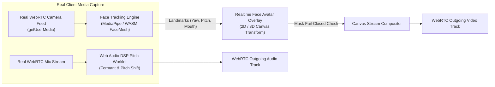

# 1. 8-Bit Visual Design System, Generated Assets & Real Privacy Engines

---

## 1.1 Creative Direction: “Neon Career City”

ภาพรวมของ MaskedMatch คือ **ฮอลล์งานแฟร์อนาคตแบบ Pixel Art ผสมผสาน Neon Aesthetics**:
- **บรรยากาศ:** Professional Convention Hall ผสมผสานกับ Modern Coworking Space, Exhibitor Booths, Recruiter Tables, Indoor Lounge, Support Desk, และ Device Test Pods
- **อารมณ์:** ฉลาด เป็นมิตร มีความหวัง ไม่ดูเด็กเกินไป (Retro-futuristic แต่ชัดเจน อ่านง่ายเหมือน Modern SaaS)
- **Top-Down Perspective:** World เป็นภาพ 2D Top-Down แบบ Full-bleed ในขณะที่ Form, HUD, และ Navigation เป็น Semantic DOM Overlay ที่คมชัดและเข้าถึงได้ (Accessible)

### Inspiration Boundary (ความแตกต่างจาก Hideout / Gather)

MaskedMatch นำเฉพาะแนวคิด **Spatial Presence, Contextual Interaction, Event Wayfinding, และ Customizable Booths** มาปรับใช้

**MUST NOT** คัดลอก:
- ✕ Sprite, Tileset, Map Layout, Furniture, หรือ Character Avatar
- ✕ Exact Color Palette, Typography, Navigation Chrome หรือ Component Composition
- ✕ Copywriting, Sound Effect, Logo, Trademark หรือ Trade Dress

---

## 1.2 Strict No-Emoji Policy & Generated Asset Standard

> **กฎเหล็กด้านงานภาพ:** **MUST NOT** ใช้อิโมจิ (Emoji) เป็นตัวแทนของวัตถุในเกม, อุปกรณ์ประกอบฉาก, ตัวละคร, หรือองค์ประกอบบนเว็บโดยเด็ดขาด

ทุก Element ประกอบฉากและส่วนติดต่อผู้ใช้จะต้องสร้างผ่าน **Generated Elements / Custom Pixel Art / Vector SVGs** เพื่อความสมจริงและเอกภาพด้าน Visual Hierarchy:

1. **อุปกรณ์ประกอบฉาก (Scene Props):** เก้าอี้, โต๊ะสัมภาษณ์, Kiosk ข้อมูล, Coffee Cart, ตู้เซิร์ฟเวอร์, ฉากกั้น (Partitions), และโคมไฟนีออน ต้องเป็น Pixel Sprite ที่ Generate ขึ้นมาเฉพาะ
2. **ตัวละครและ NPC (Characters & NPCs):** ผู้สมัคร (Candidates), ผู้สัมภาษณ์ (Recruiters), เจ้าหน้าที่จัดงาน (Staff), และผู้เชี่ยวชาญด้านการเข้าถึง (A11y Guides) ต้องมี Sprite Sheet 4 ทิศทาง พร้อม Walk/Idle Animation
3. **บูธบริษัทจัดแสดง (Exhibitor Booths):** โครงสร้างบูธ, Dynamic Logo Fixtures, เคาน์เตอร์ต้อนรับ และจอแสดงผลสื่อประชาสัมพันธ์
4. **ของตกแต่งในแผนที่ (Map Decorations):** กระถางต้นไม้ไซเบอร์, ลวดลายพื้นกระเบื้อง, พรมทางเดิน, และเส้นแสงนีออนนำทาง
5. **Web UI Elements:** ไอคอนสถานะ, ป้าย Badge, สัญลักษณ์นำทาง, ปุ่มควบคุมมัลติมีเดีย ต้องใช้ Custom Pixel SVG Icons แทนอิโมจิ

---

## 1.3 Strict Prohibition: Zero Unfinished / Raw UI Standard (ข้อห้ามเด็ดขาด: ห้าม UI ดิบหรือไม่เสร็จ)

> ⛔ **ข้อห้ามเด็ดขาด (Strict Prohibition):**
> **ห้ามปล่อยให้หน้าเว็บแสดงผลเป็น Raw HTML ดิบๆ ที่ขาดการโหลด CSS/Tailwind, ขาด Flexbox/Grid จัดกึ่งกลาง, ขาดสี/Gradient/Neon Glow, หรือปุ่ม/การ์ดดูเหมือน MVP ไม่เสร็จโดยเด็ดขาด!**

ทุกหน้าจอและคอมโพเนนต์ต้องปฏิบัติตามมาตรฐานดังนี้:
1. **Complete CSS Compilation:** ต้องมี Tailwind CSS / PostCSS หรือ CSS System ที่คอมไพล์สมบูรณ์ 100% ห้ามมี Utility Class ที่หลุดหรือไม่ทำงาน
2. **Rich Visual Polish:** ทุก Card, Modal, Button ต้องมี Background Surface ชัดเจน (`#17162E` / `#262047`), Border เรืองแสง (`#8B5CF6` / `#37E7FF` / `#FF4FD8`), และ Hover/Active Transitions
3. **Structured Responsive Containers:** จัด Layout กลางจออย่างประณีต มี `max-w-6xl mx-auto`, Grid Columns ที่มีสัดส่วน, และ Padding สม่ำเสมอ ไม่กองข้อความชิดขอบซ้าย
4. **No Default Browser Controls:** ห้ามใช้ปุ่มปุ่มเหลี่ยมสีเทามาตรฐานหรือฟอร์มดิบของเบราว์เซอร์ ต้องใช้ `PixelButton`, `DialogWindow`, `PixelCard` และไอคอน SVG ที่จัดสไตล์แล้ว 100%

---

## 1.4 Realistic & Immersive Booth Visitation Experience

การออกแบบประสบการณ์เยี่ยมชมบูธต้องมีความสมจริง (Realistic Career Fair Simulation):
- **Booth Layout & Atmosphere:** บูธแต่ละแห่งมีโครงสร้างสถาปัตยกรรมที่ชัดเจน ประกอบด้วย:
  - **Reception & Queue Terminal:** เคาน์เตอร์ต้อนรับพร้อมป้ายบอกเวลารอและจำนวนคิว
  - **Interactive Showcase Display:** จอแสดงผลงาน โครงการเด่น และ Tech Stack ของบริษัท
  - **Recruiter Station:** โต๊ะสัมภาษณ์พร้อม NPC Recruiter ประจำตำแหน่งที่สามารถเข้าใกล้เพื่อเริ่มการสนทนา
- **Proximity Feedback:** เมื่อ Avatar เดินเข้าสู่รัศมีของบูธ ขอบบูธจะแสดงเส้นเรืองแสง (Interactive Glow), Dynamic Logo Plate จะขยายตัวเล็กน้อย และปุ่ม Action Panel จะปรากฏขึ้นอย่างเป็นธรรมชาติ

---

## 1.4 Production-Ready Privacy Engines (Feasibility & Real Implementation)

การ Demo และสถาปัตยกรรมของระบบถูกออกแบบให้ **ใช้งานได้จริง (Production Feasible)** โดยไม่มีการใช้ Mock หลอกลวงในส่วนสำคัญ:

### 1. Real Camera Feed with Realtime Face Tracking Avatar Engine
- **Hardware Integration:** เชื่อมต่อกับกล้องจริงผ่าน `navigator.mediaDevices.getUserMedia({ video: true })`
- **Real Face Landmark Engine:** ประมวลผลบนเครื่อง Client แบบ Real-time ด้วย Engine ตรวจจับพิกัดใบหน้า (เช่น MediaPipe FaceMesh หรือ WebAssembly-based Vision Engine)
- **Face Avatar Overlay:** นำพิกัด Landmark (ตำแหน่งศีรษะ, การกระพริบตา, การขยับปาก) มาขับเคลื่อน 2D/3D Animal Avatar ครอบทับใบหน้าจริงแบบเรียลไทม์
- **Fail-Closed Protection:** หากระบบสูญเสีย Face Tracking เกิน 3 เฟรม ระบบจะตัดสัญญาณภาพวิดีโอทันที และสลับเป็น Avatar แบบนิ่ง เพื่อป้องกันภาพใบหน้าจริงรั่วไหล

### 2. Real Voice Pitch & Formant Transformation Engine
- **Web Audio API & AudioWorklet:** ใช้ Digital Signal Processing (DSP) Filter ประมวลผลสัญญาณเสียงจริงแบบ Low-latency (<20ms) บนเครื่องผู้ใช้
- **Feasible Pitch Modulation:** ปรับค่า Pitch และ Formant เพื่อปกปิดน้ำเสียงจริงของผู้สมัคร โดยยังคงความชัดเจนในการฟังและเข้าใจภาษา (Intelligible Speech)
- **Zero Server Latency:** ประมวลผลบน Client ก่อนส่งเข้า WebRTC Data Stream ทำให้ไม่เกิดคอขวดบน Server และใช้งานได้จริง

---

## 1.5 Design Tokens & Color System

### Base Color Tokens

| Token Name | Hex Code | Purpose & Semantic Meaning |
|---|---|---|
| `bg.canvas` | `#070816` | พื้นหลังหลักของแอปพลิเคชัน |
| `bg.world-night` | `#0D1025` | พื้นหลังของฮอลล์งานเสมือนจริง 2.5D / พื้นผิวแผนที่ |
| `surface.1` | `#17162E` | Card, Panel, Floating HUD พื้นฐาน |
| `surface.2` | `#262047` | Elevated Modal, Active Panel, Dropdown |
| `brand.purple` | `#8B5CF6` | Primary Action, Selected State |
| `brand.pink` | `#FF4FD8` | Match Highlight, Celebration, Accent |
| `brand.cyan` | `#37E7FF` | Navigation, Information, Interactive Links |
| `brand.mango` | `#FFD84D` | Attention, CTA, Ready Check Alert |
| `status.success` | `#4ADE80` | สถานะสำเร็จ, รับคิว, Online |
| `status.warning` | `#FBBF24` | สถานะเตือน, คิวใกล้ถึง, Reconnecting |
| `status.danger` | `#FF5A6F` | สถานะอันตราย, Offline, ปฏิเสธ, ลบคิว |
| `text.primary` | `#F8F7FF` | ข้อความหลักบน Dark Surface |
| `text.muted` | `#BBB6D5` | ข้อความรอง, คำอธิบายประกอบ |
| `text.on-accent` | `#070816` | ข้อความ/ไอคอนเข้ม บนปุ่ม Neon / Status |
| `text.on-dark` | `#F8F7FF` | ข้อความสว่าง บนพื้นหลังเข้ม |
| `focus.ring` | `#FFFFFF` | เส้น Focus Ring ภายนอกเพื่อการเข้าถึง |

### Approved Contrast Recipes (WCAG 2.2 AA Compliance)

| Background Token | Foreground Token | Contrast Ratio | Approved Usage |
|---|---|:---:|---|
| `brand.purple` (`#8B5CF6`) | `text.on-accent` (`#070816`) | **4.70:1** | Primary Button / Active Badge |
| `brand.pink` (`#FF4FD8`) | `text.on-accent` (`#070816`) | **6.98:1** | Match Highlight Banner |
| `brand.cyan` (`#37E7FF`) | `text.on-accent` (`#070816`) | **13.30:1** | Info Chip / Navigation Links |
| `brand.mango` (`#FFD84D`) | `text.on-accent` (`#070816`) | **14.39:1** | Ready Check CTA / Attention Alert |
| `status.success` (`#4ADE80`) | `text.on-accent` (`#070816`) | **11.42:1** | Success Status Badge |
| `status.warning` (`#FBBF24`) | `text.on-accent` (`#070816`) | **11.92:1** | Warning Chip |
| `status.danger` (`#FF5A6F`) | `text.on-accent` (`#070816`) | **6.58:1** | Danger Button / Reject Action |

---

## 1.6 Typography

| Role | Font Family / Spec | Size & Line-Height Rules |
|---|---|---|
| **Logo / Latin Display** | Pixel Display Font (Licensed) | ขนาด ≥20 px ใช้เฉพาะ Header สั้นๆ |
| **Thai Display** | `Chakra Petch` หรือ Thai Display Font | หัวข้อใหญ่, Title Bar, Hero Text |
| **Thai/English Body** | `Noto Sans Thai`, System Sans Fallback | ขนาดขั้นต่ำ 16 CSS px, Line-height 1.5–1.7 |
| **Numbers & Timers** | Monospace Font with Tabular Numerals | ตัวเลขนับถอยหลัง, เวลาคิว, รหัสผู้สมัคร |
| **Captions** | Readable Sans-serif | 16–18 CSS px ปรับขนาดได้ |

---

## 1.7 Pixel Geometry & Art Production

- **Base Tile Grid:** `16 × 16 logical px`
- **Integer Render Scale:** `2x` หรือ `3x`
- **Character Sprites:** `24 × 32 logical px`, 4 ทิศทาง (Walk loop 4–6 frames, Idle 2 frames)
- **Animation FPS:** 8–10 fps สำหรับตัวละคร; UI Transitions แยกเป็น 150–220 ms
- **Collision Footprint:** กล่องชนที่ฐานตัวละคร มีขนาดเล็กกว่าภาพ Sprite
- **Texture Atlas:** จัดกลุ่ม Sprite Atlas เป็น `core`, `district`, `booth`, `props`

---

## 1.8 Motion, Sound & Haptics

- **Reduced Motion Support:** เคารพการตั้งค่า `prefers-reduced-motion`; ปิด Camera Shake, Parallax, Particle Effects, และ Floating Bob
- **Sound Opt-in:** ปิดเสียงเป็นค่าเริ่มต้น (Muted by default) ผู้ใช้ต้องเปิดเอง
- **Haptics:** รองรับ Haptic Feedback ในจังหวะ Ready Check บนอุปกรณ์มือถือ

---

## 1.9 Two-Zone React, GSAP & 8-Bit Product Standard (Revision 2.5)

ประสบการณ์ต้องแยกเป็นสอง surface ที่มีหน้าที่ต่างกันอย่างชัดเจน:

| Zone | Technology | หน้าที่ | Visual Rule |
|---|---|---|---|
| **Website Shell** | **React + Semantic DOM + GSAP (future)** | Landing, onboarding, profile, Navigator, booth detail, queue, interview, recruiter/admin และ dialog ทั้งหมด | ใช้โครง 8-bit product UI ที่อ่านง่าย: pixel borders/icons, grid 4/8 px, high contrast และ generous whitespace; glass effect เป็น optional accent ไม่ใช่ visual identity หลัก |
| **Career Hall World** | **Phaser 4 (future)** | โลกเดินสำรวจ, player/NPC, collision, booth/Info Kiosk, camera และ depth layer | Original 2D pixel-art game scene อ้างอิง mood/shape language จาก `docs/ref_pics/`; ห้าม copy asset ของ Hideout/Gather และห้ามใช้ web-card จำนวนมากบดบัง world |

- **React first for product UI:** ทุก task, form, navigation, status, queue, modal และ accessibility fallback ต้องเป็น React/DOM; Phaser เป็น renderer ของโลกเกมเท่านั้น
- **GSAP with purpose:** ใช้ GSAP สำหรับ page entry, modal/sheet, card hover และ state transition ที่นุ่มนวล (150–220 ms) เท่านั้น; ห้ามใช้ animation เพื่อทำให้ข้อมูลสำคัญอ่านยากหรือเพิ่มความหนาแน่นของ UI
- **Minimalism:** หนึ่งหน้าต้องมี primary action เด่นเพียงหนึ่ง action ต่อ state, generous spacing ตาม grid 4/8 px, หลีกเลี่ยง dashboard ที่อัด widget และต้องไม่มี decorative element ที่ไม่มีหน้าที่
- **Effects boundary:** ถ้าใช้ glass/blur ให้ใช้เป็น accent บน DOM Task Zone เท่านั้น; world pixel art ต้องอ่านเส้นทาง, booth, collision landmark และ Info Kiosk ได้ชัดเจนแม้ไม่มี overlay
- **Reference boundary:** `docs/ref_pics/` มีไว้กำหนด composition, palette, density และ sprite scale เท่านั้น; production spritesheet/atlas ต้องวาดหรือ generate ใหม่และเก็บใน asset library ของ Game
- **Reduced motion:** เมื่อ `prefers-reduced-motion` เปิดอยู่ ให้ GSAP transition จบแบบทันทีและมี static state ที่อ่านได้เท่ากัน

---

## 1.10 Final Design Test (5 คำถามประเมินก่อนอนุมัติ Frame)

1. ผู้สมัครรู้หรือไม่ว่าตอนนี้ Recruiter มองเห็นข้อมูลอะไรจากตนเองบ้าง?
2. ทุกองค์ประกอบในฉากและ UI ใช้ Generated Assets โดยปราศจากอิโมจิหรือไม่?
3. ระบบ Face Tracking และ Voice Alteration ทำงานได้จริงแบบ Low-latency หรือไม่?
4. เมื่อเกิด Refresh, Timeout หรือ Permission Fail ผู้ใช้รู้ว่าต้องทำอะไรต่อหรือไม่?
5. หน้าจอนี้ช่วยเล่า Core Loop บนเวที หรือกำลังเพิ่ม Feature ที่ไม่จำเป็น?
