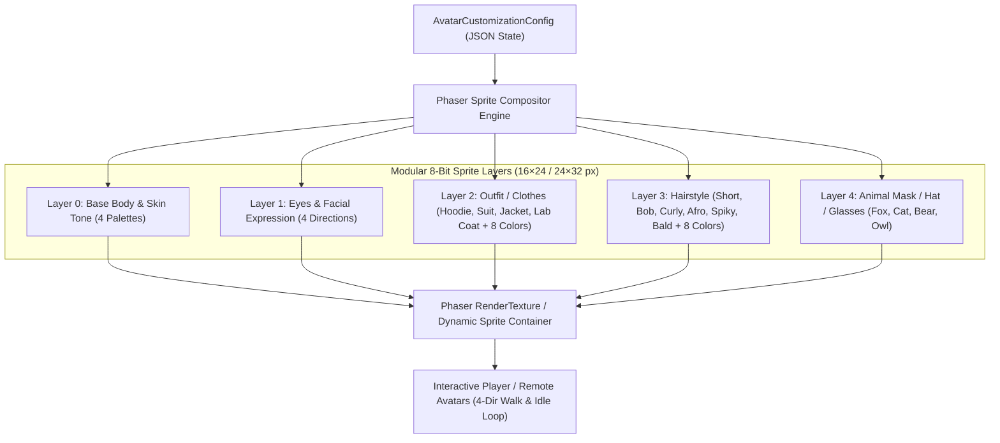

# 3. Neon Career Hall World & Realistic Scene Design

---

## 3.1 Spatial Concept: Seamless Endless Neon Career Hall (Revision 2.4)

ฉากหลักของ MaskedMatch คือ **Grand Indoor Career Hall แบบ Seamless / Endless** ที่ผู้ใช้เดินสำรวจต่อเนื่องได้ และเมื่อเดินวนรอบ hall จะกลับมาพบ landmark และโซนเดิมได้อย่างมีเหตุผลเหมือนเกม 2D แบบ Game Boy — **ไม่ใช่ภาพพื้นหลังแบนหนึ่งภาพที่เลื่อนไปมา**

- **Logical module:** แผนผัง hall มาตรฐานมีขนาด `1536 × 1024 logical px` ต่อ 1 โมดูล แต่ runtime ต้องทำงานแบบ **toroidal wrap หรือ streamed repeating modules**: เดินพ้นขอบ corridor แล้วเข้ามายัง corridor ฝั่งตรงข้าม/โมดูลถัดไปอย่างไร้รอยต่อ จึงเดินวนกลับมาจุดเดิมได้เสมอ
- **Open modular floor plan:** พื้นหลักต้องเป็น hall โล่ง มีทางเดินกว้างและพื้นที่ว่างสำหรับวาง/ย้าย booth module ได้ตาม event configuration; ห้ามออกแบบเป็นด่านคับแคบหรือ maze ที่ขวางการค้นพบงาน
- **Stable landmarks:** Central Hub, Arrival Lobby, Exit Portal, Support/A11y Desk และ Device Test Pods เป็น landmark ซ้ำที่ช่วยให้ผู้ใช้รู้ตำแหน่ง แม้จะเดินผ่านขอบ loop หรือ streamed module
- **Renderer:** ใช้ Phaser 4 พร้อม Smooth Camera-Follow และ time-based easing; background, floor, props, foreground และ sprites ถูก compose จาก pre-generated asset layers / tile chunks ไม่ใช่ procedural canvas drawing
- **Multi-Control:** รองรับ Keyboard (WASD / Arrow keys), Point-and-Click บน Desktop, Tap-to-Move บน Mobile และมี Navigator/List Mode ที่ทำงานได้เทียบเท่า 100%
- **Strict No-Emoji Standard:** ทุก Element ภายในฉาก (NPC, พร็อพ, บูธ, ของตกแต่ง) ต้องเป็น **Generated Pixel Art / SVG Assets** ทั้งหมด ห้ามใช้อิโมจิ
- **Visual Language Standards (Office / Convention Hall / Exhibition Booth):** ศึกษาโครงสร้างผัง, พร็อพอุปกรณ์สำนักงาน, โต๊ะ Recruiter, และซุ้มประตูทางเดินจากภาพอ้างอิงทั้ง 5 ภาพใน [docs/ref_pics/](../ref_pics/) และ [docs/03-design/reference-visual-language.md](./reference-visual-language.md)

```text
┌─────────────────────────────────────────────────────────────────────────────┐
│                   SEAMLESS NEON CAREER HALL MODULE                          │
│          (1536×1024 logical px · wraps / streams endlessly)                │
│                                                                             │
│  ┌──────────────────┐                     ┌──────────────────┐              │
│  │  Cyber Orchard   │                     │ Riverbyte Studio │              │
│  │   (Cloud / IoT)  │                     │   (Creative AI)  │              │
│  └─────────┬────────┘                     └─────────┬────────┘              │
│            │                                        │                       │
│            └───────────────┐        ┌───────────────┘                       │
│                            │        │                                       │
│                    ┌───────┴────────┴───────┐                               │
│                    │      CENTRAL HUB       │ ── [Quiet Lounge]             │
│                    │  Wayfinding & Info POI │                               │
│                    └───────┬────────┬───────┘                               │
│                            │        │                                       │
│            ┌───────────────┘        └───────────────┐                       │
│            │                                        │                       │
│  ┌─────────┴────────┐                     ┌─────────┴────────┐              │
│  │    Apex Cloud    │                     │ SolarPulse Energy│              │
│  │  (Infra / Sec)   │                     │  (Green Tech/Fin)│              │
│  └──────────────────┘                     └──────────────────┘              │
│                                                                             │
│  [Support / A11y Desk] ── [Device Test Pods] ── [Grand Arrival Lobby]       │
│                                                                             │
│       ← Loop corridor / streamed module boundary / loop corridor →         │
└─────────────────────────────────────────────────────────────────────────────┘
```

### 3.1.1 Endless Loop & Booth Placement Rules

1. **Loop continuity:** ขอบ module ต้องต่อกับทางเดิน/พื้นของ module ข้างเคียงได้จริง ทั้งภาพ, collision และ navigation graph; การ wrap ต้องรักษา velocity, facing, queue state และ target navigation ของผู้เล่น
2. **Modular booth pads:** Booth วางได้เฉพาะบน `BoothPad` ที่กำหนดไว้ ซึ่งเป็นพื้นที่โล่งมาตรฐานพร้อมไฟ, collision footprint, interaction sensor และจุดต่อ queue line; organizer สามารถสลับ theme/logo/job ได้โดยไม่ต้องวาดแผนที่ใหม่
3. **Discoverable, never hidden:** แม้ hall จะเดินได้ต่อเนื่อง ทุก booth ที่ active ต้องค้นหาและเปิดข้อมูลได้จาก Navigator, Search และ Mini-map โดยไม่ต้องเดินหาเอง
4. **No deceptive infinity:** UI ต้องบอกว่าเป็น "Seamless Career Hall" และยังคง landmark/wayfinding ที่ชัดเจน; ห้ามทำให้ผู้ใช้หลงคิดว่ามี booth หรือ event instance ใหม่ไม่จำกัดโดยไม่มีข้อมูลจริง

### 3.1.2 Game Physics, Collision & Render Layers

โลกต้องมีพฤติกรรมแบบเกม 2D จริง ไม่ใช่ scene ภาพแบนที่วาง hotspot ทับ:

| Runtime layer | หน้าที่ | กฎฟิสิกส์ / การบังซ้อน |
|---|---|---|
| `FloorBase` / `FloorDecal` | พื้น hall, carpet, neon wayfinding | ไม่มี collision; ใช้ tile/chunk asset ที่ต่อขอบ loop ได้ |
| `CollisionGeometry` | ผนัง, เคาน์เตอร์, planter, queue rail, booth footprint | ใช้ Phaser Arcade Physics body หรือ tile/object collision ที่สร้างจาก metadata; player/NPC เดินทะลุไม่ได้ |
| `InteractSensor` | kiosk, display board, booth radius, staff desk, exit | เป็น overlap sensor แยกจาก solid body; เข้าใกล้แล้วแสดง context prompt แต่ไม่เปิด media หรือ modal อัตโนมัติ |
| `Actor` | player, candidate NPC, recruiter, staff | มี velocity/acceleration, collision body และ state `idle/walk/interaction`; input ใช้ delta/time-based movement |
| `PropMid` / `ForegroundOccluder` | โต๊ะ, ต้นไม้, ป้ายแขวน, ซุ้มบูธด้านหน้า | กำหนด Y-pivot และ dynamic depth (`depth = y + offset`) เพื่อให้ actor เดินหน้า/หลังวัตถุได้ถูกต้อง |
| `LightingFX` | glow, sign light, ambient effect | เป็น pre-generated animated asset หรือ Phaser tween; ต้องเคารพ Reduced Motion |
| `Semantic DOM Overlay` | HUD, labels, tooltip, dialog, captions | ไม่เป็นส่วนของ physics; ต้องมี focus/keyboard และเป็น accessibility equivalent ของ interaction ทั้งหมด |

- **Collision body กับ visual footprint ต้องแยกกัน:** sprite อาจใหญ่ แต่ hitbox ใช้เฉพาะฐานเท้าหรือฐาน prop เพื่อให้เดินอ้อมอย่างเป็นธรรมชาติ
- **Y-sort ไม่พอสำหรับ physics:** ทุก solid prop ต้องมี collision metadata และทุก interactive object ต้องมี sensor metadata; ห้ามใช้เพียง CSS/ภาพทับกันเพื่อทำให้ดูเหมือนชน
- **Loop-aware physics:** เมื่อ actor ข้าม boundary ให้ remap ตำแหน่งอย่าง atomically ก่อน collision tick ถัดไป เพื่อไม่ให้ทะลุ prop หรือกระโดดผิด depth
- **Performance:** โหลด tile/prop/collision metadata เป็น zone chunk รอบกล้อง; unload เฉพาะ chunk ที่ปลอดภัย โดยไม่กระทบ booth ที่ผู้ใช้กำลัง target อยู่

---

## 3.2 Realistic & Immersive Booth Visitation Experience

การออกแบบบูธถูกสร้างให้เสมือนการเดินชมงาน Job Fair ระดับมืออาชีพจริง:

```text
┌──────────────────────────────────────────────────────────────────┐
│        MODULAR DECOUPLED BOOTH STRUCTURE (REUSABLE PREFAB)       │
│                                                                  │
│  ┌────────────────────────────────────────────────────────────┐  │
│  │ [COMPANY LOGO ICON]  COMPANY NAME TEXT  (THEME COLOR GLOW) │  │  <-- Customizable Overhead Signboard
│  └────────────────────────────────────────────────────────────┘  │
│                                                                  │
│   ┌──────────────┐     ┌──────────────────┐     ┌──────────────┐ │
│   │ [TECH DISPLAY]     │ [RECRUITER DESK] │     │ [QUEUE POST] │ │  <-- Modular Interior Props
│   │ Dual Monitor │     │ Recruiter Station│     │ Realtime Qty │ │
│   │ Code & Data  │     │ Ergonomic Chairs │     │ Wait Time    │ │
│   └──────────────┘     └──────────────────┘     └──────────────┘ │
│                                                                  │
│   ══════════════ [Interactive Proximity Border] ══════════════   │
│                 (Avatar enters -> Action Dock opens)             │
└──────────────────────────────────────────────────────────────────┘
```

> 🌟 **เกณฑ์มาตรฐานอ้างอิงหลักสูงสุด (Master Primary References):**
> ผังรวมบูธ 6 โซน และสไปรต์ชีตบูธแยกชิ้น ป้ายโลโก้ อุปกรณ์สำนักงาน ดูได้ที่ [docs/ref_pics/00_MAIN_virtual_job_fair_map.jpg](../ref_pics/00_MAIN_virtual_job_fair_map.jpg) และ [docs/ref_pics/00_MAIN_spritesheet_booths_characters_props.png](../ref_pics/00_MAIN_spritesheet_booths_characters_props.png)

### รายละเอียดองค์ประกอบความสมจริงของระบบ Modular Booth:
1. **Decoupled Overhead Signboard:** ป้ายด้านบนแยกชิ้นส่วนอิสระ ประกอบด้วยช่องใส่โลโก้บริษัท (Custom Logo Slot) + ข้อความชื่อบริษัท (Company Name Text) + เส้นขอบสีธีมนีออน
2. **Endless Tileable Background:** พื้นหลังเป็น Grid กระเบื้องเปล่าและทางเดินพรมน้ำเงินที่สามารถต่อวน (Seamless Loop / Endless Wrap) ได้ไม่รู้จบ
3. **Reception & Queue Terminal:** เสาป้ายคิวดิจิทัล แสดงจำนวนคนที่กำลังรอและเวลาประมาณการแบบ Real-time
4. **Interactive Info Screen:** ทุก booth ต้องมีป้ายจอประกาศ / Info Kiosk ที่มองเห็นได้ในฉาก ผู้ใช้กด `E`, click หรือ tap ที่จอเพื่อเปิด Booth & Job Detail แบบ Semantic DOM โดยไม่ต้องใช้ hover
5. **Interactive Media Showcase:** บอร์ดนิทรรศการแสดงผลงาน โครงการเด่น และ Tech Stack ที่รองรับการกดดูรายละเอียด
6. **Recruiter Station:** โต๊ะสัมภาษณ์พร้อมเก้าอี้และ NPC Recruiter นั่ง/ยืนประจำจุด สามารถกดคุยเพื่อดูวัฒนธรรมองค์กร
7. **Proximity Action Trigger:** เมื่อผู้สมัครเดินเข้าใกล้รัศมี 48 px จะเกิดเส้นเรืองแสงรอบบูธ และปุ่ม `[กด E หรือ แตะเพื่อดูงาน]` จะปรากฏขึ้นทันที

---

## 3.3 Original Exhibitor Booths

| บริษัทจัดแสดง | รหัสอ้างอิง | อุตสาหกรรม | ตำแหน่งงานหลัก | องค์ประกอบภาพและสถาปัตยกรรมของบูธ |
|---|---|---|---|---|
| **Cyber Orchard Co.** | `company-cyber-orchard` | IoT & Cloud Systems | Backend Developer | สถาปัตยกรรมโทนม่วง-เขียวนีออน, เสา Server Racks, หน้าจอแสดง IoT Telemetry Stream |
| **Riverbyte Studio** | `company-riverbyte` | Creative Tech & Media | Frontend / UI Engineer | โทนชมพู-ส้ม Retro, จอแสดงผล Interactive Canvas, โต๊ะทำงานสไตล์ Creative Loft |
| **Apex Cloud Tech** | `company-apex-cloud` | Cloud Infra & Security | DevOps / Cloud Architect | โทนฟ้า Cyan, ตู้เซิร์ฟเวอร์เรืองแสง, ลูกโลก Hologram หมุนเครือข่าย Global Node |
| **SolarPulse Energy** | `company-solarpulse` | GreenTech & Smart Grid | Data / Firmware Engineer | โทนเหลือง Mango ผสมเขียว, แผงโซลาร์เซลล์จิ๋ว, มิเตอร์แสดงผลพลังงานสะอาด |

---

## 3.4 Generated NPC Crowd & Synthetic Dialogue

ทุกตัวละครในฉากใช้ **Generated Pixel Sprite Atlas** พร้อมแอนิเมชัน 4 ทิศทาง (ห้ามใช้อิโมจิแทนตัวละคร):

| บทบาท NPC | จำนวน | ภาพลักษณ์ภายนอก (Generated Sprite) | พฤติกรรม & บทสนทนาสังเคราะห์ |
|---|:---:|---|---|
| **Candidates (Job Seekers)** | 6 | สวมหน้ากากสัตว์ (จิ้งจอก แมว หมี นกฮูก) ชุดลำลอง | เดินสำรวจตามทางเดิน, พูดคุยแลกเปลี่ยนเรื่องการเตรียม Portfolio |
| **Recruiters (Hiring Team)** | 4 | ชุดสูททำงานทางการ นั่ง/ยืนประจำบูธ | ต้อนรับผู้สมัคร, ให้ข้อมูลตำแหน่งงาน Must-have skills |
| **Event Guides / Staff** | 2 | สวมเสื้อกั๊กสะท้อนแสงนีออน ประจำ Lobby | แนะนำผังงาน และทิศทางเดินไปยังโซนต่างๆ |
| **Accessibility Specialist** | 1 | ประจำโซน Quiet Lounge | แนะนำการใช้งาน Navigator Mode และการขอความช่วยเหลือ |
| **Tech Support Officer** | 1 | ประจำ Device Test Pods | แนะนำการทดสอบไมค์ กล้อง และโหมด Face Mask |

---

## 3.5 Generated Scene Props & Map Decorations

อุปกรณ์ประกอบฉากทุกชิ้นถูก Generate ขึ้นมาเป็น Pixel Art เพื่อสร้างบรรยากาศสมจริง:
- **Furniture:** โต๊ะรับรองผู้สมัคร, เก้าอี้ทำงานสไตล์โมเดิร์น, เคาน์เตอร์ประชาสัมพันธ์
- **Tech Props:** ตู้ข้อมูล Kiosk, ตู้เซิร์ฟเวอร์เรืองแสง, แท่นทดสอบอุปกรณ์ Device Pods
- **Decorations:** กระถางต้นไม้ไซเบอร์เนติกส์, เสาไฟนีออนบอกทาง, ฉากกั้นกระจกใส (Glass Partition), พรมปูทางเดินลายตาราง 16×16
- **Amenities:** รถเข็นกาแฟ (Coffee Cart), โซฟาพักผ่อนใน Quiet Zone
- **Physics Metadata:** ทุก prop ที่ขวางทางต้องมี solid collision footprint; kiosk/จอประกาศต้องมี interaction sensor แยก; decorative prop ที่เดินผ่านได้ต้องระบุชัดว่าไม่มี collision
- **Sorting Rule:** ทุกชิ้นมีพิกัดความลึก (Y-axis Pivot Point) ชัดเจน ทำให้ตัวละครเดินอ้อมหน้า-หลังได้อย่างถูกต้อง และมี foreground occluder layer สำหรับวัตถุสูง

---

## 3.6 Modular 8-Bit Character Compositor Architecture (Phaser 4 & The Sims Style Customizer)

เพื่อให้ระบบสร้างตัวละคร (Character Creator) ทำงานร่วมกับ **Phaser 2D Game Engine** ได้อย่างสมบูรณ์แบบ ลื่นไหล และปรับแต่งได้หลากหลายแบบ The Sims ระบบใช้สถาปัตยกรรม **Modular Layered Sprite Compositing**:



### 1. Layer Compositing & Palette Swapping
- **Layer Stacking Order:**
  `Base Skin Body` → `Underwear/Base` → `Top/Outfit` → `Hair` → `Animal Mask / Accessories`
- **Dynamic Palette Swapping:** ใช้ Color Lookup Table (LUT) หรือ Shader บน Phaser เพื่อเปลี่ยนสีผิว (Light, Medium, Warm Tan, Deep), สีผม (Black, Brown, Blonde, Cyan, Neon Pink ฯลฯ) และสีเสื้อผ้า โดยไม่ต้องวาด Sprite แยกทุกสี
- **4-Direction Frame Synchronizer:** ทุกเลเยอร์ใช้ Frame Index เดียวกัน (Down: 0–3, Left: 4–7, Right: 8–11, Up: 12–15) ทำให้แอนิเมชันการเดินและทิศทางของทุกชิ้นส่วนขยับพร้อมเพรียงกัน 100%

### 2. Randomizer Algorithm (Dice Roll 🎲)
เมื่อผู้ใช้กดปุ่ม **[🎲 สุ่มตัวละคร]** ระบบจะทำการสุ่มค่า Configuration ผ่าน Weighted Probability:
- สุ่มค่า `skinTone` จาก 4 เฉดสีผิวธรรมชาติ
- สุ่มค่า `hairStyle` จาก 8 ทรงผมยอดนิยม + สุ่ม `hairColor` จาก 8 พาเลทสี
- สุ่มค่า `outfitStyle` (Cyber Hoodie, Business Suit, Retro Jacket, Casual Shirt, Tech Lab Coat) + สุ่ม `outfitColor`
- สุ่มค่า `animalMask` (Fox, Cat, Bear, Owl, Cyber Visor)
- บันทึกเป็น `AvatarCustomizationConfig` และอัปเดต Live Preview ทันทีใน 1 เฟรม

### 3. Realtime Phaser Live Preview in React Studio
- ในหน้าจอปรับแต่งตัวละคร (SC-05) มี **Phaser Mini-Stage Canvas** ฝังอยู่ด้านซ้าย เพื่อเรนเดอร์ตัวละครขนาดขยาย (Scaled 4x Pixel Art) ขยับท่าทาง Idle และมีปุ่มกดหมุนตัว 360° (สลับทิศทางหน้า/หลัง/ซ้าย/ขวา)
- เมื่อกดบันทึก ข้อมูล `AvatarCustomizationConfig` จะถูกบันทึกใน Local State / Presence และนำไปสร้าง Player Avatar ทันทีเมื่อก้าวเข้าสู่ Neon Career Hall World
