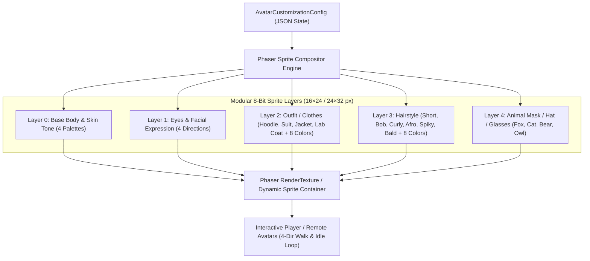

# 3. Neon Career Hall World & Realistic Scene Design

---

## 3.1 Spatial Concept: Indoor Neon Career Hall (Revision 2.1)

ฉากหลักของ MaskedMatch คือ **Grand Indoor Career Hall ขนาดใหญ่ (1536 × 1024 logical px)**:
- **Renderer:** ขับเคลื่อนด้วย Phaser 2D Canvas พร้อมกล้อง Smooth Camera-Follow ที่เคลื่อนตามตัวละครด้วย Easing แบบนุ่มนวล
- **Multi-Control:** รองรับการควบคุมผ่าน Keyboard (WASD / Arrow keys), Point-and-Click บน Desktop, และ Tap-to-Move บน Mobile
- **Visual Depth:** รองรับการจัดเรียงความลึก (Y-axis Depth Sorting) ทำให้ตัวละคร, NPCs, และ Scene Props บังซ้อนกันอย่างสมจริง
- **Strict No-Emoji Standard:** ทุก Element ภายในฉาก (NPC, พร็อพ, บูธ, ของตกแต่ง) ต้องเป็น **Generated Pixel Art Elements** ทั้งหมด ห้ามใช้อิโมจิ

```text
┌─────────────────────────────────────────────────────────────────────────────┐
│                             NEON CAREER HALL                                │
│                          (World Bounds 1536×1024)                           │
│                                                                             │
│  ┌──────────────────┐                     ┌──────────────────┐              │
│  │  Cyber Orchard   │                     │ Riverbyte Studio │              │
│  │   (Cloud / IoT)  │                     │   (Creative AI)  │              │
│  └─────────┬────────┘                     └─────────┬────────┘              │
│            │                                        │                       │
│            └───────────────┐        ┌───────────────┘                       │
│                            │        │                                       │
│                    ┌───────┴────────┴───────┐                               │
│                    │      CENTRAL HUB       │ ── [Quiet Lounge]             │
│                    │  Wayfinding & Info POI │                               │
│                    └───────┬────────┬───────┘                               │
│                            │        │                                       │
│            ┌───────────────┘        └───────────────┐                       │
│            │                                        │                       │
│  ┌─────────┴────────┐                     ┌─────────┴────────┐              │
│  │    Apex Cloud    │                     │ SolarPulse Energy│              │
│  │  (Infra / Sec)   │                     │  (Green Tech/Fin)│              │
│  └──────────────────┘                     └──────────────────┘              │
│                                                                             │
│  [Support / A11y Desk] ── [Device Test Pods] ── [Grand Arrival Lobby]       │
└─────────────────────────────────────────────────────────────────────────────┘
```

---

## 3.2 Realistic & Immersive Booth Visitation Experience

การออกแบบบูธถูกสร้างให้เสมือนการเดินชมงาน Job Fair ระดับมืออาชีพจริง:

```text
┌──────────────────────────────────────────────────────────────────┐
│                   CYBER ORCHARD BOOTH (ZONE A1)                  │
│                                                                  │
│  ┌────────────────────────────────────────────────────────────┐  │
│  │  [DYNAMIC LOGO FIXTURE]  CYBER ORCHARD CO. (IoT & Cloud)   │  │
│  └────────────────────────────────────────────────────────────┘  │
│                                                                  │
│   ┌──────────────┐     ┌──────────────────┐     ┌──────────────┐ │
│   │ [MEDIA CHOP] │     │ [RECRUITER DESK] │     │ [QUEUE POST] │ │
│   │ Interactive  │     │ Recruiter #R12   │     │ Active: 3    │ │
│   │ Tech Stack   │     │ (Hiring Team)    │     │ Wait: 8–12m  │ │
│   └──────────────┘     └──────────────────┘     └──────────────┘ │
│                                                                  │
│   ══════════════ [Interactive Proximity Border] ══════════════   │
│                 (Avatar enters -> Action Dock opens)             │
└──────────────────────────────────────────────────────────────────┘
```

### รายละเอียดองค์ประกอบความสมจริงของแต่ละบูธ:
1. **Dynamic Logo Fixture:** ป้ายไฟนีออนชื่อบริษัทที่แยก Layer อิสระ สามารถสลับแบรนด์และข้อความได้แบบไดนามิก
2. **Reception & Queue Terminal:** เสาป้ายคิวดิจิทัล แสดงจำนวนคนที่กำลังรอและเวลาประมาณการแบบ Real-time
3. **Interactive Media Showcase:** บอร์ดนิทรรศการแสดงผลงาน โครงการเด่น และ Tech Stack ที่รองรับการกดดูรายละเอียด
4. **Recruiter Station:** โต๊ะสัมภาษณ์พร้อมเก้าอี้และ NPC Recruiter นั่ง/ยืนประจำจุด สามารถกดคุยเพื่อดูวัฒนธรรมองค์กร
5. **Proximity Action Trigger:** เมื่อผู้สมัครเดินเข้าใกล้รัศมี 48 px จะเกิดเส้นเรืองแสงรอบบูธ และปุ่ม `[กด E หรือ แตะเพื่อดูงาน]` จะปรากฏขึ้นทันที

---

## 3.3 Original Exhibitor Booths

| บริษัทจำลอง | รหัสอ้างอิง | อุตสาหกรรม | ตำแหน่งงานหลัก | องค์ประกอบภาพและสถาปัตยกรรมของบูธ |
|---|---|---|---|---|
| **Cyber Orchard Co.** | `company-cyber-orchard` | IoT & Cloud Systems | Backend Developer | สถาปัตยกรรมโทนม่วง-เขียวนีออน, เสา Server Racks, หน้าจอแสดง IoT Telemetry Stream |
| **Riverbyte Studio** | `company-riverbyte` | Creative Tech & Media | Frontend / UI Engineer | โทนชมพู-ส้ม Retro, จอแสดงผล Interactive Canvas, โต๊ะทำงานสไตล์ Creative Loft |
| **Apex Cloud Tech** | `company-apex-cloud` | Cloud Infra & Security | DevOps / Cloud Architect | โทนฟ้า Cyan, ตู้เซิร์ฟเวอร์เรืองแสง, ลูกโลก Hologram หมุนจำลองเครือข่าย Global Node |
| **SolarPulse Energy** | `company-solarpulse` | GreenTech & Smart Grid | Data / Firmware Engineer | โทนเหลือง Mango ผสมเขียว, แผงโซลาร์เซลล์จิ๋ว, มิเตอร์แสดงผลพลังงานสะอาด |

---

## 3.4 Generated NPC Crowd & Synthetic Dialogue

ทุกตัวละครในฉากใช้ **Generated Pixel Sprite Atlas** พร้อมแอนิเมชัน 4 ทิศทาง (ห้ามใช้อิโมจิแทนตัวละคร):

| บทบาท NPC | จำนวน | ภาพลักษณ์ภายนอก (Generated Sprite) | พฤติกรรม & บทสนทนาสังเคราะห์ |
|---|:---:|---|---|
| **Candidates (Job Seekers)** | 6 | สวมหน้ากากสัตว์ (จิ้งจอก แมว หมี นกฮูก) ชุดลำลอง | เดินสำรวจตามทางเดิน, พูดคุยแลกเปลี่ยนเรื่องการเตรียม Portfolio |
| **Recruiters (Hiring Team)** | 4 | ชุดสูททำงานทางการ นั่ง/ยืนประจำบูธ | ต้อนรับผู้สมัคร, ให้ข้อมูลตำแหน่งงาน Must-have skills |
| **Event Guides / Staff** | 2 | สวมเสื้อกั๊กสะท้อนแสงนีออน ประจำ Lobby | แนะนำผังงาน และทิศทางเดินไปยังโซนต่างๆ |
| **Accessibility Specialist** | 1 | ประจำโซน Quiet Lounge | แนะนำการใช้งาน Navigator Mode และการขอความช่วยเหลือ |
| **Tech Support Officer** | 1 | ประจำ Device Test Pods | แนะนำการทดสอบไมค์ กล้อง และโหมด Face Mask |

---

## 3.5 Generated Scene Props & Map Decorations

อุปกรณ์ประกอบฉากทุกชิ้นถูก Generate ขึ้นมาเป็น Pixel Art เพื่อสร้างบรรยากาศสมจริง:
- **Furniture:** โต๊ะรับรองผู้สมัคร, เก้าอี้ทำงานสไตล์โมเดิร์น, เคาน์เตอร์ประชาสัมพันธ์
- **Tech Props:** ตู้ข้อมูล Kiosk, ตู้เซิร์ฟเวอร์เรืองแสง, แท่นทดสอบอุปกรณ์ Device Pods
- **Decorations:** กระถางต้นไม้ไซเบอร์เนติกส์, เสาไฟนีออนบอกทาง, ฉากกั้นกระจกใส (Glass Partition), พรมปูทางเดินลายตาราง 16×16
- **Amenities:** รถเข็นกาแฟ (Coffee Cart), โซฟาพักผ่อนใน Quiet Zone
- **Sorting Rule:** ทุกชิ้นมีพิกัดความลึก (Y-axis Pivot Point) ชัดเจน ทำให้ตัวละครเดินอ้อมหน้า-หลังได้อย่างถูกต้อง

---

## 3.6 Modular 8-Bit Character Compositor Architecture (Phaser 3 & The Sims Style Customizer)

เพื่อให้ระบบสร้างตัวละคร (Character Creator) ทำงานร่วมกับ **Phaser 2D Game Engine** ได้อย่างสมบูรณ์แบบ ลื่นไหล และปรับแต่งได้หลากหลายแบบ The Sims ระบบใช้สถาปัตยกรรม **Modular Layered Sprite Compositing**:



### 1. Layer Compositing & Palette Swapping
- **Layer Stacking Order:** 
  `Base Skin Body` → `Underwear/Base` → `Top/Outfit` → `Hair` → `Animal Mask / Accessories`
- **Dynamic Palette Swapping:** ใช้ Color Lookup Table (LUT) หรือ Shader บน Phaser เพื่อเปลี่ยนสีผิว (Light, Medium, Warm Tan, Deep), สีผม (Black, Brown, Blonde, Cyan, Neon Pink ฯลฯ) และสีเสื้อผ้า โดยไม่ต้องวาด Sprite แยกทุกสี
- **4-Direction Frame Synchronizer:** ทุกเลเยอร์ใช้ Frame Index เดียวกัน (Down: 0–3, Left: 4–7, Right: 8–11, Up: 12–15) ทำให้แอนิเมชันการเดินและทิศทางของทุกชิ้นส่วนขยับพร้อมเพรียงกัน 100%

### 2. Randomizer Algorithm (Dice Roll 🎲)
เมื่อผู้ใช้กดปุ่ม **[🎲 สุ่มตัวละคร]** ระบบจะทำการสุ่มค่า Configuration ผ่าน Weighted Probability:
- สุ่มค่า `skinTone` จาก 4 เฉดสีผิวธรรมชาติ
- สุ่มค่า `hairStyle` จาก 8 ทรงผมยอดนิยม + สุ่ม `hairColor` จาก 8 พาเลทสี
- สุ่มค่า `outfitStyle` (Cyber Hoodie, Business Suit, Retro Jacket, Casual Shirt, Tech Lab Coat) + สุ่ม `outfitColor`
- สุ่มค่า `animalMask` (Fox, Cat, Bear, Owl, Cyber Visor)
- บันทึกเป็น `AvatarCustomizationConfig` และอัปเดต Live Preview ทันทีใน 1 เฟรม

### 3. Realtime Phaser Live Preview in React Studio
- ในหน้าจอปรับแต่งตัวละคร (SC-05) มี **Phaser Mini-Stage Canvas** ฝังอยู่ด้านซ้าย เพื่อเรนเดอร์ตัวละครขนาดขยาย (Scaled 4x Pixel Art) ขยับท่าทาง Idle และมีปุ่มกดหมุนตัว 360° (สลับทิศทางหน้า/หลัง/ซ้าย/ขวา)
- เมื่อกดบันทึก ข้อมูล `AvatarCustomizationConfig` จะถูกบันทึกใน Local State / Presence และนำไปสร้าง Player Avatar ทันทีเมื่อก้าวเข้าสู่ Neon Career Hall World

