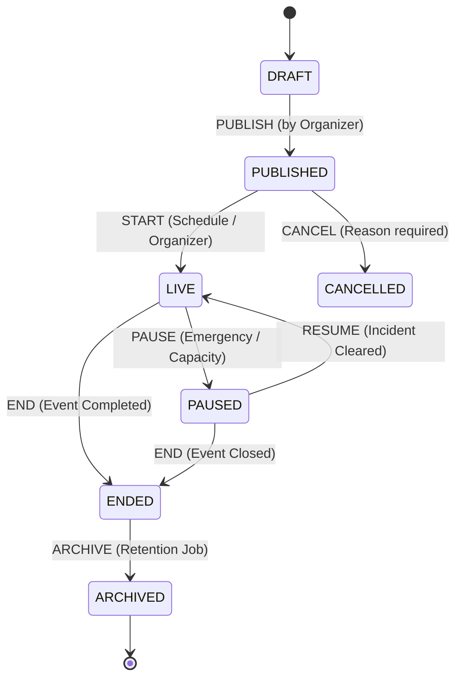
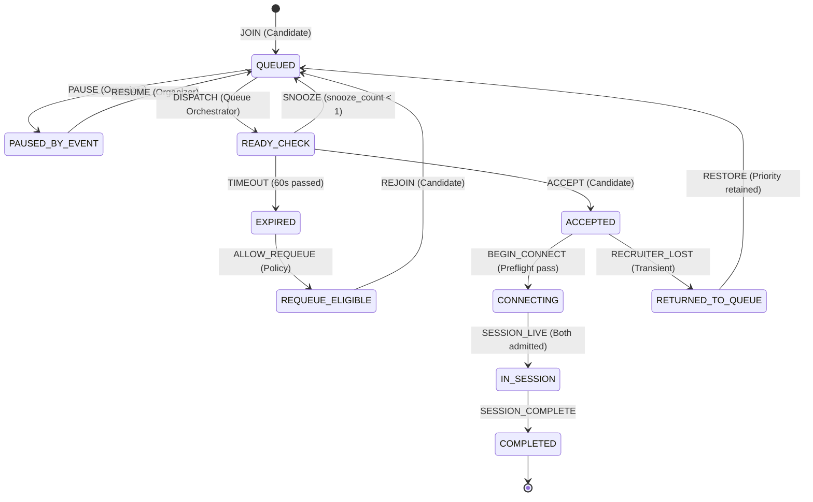
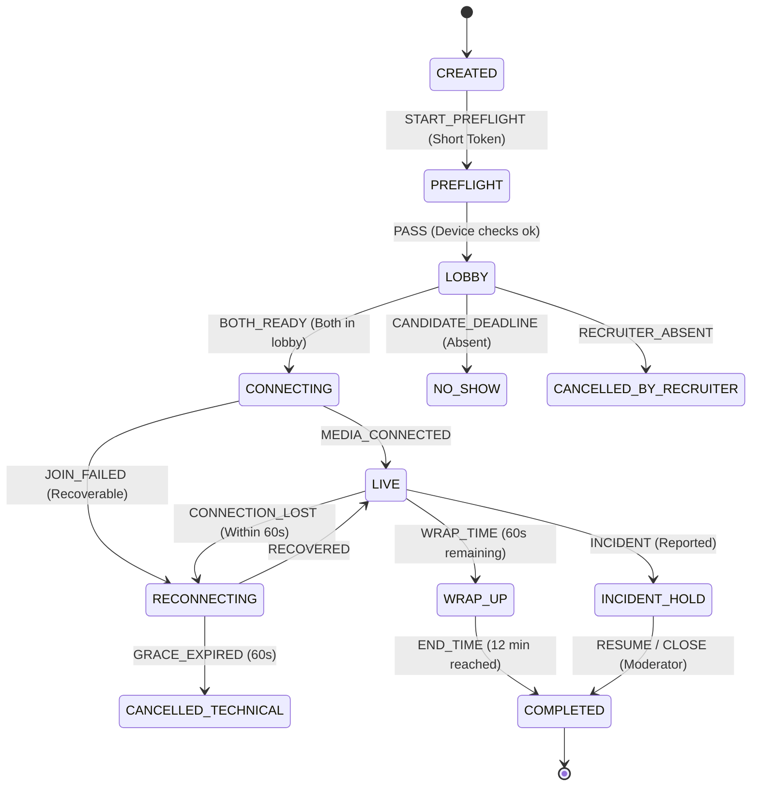
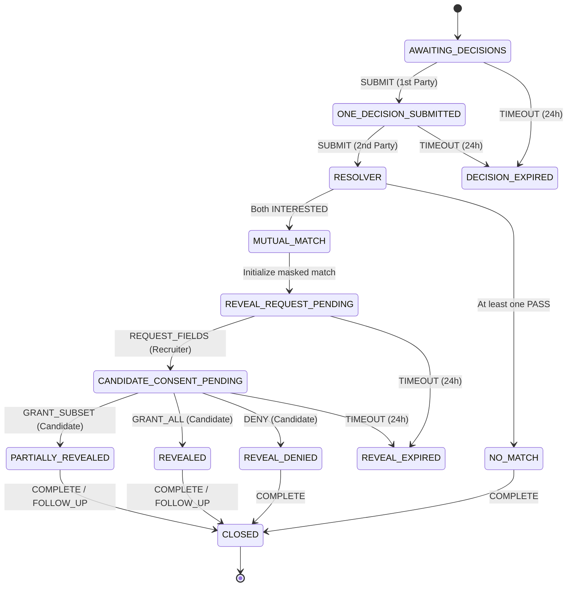
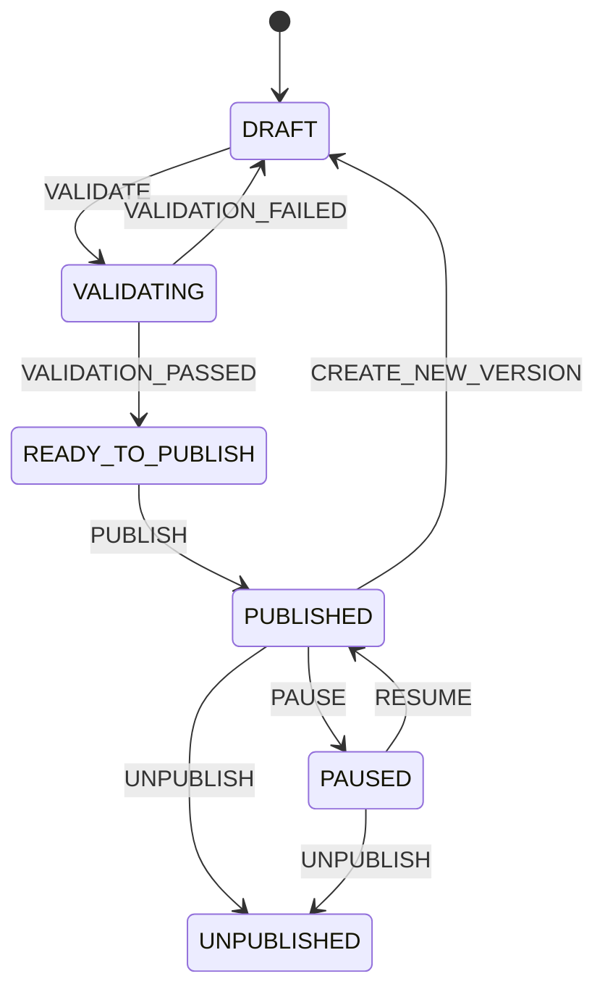

# 2. State Machines & Concurrency Contracts

---

## 2.1 Event Lifecycle State Machine



| Current State | Action / Actor | Guard Condition | Next State | Transactional Side Effects |
|---|---|---|---|---|
| `DRAFT` | `PUBLISH` / Organizer | นโยบาย แผนที่ และเจ้าหน้าที่ผ่านการตรวจสอบ | `PUBLISHED` | Freeze Public Event Version |
| `PUBLISHED` | `START` / Scheduler | อยู่ในหน้าต่างเวลาที่กำหนด | `LIVE` | เปิดให้ผู้สมัครเข้างานและเปิดคิว |
| `PUBLISHED` | `CANCEL` / Organizer | ระบุเหตุผลจำเป็น | `CANCELLED` | แจ้งเตือนผู้ลงทะเบียนและเพิกถอน Token |
| `LIVE` | `PAUSE` / Organizer | ระบุเหตุผลและขอบเขต | `PAUSED` | ระงับการเข้างาน/รับคิวใหม่ชั่วคราว |
| `PAUSED` | `RESUME` / Organizer | แก้ไขเหตุการณ์เรียบร้อย | `LIVE` | เปิดระบบและรักษาลำดับคิวเดิม |
| `LIVE` / `PAUSED` | `END` / Organizer | สิ้นสุดเวลางาน | `ENDED` | ปิดรับคิวใหม่ ปล่อยรอบสัมภาษณ์ที่เหลือให้จบ |
| `ENDED` | `ARCHIVE` / System | ผ่านการตรวจสอบ Retention | `ARCHIVED` | สลับรหัส Alias และเริ่ม Purge Job |

---

## 2.2 Queue Ticket State Machine



| Current State | Action / Actor | Guard Condition | Next State | Transactional Side Effects |
|---|---|---|---|---|
| `none` | `JOIN` / Candidate | ผ่านเกณฑ์, คิวเปิด, ไม่มี Active Ticket อื่น | `QUEUED` | บันทึก `joined_at`, Order Key, Version |
| `QUEUED` | `PAUSE` / Organizer | มีคำสั่งระงับคิว | `PAUSED_BY_EVENT` | ล็อกและรักษา Order Key เดิม |
| `PAUSED_BY_EVENT` | `RESUME` / Organizer | เปิดคิวอีกครั้ง | `QUEUED` | คืนลำดับคิวเดิม |
| `QUEUED` | `DISPATCH` / System | Recruiter Heartbeat พร้อม | `READY_CHECK` | ตั้งเวลา Countdown 60s, ล็อก Recruiter |
| `READY_CHECK` | `ACCEPT` / Candidate | ตอบก่อนหมดเวลา | `ACCEPTED` | สร้าง `InterviewSession` แบบ Atomic |
| `READY_CHECK` | `SNOOZE` / Candidate | `snooze_count < 1` | `QUEUED` | เพิ่มตัวนับ เลื่อนไปต่อท้ายคิว |
| `READY_CHECK` | `TIMEOUT` / Scheduler | พ้น 60 วินาที | `EXPIRED` | ปลด Recruiter, ประเมินสิทธิ์ Requeue |
| `EXPIRED` | `ALLOW_REQUEUE` / Policy| ยังมีโควตา Requeue | `REQUEUE_ELIGIBLE` | บันทึกประวัติและเหตุผล |
| `ACCEPTED` | `RECRUITER_LOST` / System| Recruiter ขาดการเชื่อมต่อ | `RETURNED_TO_QUEUE` | บันทึก Audit, ปลดการถือครอง |
| `RETURNED_TO_QUEUE`| `RESTORE` / System | คิวเดิมเปิดอยู่ | `QUEUED` | คืนลำดับความสำคัญสูงสุดให้ Candidate |
| `ACCEPTED` | `BEGIN_CONNECT` / User | Preflight ผ่าน | `CONNECTING` | ผูก Session Token สัมภาษณ์ |
| `CONNECTING` | `SESSION_LIVE` / System | ทั้งสองฝ่ายเข้าห้องครบ | `IN_SESSION` | ยกเลิก Ready Token ที่ไม่ได้ใช้ |
| `IN_SESSION` | `SESSION_COMPLETE` / Sys | สัมภาษณ์เสร็จสิ้น | `COMPLETED` | บันทึก Audit และปลด Active Ticket |

---

## 2.3 Interview Session State Machine



| Current State | Action / Actor | Guard Condition | Next State | Side Effects |
|---|---|---|---|---|
| `CREATED` | `START_PREFLIGHT` | Token ถูกต้อง | `PREFLIGHT` | ตรวจสอบอุปกรณ์และโหมดหน้ากาก |
| `PREFLIGHT` | `PASS` / Participant | กล้อง/ไมค์/Avatar พร้อม | `LOBBY` | ตั้งค่าสถานะ Ready |
| `LOBBY` | `BOTH_READY` / Server | ทั้งสองฝ่ายพร้อมก่อนหมดเวลา | `CONNECTING` | ออก Session Token สำหรับ WebRTC |
| `CONNECTING` | `MEDIA_CONNECTED` | ทั้งสองฝ่ายเชื่อมต่อสำเร็จ | `LIVE` | ตั้งเวลา Authoritative `started_at`/`ends_at` |
| `LIVE` | `CONNECTION_LOST` | หลุดระหว่างสนทนา | `RECONNECTING` | เริ่มนับถอยหลัง Grace Period 60 วินาที |
| `RECONNECTING` | `RECOVERED` | เชื่อมต่อใหม่ทัน | `LIVE` | Rotate Token และ Sync สถานะห้อง |
| `RECONNECTING` | `GRACE_EXPIRED` | เกิน 60 วินาที | `CANCELLED_TECHNICAL` | เสนอทางเลือกนัดใหม่ ไม่ลงโทษผู้สมัคร |
| `LIVE` | `WRAP_TIME` | เหลือเวลา 60 วินาที | `WRAP_UP` | ส่ง Event เตือนครั้งเดียว |
| `WRAP_UP` | `END_TIME` | ครบเวลา 12 นาที | `COMPLETED` | สร้าง `DecisionCase` ในสถานะ `AWAITING_DECISIONS` |

---

## 2.4 Decision & Reveal State Machine



| Current State | Action / Actor | Guard Condition | Next State | Side Effects |
|---|---|---|---|---|
| `AWAITING_DECISIONS` | `SUBMIT` / 1st Party | ภายในกำหนดเวลา | `ONE_DECISION_SUBMITTED` | เข้ารหัสคำตอบ ไม่เปิดเผยผลลัพธ์ |
| `ONE_DECISION_SUBMITTED`| `SUBMIT` / 2nd Party | ภายในกำหนดเวลา | Resolver | ถอดรหัสและประมวลผลพร้อมกันใน DB Transaction |
| `Resolver` | Both `INTERESTED` | คำตอบทั้งสองถูกต้อง | `MUTUAL_MATCH` | สร้าง masked match แล้วแจ้งผลทันที โดยยังไม่เปิด PII |
| `Resolver` | At least one `PASS` | คำตอบถูกต้อง | `NO_MATCH` | ปิดเคสโดยไม่เปิดเผยว่าใครเลือก Pass |
| `AWAITING/ONE_SUBMITTED`| `TIMEOUT` / Scheduler| พ้นกำหนด 24 ชม. | `DECISION_EXPIRED` | ไม่ถือเป็น Pass และไม่เปิดเผยข้อมูล |
| `MUTUAL_MATCH` | `INITIALIZE` / System | resolver commit สำเร็จ | `REVEAL_REQUEST_PENDING` | เปิดเฉพาะช่องทางให้ Recruiter สร้างคำขอ |
| `REVEAL_REQUEST_PENDING` | `REQUEST_FIELDS` / Recruiter | ระบุ field, purpose และ policy allowance ครบ | `CANDIDATE_CONSENT_PENDING` | สร้าง versioned `RevealRequest`; default ได้เฉพาะ name/email/phone/resume |
| `CANDIDATE_CONSENT_PENDING` | `GRANT_SUBSET` / Candidate | field เป็น subset ของ request | `PARTIALLY_REVEALED` | สร้าง Field Grants และ scoped access เฉพาะรายการที่ยินยอม |
| `CANDIDATE_CONSENT_PENDING` | `GRANT_ALL` / Candidate | ยืนยันแต่ละ field ใน request | `REVEALED` | สร้าง Field Grants และ scoped access ตาม request |
| `CANDIDATE_CONSENT_PENDING` | `DENY` / Candidate | Candidate ปฏิเสธ | `REVEAL_DENIED` | ไม่เปิด PII; match ยังบันทึกแบบ masked และห้าม coercive retry |

ผลลัพธ์ Decision ต้อง resolve และส่งถึงทั้งสอง client ทันทีหลัง transaction ของคำตอบที่สองสำเร็จ ส่วน Reveal เป็น transaction คนละชุด: การ Mutual Match ไม่ใช่ consent ให้เปิดข้อมูล และ Organizer/Support ไม่มีสิทธิ์ดูค่าคำตอบหรือ field ที่เปิดเผยโดยอัตโนมัติ

---

## 2.5 Resume & Profile Processing Lifecycle

```text
UPLOADED ──→ QUARANTINED ──→ SCANNING ──→ PARSING ──→ REVIEW_REQUIRED ──→ APPROVED
                               │             │
                               ▼             ▼
                         SCAN_FAILED     PARSE_FAILED ──→ RETRY
```

- **`APPROVED`** อ้างอิงถึง Immutable Profile Version; การแก้ไขข้อมูลทักษะในภายหลังจะสร้าง Version ใหม่และต้องผ่านการกดยืนยันอีกครั้ง
- ไฟล์ที่ติดสถานะ `SCAN_FAILED` จะถูกกักกัน ห้ามไม่ให้ Model หรือ Recruiter เข้าถึงโดยเด็ดขาด

---

## 2.6 Post-Match Assessment Lifecycle

| Current State | Action / Actor | Guard Condition | Next State |
|---|---|---|---|
| `none` | `INVITE` / Recruiter | เกิด Mutual Match และได้รับ Reveal Consent | `INVITED` |
| `INVITED` | `ACCEPT` / Candidate | ตอบรับก่อนหมดเวลา | `ACCEPTED` |
| `INVITED` | `DECLINE` / Candidate | ปฏิเสธการทำแบบทดสอบ | `DECLINED` |
| `ACCEPTED` | `START` / Candidate | เข้าสู่ลิงก์/ระบบทดสอบ | `IN_PROGRESS` |
| `IN_PROGRESS` | `SUBMIT` / Candidate | ส่งผลงานสำเร็จ | `SUBMITTED` |
| `SUBMITTED` | `REVIEW` / Recruiter | ผู้ตรวจประเมินผลเสร็จสิ้น | `REVIEWED` |
| `REVIEWED` | `CLOSE` / System | บันทึกผลเข้าระบบ | `CLOSED` |

---

## 2.7 Company, Job, Booth and Showcase Publication

Company workspace ใช้ publication aggregate เดียวกัน เพื่อไม่ให้ World, Navigator และ Recruiter Desk เห็นคนละ version:



- `VALIDATION_PASSED` ต้องตรวจ organization verification, required company/job fields, salary policy, job rubric, booth accessibility, asset provenance และ showcase moderation
- `PUBLISH` เปลี่ยน `publication_version` แบบ atomic และ broadcast `company.publication.updated`; World/Navigator โหลดเฉพาะ version ที่ publish แล้ว
- การแก้ข้อมูลหลัง publish สร้าง Draft version ใหม่ ห้ามแก้ snapshot ที่ผู้สมัครกำลังดูอยู่เงียบๆ
- Demo adapter ต้องใช้ lifecycle นี้จริง รวม conflict (`expected_version` ไม่ตรง), validation failure, pause/resume และ unpublish
