# 1. System Architecture & Technical Strategy

---

## 1.1 Architecture Principles

- **DOM-First for Task UI:** ฟอร์ม, การนำทาง, HUD, กล่องข้อความ และเครื่องมือควบคุมทั้งหมดทำงานบน Semantic HTML/DOM เพื่อความเข้าถึงได้ (Accessibility) โดยใช้ Phaser/Canvas สำหรับ World Rendering เท่านั้น
- **Strict Generated Assets (No Emojis):** ทุกองค์ประกอบภาพในเกม, ฉาก, บูธ, ตัวละคร และ Web UI ต้องเป็น Original Generated Assets / Vector SVGs ทั้งหมด ห้ามใช้อิโมจิ
- **Realtime Client-side Privacy Engines:** การประมวลผลกล้องจริง, Face Tracking, การเรนเดอร์ Face Mask Overlay, และการดัดเสียง (Voice DSP) ทำงานบนเครื่องผู้ใช้ (Client-Side) 100% เพื่อลด Latency และป้องกันข้อมูลชีวมิติรั่วไหล
- **Server-Authoritative Core State:** คิวสัมภาษณ์, เวลา Session, การตัดสินใจ (Decision), ผลการเปิดเผยข้อมูล (Reveal), และสถานะ Event ต้องถูกควบคุมและตัดสินโดย Server
- **Separate Identity Vault Plane:** ข้อมูลยืนยันตัวตน (PII) ถูกแยกขาดจาก Data Plane ของงานแฟร์และการจับคู่ทักษะ
- **Durable Persistence vs Realtime Broker:** PostgreSQL รับผิดชอบ Transactional Source of Truth ในขณะที่ Redis รับผิดชอบ Presence, Caching, และ WebSocket Realtime Fanout

---

## 1.2 Component Architecture Diagram

```mermaid
flowchart TB
    subgraph Client["Browser Client — Separate Build Artifacts"]
      subgraph WebWorkspace["Website Workspace"]
        UI["Semantic UI + Navigator (React / DOM)"]
      end
      subgraph GameWorkspace["Game Workspace"]
        GAME["2D World Runtime (Phaser 4 / Canvas)"]
      end
      UI <-->|"Versioned typed adapter"| GAME

      subgraph RealMediaEngine["Realtime Client Media Privacy Engine"]
        CAM["Real Camera Stream (getUserMedia)"] --> FACE_ENG["Face Tracking Landmark Engine\n(MediaPipe / WASM FaceMesh)"]
        FACE_ENG --> MASK_COMP["Face Avatar Compositor\n(2D / 3D Animal Mask Overlay)"]
        MASK_COMP --> FAIL_GUARD{"Fail-Closed Guard\n(Tracking Loss > 3 frames)"}
        FAIL_GUARD -->|"Valid Tracking"| VIDEO_OUT["Anonymized Canvas Stream"]
        FAIL_GUARD -->|"Lost Tracking"| AVATAR_FALLBACK["Static Avatar Stream"]

        MIC["Real Mic Stream"] --> AUDIO_DSP["Web Audio API AudioWorklet\n(Pitch Shift & Formant DSP)"]
        AUDIO_DSP --> AUDIO_OUT["Altered Audio Stream"]
      end

      CACHE["Public Versioned Asset Cache"]
    end

    EDGE["CDN / WAF / Edge Rate Limiter"]
    BFF["API Gateway / Backend-For-Frontend"]

    subgraph Services["Core Microservices / Modules"]
      AUTH["Auth & Identity Service"]
      CONSENT["Consent & DSAR Service"]
      PROFILE["Profile & Redaction Service"]
      MATCH["Skill Match & Explain Service"]
      WORLD["World Presence Service"]
      QUEUE["Queue Orchestrator"]
      INTERVIEW["Interview Session Service"]
      DECISION["Decision & Reveal Service"]
      NOTIFY["Notification Service"]
      ADMIN["Event & Company Admin Service"]
    end

    subgraph DataPlane["Data & Storage Infrastructure"]
      VAULT[("(Restricted) Encrypted Identity Vault")]
      AUTHDB[("Auth DB")]
      DB[("PostgreSQL Durable Store")]
      REDIS[("Redis (Presence & Queue Cache)")]
      OBJ[("Private Object Storage (S3 / GCS)")]
      AUDIT[("Append-Only Audit Store")]
      MEDIAINFRA["WebRTC SFU / TURN Infrastructure"]
    end

    Client --> EDGE --> BFF
    VIDEO_OUT --> MEDIAINFRA
    AUDIO_OUT --> MEDIAINFRA
    BFF --> AUTH --> AUTHDB
    AUTH --> VAULT
    BFF --> CONSENT --> DB
    CONSENT --> AUDIT
    BFF --> PROFILE --> OBJ
    PROFILE --> MATCH
    BFF --> WORLD --> REDIS
    WORLD --> DB
    BFF --> QUEUE --> REDIS
    QUEUE --> DB
    BFF --> INTERVIEW --> MEDIAINFRA
    INTERVIEW --> DB
    BFF --> DECISION --> DB
    DECISION --> VAULT
    BFF --> NOTIFY --> DB
    BFF --> ADMIN --> DB
    AUTH --> AUDIT
    PROFILE --> AUDIT
    QUEUE --> AUDIT
    INTERVIEW --> AUDIT
    DECISION --> AUDIT
    ADMIN --> AUDIT
```

---

## 1.3 Realtime Media Privacy Pipeline (Feasibility & Implementation)

### 1. Real Face Landmark Tracking & Avatar Overlay Pipeline
- **Engine Selection:** ใช้ Lightweight Vision Engine (เช่น MediaPipe FaceMesh / TensorFlow.js WASM Backend) ทำงานที่ 30–60 FPS
- **Landmark Mapping:** ตรวจจับพิกัด 468 จุดบนใบหน้า เพื่อคำนวณ:
  - ศีรษะ (Head Pose Yaw / Pitch / Roll)
  - การขยับปากและการพูด (Mouth Open / Close Ratio)
  - การกระพริบตา (Eye Blink Landmark Status)
- **Realtime Canvas Compositing:** เรนเดอร์ 2D/3D Animal Mask ครอบทับตำแหน่งพิกัดใบหน้าของผู้ใช้ลงบน Offscreen Canvas และส่งออกเป็น `MediaStream`
- **Fail-Closed Hardware Protection:** หาก Landmark Detection ขัดข้อง หรือผู้ใช้หันหน้าออกจากกล้องเกิน 3 เฟรม ระบบจะตัดภาพวิดีโอออกทันที และสลับเป็นภาพ Avatar นิ่ง เพื่อรับประกันว่า **ใบหน้าจริงของผู้สมัครจะไม่รั่วไหลออกไปเด็ดขาด**

### 2. Real Voice Alteration (AudioWorklet DSP Pipeline)
- **Web Audio API Integration:** สัญญาณเสียงจากไมโครโฟนถูกส่งเข้า `AudioContext`
- **AudioWorklet DSP Node:** ทำการแปลงความถี่ (Pitch Shifting & Formant Modulation) ในระดับ Low-latency Buffer (128 samples, <10ms added latency)
- **Speech Intelligibility:** ปรับเปลี่ยนโทนเสียงให้จำแนกเอกลักษณ์ไม่ได้ แต่ยังคงความชัดเจนของคำพูด (Clear & Intelligible)

---

## 1.4 Service & Module Boundaries

| Component / Module | AI/ML? | Primary Responsibility | Safety Guardrail & Fallback |
|---|:---:|---|---|
| **IdentityShield** | Hybrid | ตรวจจับและปิดบัง PII จาก Resume | Candidate ตรวจสอบและ Approve ก่อนเสมอ; Deterministic regex fallback |
| **SkillMatch** | Yes/Hybrid | คำนวณคะแนนความตรงกันและอธิบายเหตุผล | Excluded demographic attributes, versioning, deterministic rule fallback |
| **MediaPrivacy Processor** | ML On-device | ประมวลผล Real Face Mesh + Animal Mask + Voice DSP | **Fail-closed:** หยุดส่งวิดีโอทันทีเมื่อ Tracking หลุด แล้วสลับเป็น Avatar-only |
| **Integrity Collector** | No | บันทึกสัญญาณเบราว์เซอร์พื้นฐาน | ปราศจาก Auto-reject; ไม่แสดง Raw Timeline ให้ Recruiter; ลบใน 7 วัน |
| **Queue Orchestrator** | No | จัดการคิว FIFO, Ready Check, Atomic Dispatch | Durable PostgreSQL Transaction, Idempotency keys |
| **Decision & Reveal** | No | จัดการ Double-blind Decision และ Consent Reveal | ทำงานแบบ Atomic, เข้ารหัสตัวเลือก, บันทึก Append-only Audit Log |

---

## 1.5 Recommended Prototype Architecture (R0 Baseline)

> โครงสร้าง frontend/workspace ส่วนนี้เริ่มใช้งานแล้วใน R0; backend, durable realtime, production identity และ media infrastructure ด้านล่างยังเป็น future-state จนกว่าจะมี implementation/evidence จริง

### Tech Stack
- **Framework:** Vite + React + TypeScript
- **Routing:** React Router (รองรับการแชร์และ Refresh URL)
- **Styling & Tokens:** CSS Custom Properties (Design Tokens) + Scoped CSS Modules
- **Game Engine:** Phaser `4.2.1` ใน R0 Game workspace; การอัปเกรดต้องผ่าน compatibility/performance gate
- **Realtime Media:** WebRTC + MediaPipe FaceMesh / WASM + Web Audio API AudioWorklet
- **UI Overlay:** Semantic HTML/DOM สำหรับ Navigation, Forms, HUD, Dialogs, และ Captions
- **Testing:** Vitest + React Testing Library (Unit/Component), Playwright (E2E & Viewport Smoke), Axe-core (Accessibility Smoke)

### Two-Workspace / Two-Zone Client Boundary (Revision 2.5)

- **Workspace / Zone 1 — Website Shell:** React เป็น owner ของ route, state, accessibility, form, modal, queue, recruiter/admin desk และ semantic Navigator ทั้งหมด ใช้ GSAP สำหรับ purposeful micro-transition และใช้ Minimalist Liquid Glass เฉพาะ DOM surface
- **Workspace / Zone 2 — Career Hall Runtime:** Phaser 4 เป็น owner เฉพาะ world simulation: seamless module streaming/wrap, physics/collision, actor movement, camera follow, dynamic Y-depth, booth sign และ Info Kiosk sensor
- **Contract:** Phaser ส่ง semantic interaction event (`boothSelected`, `infoKioskActivated`, `queueIntent`) ไปยัง React; React เปิด context/detail UI และสามารถสั่ง navigation target กลับไปยัง Phaser ได้ ไม่มี form, modal หรือข้อมูลสำคัญถูกวาดอยู่ใน Canvas
- **Repository boundary:** เมื่อเริ่ม implementation ให้ Website และ Game มี dependency graph, build และ test entrypoint แยกกัน โดยแชร์เฉพาะ typed contracts, domain types และ approved production assets
- **No flat-scene shortcut:** world ต้อง compose จาก pre-generated floor/prop/foreground sprite layers และ collision metadata; ห้ามใช้เพียงภาพ background เดียวร่วมกับ CSS hotspot เพื่ออ้างว่าเป็นเกม

รายละเอียดและ acceptance gate ของ Phaser 4 ดูที่ [Web–Game Separation](./web-game-separation.md)
