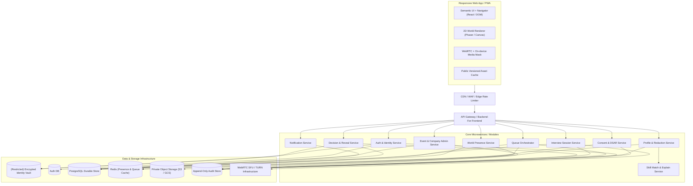

# 1. System Architecture & Technical Strategy

---

## 1.1 Architecture Principles

- **DOM-First for Task UI:** ฟอร์ม, การนำทาง, HUD, กล่องข้อความ และเครื่องมือควบคุมทั้งหมดทำงานบน Semantic HTML/DOM เพื่อความเข้าถึงได้ (Accessibility) โดยใช้ Phaser/Canvas สำหรับ World Rendering เท่านั้น
- **Server-Authoritative Core State:** คิวสัมภาษณ์, เวลา Session, การตัดสินใจ (Decision), ผลการเปิดเผยข้อมูล (Reveal), และสถานะ Event ต้องถูกควบคุมและตัดสินโดย Server
- **Separate Identity Vault Plane:** ข้อมูลยืนยันตัวตน (PII) ถูกแยกขาดจาก Data Plane ของงานแฟร์และการจับคู่ทักษะ
- **On-Device Media Transform:** การประมวลผล Animal Face Mask และ Background Blur ทำงานบนเครื่องผู้ใช้ (Client-side) เพื่อความปลอดภัยและความเป็นส่วนตัว
- **Durable Persistence vs Realtime Broker:** PostgreSQL รับผิดชอบ Transactional Source of Truth ในขณะที่ Redis รับผิดชอบ Presence, Caching, และ WebSocket Realtime Fanout

---

## 1.2 Component Architecture Diagram



---

## 1.3 Service & Module Boundaries

| Component / Module | AI/ML? | Primary Responsibility | Safety Guardrail & Fallback |
|---|:---:|---|---|
| **IdentityShield** | Hybrid | ตรวจจับและปิดบัง PII จาก Resume | Candidate ตรวจสอบและ Approve ก่อนเสมอ; Deterministic regex fallback |
| **SkillMatch** | Yes/Hybrid | คำนวณคะแนนความตรงกันและอธิบายเหตุผล | Excluded demographic attributes, versioning, deterministic rule fallback |
| **MediaPrivacy Processor** | ML On-device | ประมวลผล Face Landmark + Animal Mask | **Fail-closed:** หยุดส่งวิดีโอทันทีเมื่อ Mask หลุด แล้วสลับเป็น Avatar-only |
| **Integrity Collector** | No | บันทึกสัญญาณเบราว์เซอร์พื้นฐาน | ปราศจาก Auto-reject; ไม่แสดง Raw Timeline ให้ Recruiter; ลบใน 7 วัน |
| **Queue Orchestrator** | No | จัดการคิว FIFO, Ready Check, Atomic Dispatch | Durable PostgreSQL Transaction, Idempotency keys |
| **Decision & Reveal** | No | จัดการ Double-blind Decision และ Consent Reveal | ทำงานแบบ Atomic, เข้ารหัสตัวเลือก, บันทึก Append-only Audit Log |

---

## 1.4 Recommended Prototype Architecture (R0 Baseline)

### Tech Stack
- **Framework:** Vite + React + TypeScript
- **Routing:** React Router (รองรับการแชร์และ Refresh URL)
- **Styling & Tokens:** CSS Custom Properties (Design Tokens) + Scoped CSS Modules
- **Game Engine:** Phaser 3 (สำหรับ 2D Career Hall World Canvas)
- **UI Overlay:** Semantic HTML/DOM สำหรับ Navigation, Forms, HUD, Dialogs, และ Captions
- **Testing:** Vitest + React Testing Library (Unit/Component), Playwright (E2E & Viewport Smoke), Axe-core (Accessibility Smoke)

### Recommended Source Code Layout

```text
src/
  app/                 # router, providers, app shell, error boundary
  design-system/       # tokens, primitives, icons, focus/motion rules
  features/
    auth-demo/         # mock identity & consent
    profile/           # resume import, redaction review, approval
    world/             # phaser world canvas wrapper & camera follow
    navigator/         # accessible semantic list / search alternative
    booths/            # company booth details, jobs, match explanation
    queue/             # active ticket, ready check dialog, recovery
    interview/         # preflight, speed interview room, fallback dock
    decision/          # private decision submission, mutual match, reveal
    recruiter/         # recruiter desk, availability, rubric evaluator
  domain/              # pure rules, state machine enums, transitions
  data/
    contracts/         # repository interfaces
    demo/              # synthetic fixtures & in-memory/storage adapters
  game/                # phaser scenes, sprites, collision, tilemap
  i18n/                # translation keys & locale formatters
  test/                # test helpers, fixtures, axe a11y harness
```

### Prototype Boundaries & Persistence
- **State Separation:** UI ห้ามเขียน Rule เรื่องคิวหรือ Reveal เองเด็ดขาด ต้องเรียกผ่าน Domain Hooks / Repository Interfaces
- **Browser Persistence:** ในโหมด R0 ที่ไม่มี Backend จริง ให้ใช้ LocalStorage ภายใต้ Namespace `maskedmatch.demo.v1` และใช้ `BroadcastChannel` สำหรับ Sync สถานะข้าม 2 Tabs
- **Zero Real Data:** ห้ามเก็บ Resume จริง, ข้อมูลติดต่อจริง, หรือ Private Key ลงใน Browser Storage
