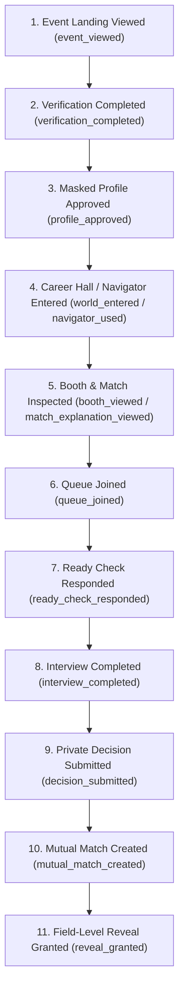

# 2. Observability, Telemetry & Analytics

---

## 2.1 Observability Architecture

- **Structured Logging:** บันทึก Log ในรูปแบบ JSON พร้อม `request_id`, `tenant_id`, `event_id`, `timestamp` และ `service_name`
- **PII Allowlist Policy:** กำหนดฟิลด์ที่ได้รับอนุญาตให้บันทึกลง Log อย่างเคร่งครัด **ห้าม** บันทึก Plaintext Resume, ข้อมูลติดต่อ, Token ลับ, หรือผล Decision ลงใน Application Logs
- **Distributed Tracing:** ใช้ OpenTelemetry ในการ Trace คำขอตั้งแต่ Edge Gateway ผ่าน Microservices จนถึงฐานข้อมูล โดยไม่แนบ Payload ที่ละเอียดอ่อน
- **Correlation ID in User Errors:** ทุก Error ที่แสดงบนหน้าจอจะมี Correlation ID ให้ผู้ใช้สามารถแจ้งทีม Support เพื่อใช้ค้นหาปัญหาใน Log ได้ทันที

---

## 2.2 North-Star Metric & Product Funnel

### North-Star Metric
> **Qualified Mutual Matches that progress to a confirmed next step per completed interview**  
> *(อัตราการเกิด Mutual Match ที่มีคุณภาพและได้ไปต่อในรอบถัดไป ต่อจำนวนการสัมภาษณ์ที่เสร็จสมบูรณ์)*

### End-to-End Analytics Funnel



---

## 2.3 Experience & Fairness Metrics

- **Candidate CSAT & Recruiter CSAT:** ความพึงพอใจต่อประสบการณ์การใช้งานและระบบ Blind Mode
- **Perceived Fairness & Trust Index:** การประเมินความโปร่งใสและไร้อคติจากการสุ่มสำรวจหลังจบงาน
- **Match Explanation Helpfulness:** อัตราที่ผู้สมัครพบว่าเหตุผลการแนะนำงานของ AI มีประโยชน์
- **Low-Bandwidth Completion Rate:** อัตราการสัมภาษณ์สำเร็จในโหมด Audio-only หรือสัญญาณเน็ตต่ำ
- **Demographic Disparity Ratio:** สัดส่วนการแนะนำงานและอัตรา Match ข้ามกลุ่มประชากรที่เข้าร่วม Audit

---

## 2.4 Metric Definition Dictionary Example

ก่อนเปิดใช้งานระบบใน Production ต้องจัดทำ Metric Dictionary ที่มีนิยามชัดเจน เช่น `queue_abandonment_rate`:

```text
Metric Name: queue_abandonment_rate
Formula:
  Numerator   = จำนวน QueueTicket ที่ Candidate กดยกเลิกเองหลังเข้าสถานะ QUEUED และก่อนเกิด READY_CHECK
  Denominator = จำนวน QueueTicket ทั้งหมดที่เข้าสู่สถานะ QUEUED ใน Event เดียวกัน
Exclusions:
  - การยกเลิกโดย Event Organizer (Event Cancelled / Paused)
  - กรณี Recruiter Offline หรือระบบขัดข้อง
  - บัญชีสำหรับการทดสอบ (Test Accounts)
Attribution Window:
  - ตั้งแต่เวลา Event Start ถึง Event End + 24 ชม.
Refresh SLA: 15 นาที
```
